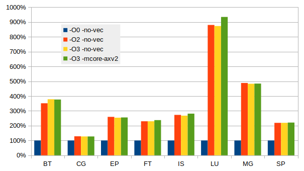

# Building scientific software
This section covers how to compile and link software, and how to use math and MPI libraries.

## Compilers
### GCC
The [GNU Compiler Collection](https://gcc.gnu.org) (GCC) includes compilers for C, C++ and Fortran, and libraries for these languages on a variety of platforms including x86 and ARM64 (AArch64).

#### Compiler flags

The default settings of `gcc/gfortran` are not optimal for performance. There a lot of optimizing options available, a list can be generated issuing command

	gcc --help=optimizers
 
A set of flags for optimisation include:
```
-O3
-O3 -mfma -mavx2                    # enable fused multiply–add and AVX2 extensions
-O3 -march=skylake-avx512           # Intel Skylake
-O3 -march=znver2 -mtune=znver2     # AMD EPYC Rome (Betzy)
-O3 -march=znver5 -mtune=znver5     # AMD EPYC Turin (Olivia)
-O3 -mcpu=grace                     # NVIDIA GraceHopper
```

#### Further Information
- [GCC online documentation](https://gcc.gnu.org/onlinedocs/)

### Intel
The Intel compiler suite, included in the Intel oneAPI Toolkit, is supported on all NRIS systems.

#### Compiler flags
The Intel compiler comes with a set of default optimisation flags already set. Just invoking the compiler without any additional flags will generate reasonably good code. But telling the compiler generate optimised code can have a huge impact on performance.

The following graph show the observed speed using the 
[NASA NPB MPI](https://en.wikipedia.org/wiki/NAS_Parallel_Benchmarks) benchmarks built using the Intel compiler and running 64 MPI ranks.



The benefit of selecting optimisation flags is obvious. The effect of vectorisation is 
less pronounced with these benchmarks which are extracts from real applications and running with larger datasets. The compiler can recognise some type of code and generate excellent code, often related to cache and TLB issues.

As all processors on the NRIS cluster support AVX2 this can always be used. A set of flags for optimisation include:
```
-O3
-Ofast
-O3 -xAVX2
-O3 -xcore-avx2
-O3 -march=core-avx2 -mtune=core-avx2
```
The `-x<code>` option tells the compiler which processor features it may target. As the compiler is primarily written for the Intel processors this can cause problems on AMD cpus (as on Betzy and Olivia) when specifying AVX extensions for the `<code>` setting, e.g. `-xcore-avx2`. Intel has implemented a run time processor check for any program compiled with this flag, which will result in a message like this:
```
Please verify that both the operating system and the processor support
Intel(R) X87, CMOV, MMX, FXSAVE, SSE, SSE2, SSE3, SSSE3, SSE4_1, SSE4_2,
MOVBE, POPCNT, AVX, F16C, FMA, BMI, LZCNT and AVX2 instructions.
```
Notice, this only apply to the main routine. If the main() function is not compiled with the flag the test is not inserted and performance is as expected. To fix this, compile the main() function without the `-x<code>` with AVX extensions setting. Alternatively, the safe option is `-O3  -march=core-avx2 -mtune=core-avx2` which mostly provide fair performance.

Compiler flags related to optimisation reports can be useful. To generate an optimisation report use option `-qopt-report[=arg]` (arg = 1,2 or 3), e.g.

	icx -O3 -march=core-avx2 -mtune=core-avx2 -qopt-report=3 foo.c

This will generate a file called `foo.optrpt` containing the optimization report messages.

```{note}
Notice, the Intel Compiler Classic drivers commands icc and icpc have been removed since the Intel oneAPI 2024.0 release (i.e. 2024 toolchains for NRIS clusters). Use the LLVM-based Intel Compiler drivers icx and icpx instead. The Classic ifort command will be discontinued in the Intel oneAPI 2025 release. Use LLVM-based Intel Compiler driver ifx instead.
```

#### Further Information
- [Intel oneAPI Toolkit](https://www.intel.com/content/www/us/en/developer/tools/oneapi/oneapi-toolkit.html)
- [Intel oneAPI DPC++/C++ Compiler](https://www.intel.com/content/www/us/en/docs/dpcpp-cpp-compiler/get-started-guide/2025-2/overview.html)
- [Porting Guide for ICC Users to DPCPP or ICX](https://www.intel.com/content/www/us/en/developer/articles/guide/porting-guide-for-icc-users-to-dpcpp-or-icx.html)
- [Intel Fortran Compiler](https://www.intel.com/content/www/us/en/docs/fortran-compiler/get-started-guide/2025-2/overview.html)
- [Porting Guide for Intel Fortran Compiler](https://www.intel.com/content/www/us/en/developer/articles/guide/porting-guide-for-ifort-to-ifx.html)

### AMD AOCC
The AMD Optimizing Compilers (AOCC) are based on LLVM, with Clang as the default front-end for C/C++ and Flang for Fortran, and are designed for optimizing code on the AMD Zen series processors. 

A suggested set of flags to try for optimization is given below:
```
-O3
-Ofast
-O3 —mcpu=znver2     # AMD EPYC Rome (Betzy)
-O3 —mcpu=znver5     # AMD EPYC Turin (Olivia)
```
#### Further Information
- [AOCC User Guide](https://docs.amd.com/r/en-US/57222-AOCC-user-guide/Introduction)

### NVIDIA compilers
The NVIDIA compilers (formerly PGI) are part of the NVIDIA HPC Software Development Kit (SDK). To access the compilers load one of the available `nvidia-compilers` modules.

When building software natively NVHPC compilers will auto-detect the host CPU and device GPU architectures of the system without additional command-line options. To verify, add compiler option `—version`, e.g. on the Olivia Grace Hopper nodes:
```
module load NRIS/GPU
module load nvidia-compilers/25.9-CUDA-12.9.1
nvc —version
```
This will produce output
```
nvc 25.9-0 linuxarm64 target on aarch64 Linux -tp neoverse-v2 
NVIDIA Compilers and Tools
…etc.
```
As can be seen, the output includes `-tp neoverse-v2`.

#### Further Information
- [NVIDIA HPC SDK](https://docs.nvidia.com/hpc-sdk/compilers/index.html)

### Performance of compilers
A test using the well known reference implementation of matrix matrix
([dgemm](https://www.netlib.org/lapack/explore-html/d7/d2b/dgemm_8f_source.html))
multiplication is used for a simple test of the different compilers.

| Compiler      | Flags                               | Performance       |
|:--------------|:-----------------------------------:|:-----------------:|
| GNU gfortran  | `-O3 -march=znver2 -mtune=znver2`     | 4.79 Gflops/s     |
| AOCC flang    | `-Ofast -march=znver2 -mavx2 -m3dnow` | 5.21 Gflops/s     |
| Intel ifort   | `-O3 -xavx2`                          | 26.39 Gflops/s    |

The Intel Fortran compiler do a remarkable job with this nested loop problem.

## Performance libraries
Many optimized mathematical libraries are available on the NRIS clusters.

The following simple example `test_blas.c` using the BLAS matrix multiply code dgemm can be used to test the different math libraries described in this section.
<details>
<summary>test_blas.c</summary>
### Example using BLAS matrix multiply code dgemm

```
#include <stdio.h>

#ifdef OPENBLAS               // gcc -DOPENBLAS test_blas.c -lopenblas
  #include <cblas.h>

#elif defined GSL             // gcc -DGSL test_blas.c -lgsl -lgslcblas -lm
  #include <gsl/gsl_cblas.h>

#elif defined MKL             // icx -DMKL -qmkl test_blas.c. (compiler option)
  #include <mkl_cblas.h>.     // icx -DMKL test_blas.c -lmkl_rt (SDL library)

#elif defined AOCL            // gcc -DAOCL test_blas.c -lblis-mt
  #include <blis/cblas.h>
#endif

int main()
{
  int i=0;
  double A[6] = {1.0,2.0,1.0,-3.0,4.0,-1.0};
  double B[6] = {1.0,2.0,1.0,-3.0,4.0,-1.0};
  double C[9] = {.5,.5,.5,.5,.5,.5,.5,.5,.5};

  cblas_dgemm(CblasColMajor, CblasNoTrans, CblasTrans, 3, 3, 2, 1, A, 3, B, 3, 2, C, 3);

  for(i=0; i<9; i++)
    printf("%lf ", C[i]);
  printf("\n");
}
```
</details>

### OpenBLAS
OpenBLAS is an optimized library that include BLAS and LAPACK linear algebra routines.

To link to the shared OpenBLAS (adding `-DOPENBLAS` to follow the OPENBLAS path in the code) build with:

	gcc -DOPENBLAS test_blas.c -lopenblas

#### Further Information
- [OpenBLAS](https://www.openmathlib.org/OpenBLAS/docs/)

### GSL (GNU Scientific Library)
The GNU Scientific Library (GSL) is a numerical software package for C and C++ covering a range of subject areas including:
- BLAS (level 1, 2, and 3) and linear algebra routines
- Fast Fourier transform (FFT) functions
- Numerical integration
- Random number generation functions

To link to the shared GSL library (adding `-DGSL` to follow the GSL path in the code) build with:

	gcc -DGSL test_blas.c -lgsl -lgslcblas -lm

#### Further Information
- [GSL - GNU Scientific Library](https://www.gnu.org/software/gsl)


### Intel MKL
The Intel Math Kernel Library (MKL) contains highly optimised, extensively multithreaded math routines for different areas of computation. The library includes:
- BLAS (level 1, 2, and 3) and LAPACK linear algebra routines
- ScaLAPACK distributed processing routines and BLACS routines for communication
- Fast Fourier transform (FFT) functions
- Vectorized math functions
- Random number generation functions

#### Dynamic Linking
Using Intel compilers the compiler option `-qmkl` can be used to link to shard MKL libraries:
```
-mkl or -mkl=parallel   # link with standard multithreaded MKL
-mkl=sequential         # link with sequential version of MKL
-mkl=cluster            # link with cluster components (single-threaded) that use Intel MPI

```
For example (adding `-DMKL` to follow the MKL path in the code):

	icx -DMKL -qmkl test_blas.c

An alternative is to use the Single Dynamic Library (SDL), `libmkl_rt.so`, at the link stage, e.g.:

	icx -DMKL test_blas.c -lmkl_rt

SDL enables you to select the interface (32-bit or 64-bit integers) and threading library (Intel OpenMP or Intel TBB) for MKL at run time, e.g. for running in single-threaded mode specify:

	export MKL_THREADING_LAYER=SEQUENTIAL

at run time.

#### Static Linking
In case of static linking of MKL enclose components [threading libraries](https://www.intel.com/content/www/us/en/docs/onemkl/developer-guide-linux/2023-2/linking-with-threading-libraries.html) and 
[computational libraries](https://www.intel.com/content/www/us/en/docs/onemkl/developer-guide-linux/2023-2/linking-with-computational-libraries.html) in grouping symbols, and add [compiler run-time libraries](https://www.intel.com/content/www/us/en/docs/onemkl/developer-guide-linux/2023-2/linking-with-compiler-run-time-libraries.html).

For example, to link a Fortran program `myprog.f` with multi-threaded ScaLAPACK using the Intel MPI  `mpiifx` compiler wrapper to setup the MPI environment specify:
```
mpiifx -I$(MKLROOT)/include myprog.f \
-Wl,--start-group \
$(MKLROOT)/lib/intel64/libmkl_scalapack_lp64.a \
$(MKLROOT)/lib/intel64/libmkl_intel_lp64.a \
$(MKLROOT)/lib/intel64/libmkl_intel_thread.a \
$(MKLROOT)/lib/intel64/libmkl_core.a \
$(MKLROOT)/lib/intel64/libmkl_blacs_intelmpi_lp64.a \
-Wl,--end-group \
-liomp5 -lpthread -lm -ldl
```
Notice, the `MKLROOT` environment variable is set `mkl` modules. The easiest way to decide on the compile and link line when linking MKL is to use the I[ntel Math Kernel Library Link Line Advisor](https://www.intel.com/content/www/us/en/developer/tools/oneapi/onemkl-link-line-advisor.html).

#### Forcing MKL to use best performing routines
MKL issue a run time test, with a call to a function `mkl_serv_intel_cpu_true()`, to check for genuine Intel processor. If a Intel processor is found it simply return `1`. But if this test fail it will select a generic x86-64 set of routines yielding 
inferior performance.

The solution is simply to override this function by writing a dummy functions which always return 1 and place this 
early in the search path. The function is simply:
```c
int mkl_serv_intel_cpu_true() {
  return 1;
}
```
Compiling this file into a shared library using the following command:

	gcc -shared -fPIC -o libfakeintel.so fakeintel.c

To put the new shared library first in the search path we can use a preload environment variable:
`export LD_PRELOAD=<path to lib>`
A suggestion is to place the new shared library in `$HOME/lib64` and using 
`export LD_PRELOAD=$HOME/lib64/libfakeintel.so` to insert the fake test function.
  
For performance impact and more about running software with MKL see
{ref}`using-mkl-efficiently`.

#### Further Information
- [Intel oneAPI Math Kernel Library](https://www.intel.com/content/www/us/en/docs/onemkl/get-started-guide/2026-0/overview.html)
- [Intel oneAPI Math Kernel Library Link Line Advisor](https://www.intel.com/content/www/us/en/developer/tools/oneapi/onemkl-link-line-advisor.html)

### AMD AOCL
AMD Optimizing CPU Libraries (AOCL) are a set of numerical libraries optimized for AMD Zen series processors. On Betzy and Olivia the following are installed:
- AOCL-BLAS, a high-performance BLAS implementation based on [BLIS](https://github.com/flame/blis)
- AOCL-LAPACK, a high-performance BLAS implementation based on [libFLAME](https://github.com/amd/libflame)

To link to the shared AOCL-BLAS library (adding `-DAOCL` to follow the OPENBLAS path in the code) build with:

	gcc -DAOCL test_blas.c -lblis-mt

### Further Information
- [AOCL User Guide](https://docs.amd.com/r/en-US/57404-AOCL-user-guide/AOCL-User-Guide)

### Performance of math libraries
In the test below using matrix matrix multiplication, Level 3 BLAS
function dgemm is used to test single core performance of the
libraries. The tests are run on a single node using a single core on
Betzy.

| Library | Link line                                                   | Performance     |
|:--------|:-----------------------------------------------------------:|:---------------:|
| AOCL    | `gfortran -O3 dgemm-test.f90 -L$LIB -lblis` | 50.13 Gflops/s  |
| AOCL    | `flang -O3 dgemm-test.f90 -L$LIB -lblis`    | 50.13 Gflops/s  |
| MKL     | `ifort -O3 dgemm-test.f90 -mkl=sequential`  | 51.53 Gflops/s  |

This is a nice example of clock boost when using only a few cores, or in this case only one.

The performance data below is obtained for a 3d-complex forward FT with a footprint of about 22 GiB using a single core.

| Library        | Environment flag             |Performance |
|:---------------|:-----------------------------|:----------:|
| FFTW 3.3.8     | none                         | 62.7 sec.  |
| AMD/AOCL 2.1   | none                         | 61.3 sec.  |
| MKL-2020.4.304 | none                         | 52.8 sec.  |
| MKL-2020.4.304 | `LD_PRELOAD=./libfakeintel.so` | 27.0 sec.  |

In this test the performance of MKL is significantly higher than both FFTW and the AMD library. 

## MPI libraries

### OpenMPI
OpenMPI provides full support for the MPI-3.1 in its modern releases and partial support for the newer MPI-4.0 standard in the v5.0 series. OpenMPI is supported on all the NRIS systems.

The Open MPI compiler wrapper scripts listed in the table below add in all relevant compiler and link flags, and then invoke the underlying compiler, i.e. the compiler that the Open MPI installation was built with.

| Language       | Wrapper script          | Default compiler| Environment variable |
| :------------- | :-------------:         |:-------------:  |:-------------:       |
| C              | `mpiicc`                | `gcc`           | `OMPI_CC`            |
| C++            | `mpicxx, mpic++, mpiCC` | `g++`           | `OMPI_CXX`           |
| Fortran        | `mpifort`               | `gfortran`      | `OMPI_FC`            |

It is possible to change the underlying compiler that is invoked when calling the compiler wrappers using the environment variables listed in the table. Use option `-showme` to see the underlying compiler, the compile and link flags, and the libraries that are linked when invoking the MPI wrapper commands.

MPI jobs are launched running command `mpirun` (or alternatively Slurm `srun`). There are many available  options to mpirun, including process placement options. See the manual `man mpirun` page for details.

For example, to run 8 MPI processes on two 2-socket, 64-core nodes mapping evenly to sockets and binding to cores, use the following command:

	mpirun --report-bindings --map-by package --bind-to core ./a.out

with output
```
[b5227] Rank 0 bound to package[0][core:L0]
[b5227] Rank 1 bound to package[0][core:L1]
[b5227] Rank 2 bound to package[1][core:L64]
[b5227] Rank 3 bound to package[1][core:L65]
[b5248] Rank 4 bound to package[0][core:L0]
[b5248] Rank 5 bound to package[0][core:L1]
[b5248] Rank 6 bound to package[1][core:L64]
[b5248] Rank 7 bound to package[1][core:L65]
```
(This example was run on Betzy compute nodes)

### Further Information
- [Open MPI](https://www.open-mpi.org/)

### Intel MPI
The Intel MPI library is based on MPICH and supports the MPI-4.1 standard. Intel MPI is supported on all NRIS systems.

The following table shows available Intel MPI compiler wrapper commands, the underlying Intel and GNU compilers, and ways to override underlying compilers with environment variables or command line options.

| Language     | Wrapper script | Default compiler | Environment variable | Command line      |
| :----------- | :-------------:|:-------------:   |:-------------:       |:---------------:  |
| C            | `mpiicc`       | `icc` [^1]       | `I_MPI_CC`           | `-cc=<compiler>`  |
| C            | `mpiicx` [^2]  | `icx` [^3]       | `I_MPI_CC`           | `-cc=<compiler>`  |
| C            | `mpicc`        | `gcc`            | `I_MPI_CC`           | `-cc=<compiler`>  |
| C++          | `mpiicpc`      | `icpc` [^1]      | `I_MPI_CXX`          | `-cxx=<compiler>` |
| C++          | `mpiicpx`[^2]  | `icpx` [^3]      | `I_MPI_CXX`          | `-cxx=<compiler>` |
| C++          | `mpicxx`       | `g++`            | `I_MPI_CXX`          | `-cxx=<compiler>` |
| Fortran      | `mpiifort`     | `ifort` [^1]     | `I_MPI_FC`           | `-fc=<compiler>`  |
| Fortran      | `mpiifx` [^2]  | `ifx` [^3]       | `I_MPI_FC`           | `-fc=<compiler>`  |
| Fortran      | `mpif90`       | `gfortran`       | `I_MPI_FC`           | `-fc=<compiler>`  |

Specify option `-show` with one of the compiler wrapper scripts to see the underlying compiler together with compiler options, link flags and libraries.

For example, use the available MPI C wrapper command before the Intel oneAPI 2023.2 release but with the LLVM based compiler
```
module load intel/2023a
mpiicc -cc=icx mpi_hello_world.c
```
To launch programs linked with Intel MPI use the `mpirun` command (or alternatively Slurm `srun`). Intel MPI uses environment variables prefixed with `I_MPI_` to control job launching, performance tuning, process placement, and debugging behaviors. Issue command

	impi_info -all

to see information on environment variables available in the Intel MPI Library.

For example, to run 8 mpi processes on two 2-socket 64-core nodes mapping evenly to sockets and binding to cores, specify

```
export I_MPI_DEBUG=4
export I_MPI_PIN_DOMAIN=socket
export I_MPI_PIN_CELL=core
mpirun ./a.out
```
with output
```
[0] MPI startup(): ===== CPU pinning =====
[0] MPI startup(): Rank    Pid      Node name    Pin cpu
[0] MPI startup(): 0       150838   b1395        {0-63}
[0] MPI startup(): 1       150839   b1395        {64-127}
[0] MPI startup(): 2       150840   b1395        {0-63}
[0] MPI startup(): 3       150841   b1395        {64-127}
[0] MPI startup(): 4       148375   b1396        {0-63}
[0] MPI startup(): 5       148376   b1396        {64-127}
[0] MPI startup(): 6       148377   b1396        {0-63}
[0] MPI startup(): 7       148378   b1396        {64-127}

```
The output shows that processes `0` and `2` ends up on socket 1 (cpus `{0-63}`), and processes `1` and `3` ends up on socket 2 (cpus `{64-127}`) on the first node, etc. (This example is run on Betzy compute nodes.)

### Further Information
- [Intel MPI Library](https://www.intel.com/content/www/us/en/developer/tools/oneapi/mpi-library.html)
- [Developer Guide for Linux](https://www.intel.com/content/www/us/en/docs/mpi-library/developer-guide-linux/2021-18/overview.html)

[^1]: Intel Compiler Classic driver commands, available before the Intel oneAPI 2024.0 release (`icc/icpc`), and before the Intel oneAPI 2025 release (`ifort`).
[^2]: Intel LLVM based compiler based wrappers available since the Intel oneAPI 2023.2 release (i.e. `intel/2023b` toolchain on NRIS clusters)
[^3]: LLVM-based backend Intel Compiler drivers available since 2022

