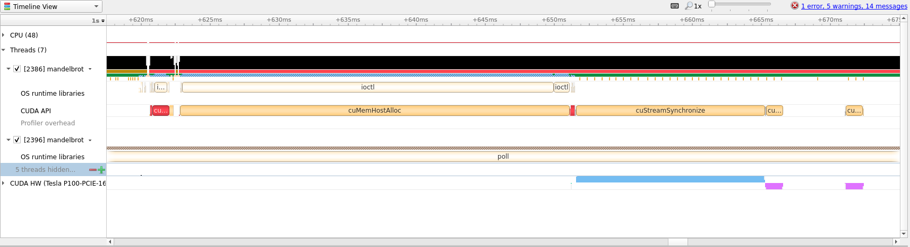

```{index} GPU; Async and Multi-GPU OpenACC, OpenACC; Async and Multi-GPU OpenACC, Nvidia Nsight; Async and Multi-GPU OpenACC, Multi-GPU; Async and Multi-GPU OpenACC
```

# Async and Multi-GPU OpenACC
In this guide we will go over a few advance topics regarding OpenACC. The guide
will cover asynchronous operations, which can overlap memory transfers and
compute for higher throughput, and how to utilize multiple GPUs.

```{tip}
If you are not sure what OpenACC is we have an [introductory
guide](./openacc.md) which explains the basics.
```

## Introduction
Asynchronous programming in OpenACC is a way to schedule work so that the GPU
can work _concurrently_ with the tasks given. Note that this does not mean that
the GPU will necessarily run multiple kernels simultaneously. Often,
asynchronous programming with OpenACC will allow us to overlap memory transfer
with kernel execution. This can improve efficiency since the GPU does not sit
idle while transferring memory back-and-forth, resulting in improved throughput.
If you are just beginning to translate an existing code base to OpenACC,
asynchronous operations should be some of the last optimizations to apply and
can be tricky when the problem is _not_ [embarrassingly
parallel](https://en.wikipedia.org/wiki/Embarrassingly_parallel).

After reading this guide you should be familiar with the following topics and
ideas.
 - Understand how asynchronous programming with OpenACC works.
     - How memory and kernels can be overlapped.
     - How different OpenACC blocks can be made dependent on each other.
     - Which problems are suitable for asynchronous OpenACC.
 - Know the basics of utilizing multiple GPUs.

---

To get started we will need some piece of code that we would like to accelerate.
This time we have chosen to accelerate the visualization of the [Mandelbrot
set](https://en.wikipedia.org/wiki/Mandelbrot_set).

Since this code requires a bit more setup than before we have created a [`meson`
project](https://mesonbuild.com/) that can be used to build the code. Below we
have attached the full project, and we will offer `zip` archives of the full
project as we make changes, but will focus on the main code in `mandelbrot.c`.

```{eval-rst}
:download:`Serial version of project as 'zip' archive <./async_openacc/serial.zip>`
```

Below we have attached the full version of `mandelbrot.c` and highlighted the
two main areas of computation where we will focus our efforts.

```{eval-rst}
.. literalinclude:: async_openacc/mandelbrot_serial.c
   :language: c
   :emphasize-lines: 30-47, 125-131
```

To build the project on Saga we first need to load a few modules before using
`meson` to build the project.

```bash
$ module load Python/3.8.2-GCCcore-9.3.0
$ pip3 install --user meson
# To download the project directly
# wget https://documentation.sigma2.no/_downloads/bdfbca90a90a8d1b824fc6b1154ceee7/serial.zip
$ unzip serial.zip
$ cd AccelBrot-master
```

```{note}
We need to manually install `meson` above since we require version `0.56.0`
which only exist as a `pip` package at the time of writing. Check with `module
--show_hidden avail Meson` to see if a sufficiently new version is installed.
```

Then to build the project load `NVHPC` + `Ninja` and run the following `meson`
commands

```bash
$ module load NVHPC/20.7 Ninja/1.10.0-GCCcore-9.3.0
$ CC=nvc meson setup builddir --buildtype=debugoptimized
$ meson compile -C builddir
```

Afterwards, as long as `NVHPC` and `Ninja` is loaded, only the last command
`meson compile -C builddir` is required when making changes.

To run this on Saga (_without_ GPU) the following `srun` command can be used
```bash
$ srun --account=<your project number> --time=02:00 --mem-per-cpu=1G ./builddir/src/mandelbrot
```

```{tip}
Try different image size or iteration parameters to see how much time the CPU vs
GPU will take, `./builddir/src/mandelbrot 4k`.
```

```{tip}
Use this opportunity to try to optimize the above code with OpenACC directives
without focusing on asynchronous programming or multi-GPU setups.
```

## Initial translation to OpenACC
To run the above code on a GPU using OpenACC we first need to introduce the
`#pragma acc routine` directive. This directive tells OpenACC that we would like
the function following the directive to be translated into GPU code. When
looking at the code above we can see that the `mandelbrot()` function is used to
separate the calculation of the set and iteration over the image. To be able to
optimize the loop we therefore need to translate the `mandelbrot()` function.

```{eval-rst}
.. literalinclude:: async_openacc/mandelbrot_initial.c
   :language: c
   :lines: 21-49
   :emphasize-lines: 2, 11
```

```{note}
In the above code we added `seq` to the end of the directive. This tells OpenACC
that the `routine` must run **seq**uentially on the GPU and no additional
parallelization is possible. Adding `seq` is not necessary, but can be a good
way to ensure that your thinking is correct as the compiler would complain if it
is not correct. See the [quick
reference](https://www.openacc.org/sites/default/files/inline-files/API%20Guide%202.7.pdf)
for further explanation of the possible additions to `#pragma acc routine`.
```

After this we can add the `#pragma acc parallel loop` directives around the
image computation.

```{eval-rst}
.. literalinclude:: async_openacc/mandelbrot_initial.c
   :language: c
   :lines: 127-137
   :emphasize-lines: 2-5
```
```{eval-rst}
:download:`Initial translation of 'mandelbrot.c' to OpenACC <./async_openacc/mandelbrot_initial.c>`
```

This initial translation is already quite a lot better than the serial CPU
version (clocking in at around `10x` improvement when generating a `4k` image).
Let's see what insight we can gain from running with `Nsight`.

---

To run with `Nsight` use the following invocation of `srun`
```bash
$ srun --account=<your project number> --time=02:00 --mem-per-cpu=1G --partition=accel --gres=gpu:1 nsys profile -t cuda,openacc,osrt -o initial ./builddir/src/mandelbrot 4k
```

```{eval-rst}
:download:`Nsight profile <./async_openacc/initial.qdrep>`
```


As we can see, most of the timeline is taken with doing other work and not the
actual compute. We will therefore zoom into the desired range (which we can
identify by following the `CUDA API` row until a cluster of yellow boxes
appear).




From the above screenshot we can see that we are running on the GPU, but
computation and memory copies are sequential. For large amounts of data this is
less than optimal and we can try to improve the situation with asynchronous
scheduling of compute and memory transfer.

## Async OpenACC
Translating a piece of OpenACC code to run asynchronously requires us to split
our work into smaller tasks that we know could run concurrently. Looking at our
main loop we can see that every computation is independent of any other
iteration or computation. This make the Mandelbrot example quite simple to
translate, but that does not mean asynchronous operations is only for
embarrassingly parallel problems.

```{tip}
One way to quickly utilize asynchronous OpenACC is to identify blocks of code
that are run sequentially (e.g. one loop that does something to `A` and another
loop that does something to `B`) and does not involve data from one another.
Loops like that can be run asynchronously which can increase throughput by
overlapping computation and memory transfer.
```

In our case we can split the computation on rows and process the image in
blocks. This will allow us to use the `#pragma acc update` directive to copy
data from the GPU per image block instead of doing this all at the end.

```{eval-rst}
:download:`Async OpenACC project as 'zip' <./async_openacc/async.zip>`
```

To split the image into blocks we will create a new command line parameter and
add an additional loop around our computation.

```{eval-rst}
.. literalinclude:: async_openacc/mandelbrot_async.c
   :language: c
   :lines: 134-150
   :emphasize-lines: 2, 8, 15, 17
   :linenos:
```

In the above code the `num_blocks` value divides our image into a given number
of blocks. Then we create and copy the necessary data before beginning our
actual computation. Notice in particular the `async` directive added on line
`8`. This directive tells OpenACC that it should launch the kernel and
immediately continue working. The parameter given to `async` is the queue
number, kernels submitted to the same queue must wait for previous work in that
queue to finish before being launched. Notice therefore that we, on line `15`,
ensure that we have the same variable `block` which means that we do not update
the data before the computation is complete. Lastly, on line `17` we wait for
all previously launched asynchronous work to finish before continuing.

We will run this again with `Nsight` to see if we were able to perform the work
asynchronously. Use the following command on Saga (don't forget to compile with
`meson compile -C builddir`)

```bash
$ srun --account=<your project number> --time=02:00 --mem-per-cpu=1G --partition=accel --gres=gpu:1 nsys profile -t cuda,openacc,osrt -o async ./builddir/src/mandelbrot 4k
```

```{eval-rst}
:download:`Nsight async profile <./async_openacc/async.qdrep>`
```

This new code runs about `1.25x` faster than the initial translation, which
shows the value in overlapping memory and compute. Below we have attached the
zoomed in view of the `Nsight` timeline to show how asynchronous OpenACC looks.


## Utilizing multiple GPUs
To utilize multiple GPUs on Saga we will have to dip into the OpenACC runtime
calls to query and set which GPU we want to run on. We will use the
`acc_get_num_devices` and `acc_set_device` methods to assign work to GPUs.

```{tip}
To see all the directives and runtime methods of OpenACC consult the [quick
reference](https://www.openacc.org/sites/default/files/inline-files/API%20Guide%202.7.pdf).
```

```{tip}
For most real world code it can be very difficult to find places to split the
work over multiple GPUs and so a different technique might be called for.

Instead of trying to split loops into work for multiple GPUs, try to see already
existing possibilities to split the work. One natural way is to give individual
MPI ranks their own GPU to utilize.
```

```{eval-rst}
:download:`Multi-GPU OpenACC project as 'zip' <./async_openacc/multi.zip>`
```

```{eval-rst}
.. literalinclude:: async_openacc/mandelbrot_multi.c
   :language: c
   :lines: 134-161
   :emphasize-lines: 1, 5-8, 13, 24-28
```

Notice that we copy the data to each GPU and then assign a device after the
current block number. We also have to take special care when exiting all loops
that we wait for all GPUs to finish and remove the data since the `#pragma acc
enter data` directive keeps the data in GPU memory until otherwise stated (in
contrast to `#pragma acc data` which keeps the data only for the extent of the
following block of code).

This last iterations is about `1.5x` faster using `--gres=gpu:2` with
diminishing, or even negative, returns for additional GPUs.

## Summary
We have shown how to translate the Mandelbrot calculation into OpenACC code, how
such code can be made asynchronous to overlap computation and memory transfer,
and how to utilize multiple GPUs on Saga.

Below is the summary of speedup where the improvement is shown relative to the
previous entry in the table (take the measured times with a grain of salt, they
are more an illustration of possible speedup, not guaranteed speedup).

| Version | Time in milliseconds | Speedup |
| ------- | -------------------- | ------- |
| Serial | `10757`| N/A |
| OpenMP  `--cpus-per-task=6`\* | `3313` | `3.24x` |
| Initial OpenACC | `1020` | `3.25x` |
| Async | `811` | `1.25x` |
| Multi-GPU `--gres=gpu:2` | `547` | `1.48x` |
| Multi-GPU `--gres=gpu:4` | `2932` | `0.18x` |
**\*** To keep the comparison as fair as possible we compare the CPU resources
that would be the equivalent to [the billing resources of 1 GPU on
Saga](../../jobs/projects_accounting.md).
