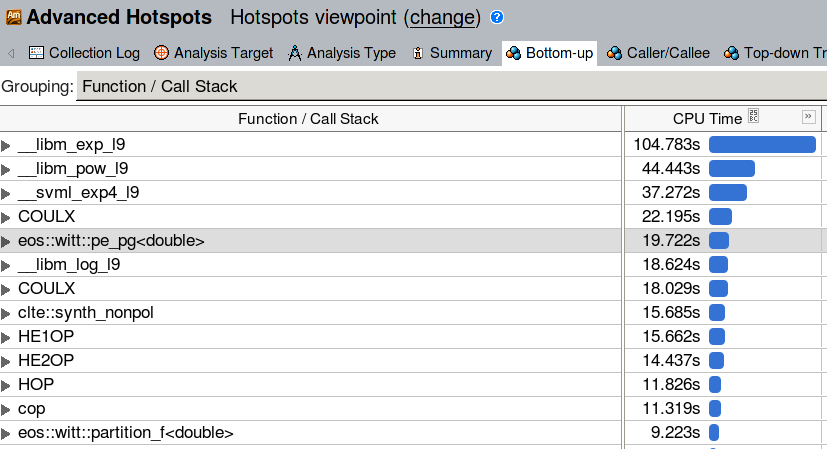

# Example VTune Analysis

As an example we use VTune Amplifier to analyze the performance of the
original, and the optimized software package ART - a 3D radiative
transfer solver developed within the [SolarALMA
  project](https://www.mn.uio.no/astro/english/research/projects/solaralma/). The
  code is written in C++ and consists of two major computational
  parts:

* An equation of state (EOS) solver, which - based on various types of
input data - computes electron density, gas pressure, and
density.

* A nonlinear solver for radiative transfer (RT). This code is based on
a FORTRAN code from 1970 by Robert Kurucz.

Input data is read from HDF5 files and composed into a set of 3D
Cartesian grids. The two kernels described above are executed
independently for each grid point, with no communication required by
the neighbor cells. In this sense the code is trivially
parallelizable and to find opportunities for optimization we look at
the per-core (call it "sequential") performance. The optimization
effort has been done within the PRACE Preparatory Access project type
D. For more details about the optimizatoin techniques [consult the
white paper.](https://doi.org/10.5281/zenodo.2633704)


## Using VTune on Fram

First, to use VTune on Fram you need to load the corresponding
software module `VTune`. To list the available versions:

```
$ ml avail VTune

   VTune/2017_update1    VTune/2018_update1    VTune/2018_update3
```

Then load the desired (newest) version

```
$ ml load VTune/2018_update3
```

To gather information about a code's performance one needs to execute
the code using the [`amplxe-cl`
command](https://software.intel.com/en-us/vtune-amplifier-help-amplxe-cl-command-syntax). Depending
on the needs, `amplxe-cl` can gather all sorts of performance statistics: FPU
utilization, usage of vector (SIMD) AVX insturctions, instructions per
clock, memory bandwidth, cache utilization, threading level, etc. For
example, to collect general information about the most time-consuming
parts of the code:

```
$ amplxe-cl -collect hotspots ./your-program your-arguments
```

For a complete list of analysis modes please consult the [VTune
documentation](https://software.intel.com/content/www/us/en/develop/tools/vtune-profiler.html). A
useful set of performance metrics is gathered by the
`hрc-performance` analysis, which can help to identify opportunities
to optimize CPU, memory, and vectorization level:

```
$ amplxe-cl -collect hpc-performance ./your-program your-arguments
```

A detailed description and the available options for each profiling
mode can be obtained as follows

```
$ amplxe-cl -help collect hpc-performance

[...]

 To modify the analysis type, use the configuration options (knobs) as
 follows:
 -collect hpc-performance -knob <knobName>=<knobValue>
 Multiple -knob options are allowed and can be followed by additional collect
 action options, as well as global options, if needed.

sampling-interval
[...]

enable-stack-collection
[...]

collect-memory-bandwidth
[...]

dram-bandwidth-limits
[...]

analyze-openmp
[...]
```

The `enable-stack-collection` knob, disabled by default, provides detailed
caller / callee information for each profiled function. It can be very
useful, but might introduce some overhead. We will use it in the
following example.

Collected performance statistics are saved in a subdirectory, by
default in the directory you are running from. For the above example
the results are stored in `r000hpc/`. They can then be compressed and
moved to, e.g., a desktop computer, or they can be analyzed on one of
the Fram login nodes using the VTune Amplifier GUI:

```
$ ssh -Y fram.sigma2.no
$ ml load VTune/2018_update3
$ amplxe-gui
```

Note that running the GUI directly on Fram migh feel sluggish depending
on your network connection.

## VTune analysis

The performance characteristics of the original code are obtained as
follows

```
amplxe-cl -collect hpc-performance -knob enable-stack-collection=true -knob collect-memory-bandwidth=false mpirun -np 1 ./ART.x
```

Since we are interested in the "sequential" (per-core) performance, we
only analyze a single MPI rank. The stack collection is enabled. Once
the sampling results are opened in the VTune Amplifier GUI, the
performance summary is presented:


The CPU Utilization section shows the total percentage of all
available cores used. Since a single ART process was executed, this
metric is very low (1 out of 64 logical cores are used), but that is
expected. The memory statistics show that ART is compute bound: there
is almost no references to the global memory (DRAM bound 0%). Also the
caches are not very busy. It is clear that most of the run time goes
into CPU instructions.

The FPU utilization report is hence the most interesting one in this
case. It reveals that 90% of the floating point instructions are scalar, i.e.,
the vector units (AVX) are mostly unused. Looking at the top most busy
functions it becomes clear that the time is spent in calls to `libm`
`exp` and `log`.

A closer look at the Bottom-up section of the performance report
reveals the heaviest parts of the code.



This confirms the previous finding (and adds `pow` to the list of
computationally heavy functions). From the above reports we can
roughly scetch the optimization directions:

* Re-write the code such that the vectorized math library is used for
  `exp, log, pow` calls
* Concentrate on the heaviest functions from the Bottom-up list

## The optimized code

Both GCC and ICC provide an interface to a vectorized math library with
platform-optimized implementations of amongst others
`exp,pow,log`. Intel compiler uses
its own Short Vector Math Library (SVML). The library comes together
with the compiler installation, and there is nothing system-specific
that needs to be done to use it. GCC on the other hand relies on
`libmvec`, which is part of Glibc version 2.22 and higher. This means
that on systems with an older version of Glibc the vectorized math
library is not readily available, regardless of the GCC version. This
is a practical problem, because OS vendors often lag a few years when
it comes to Glibc (e.g., Centos 7.5 comes with version 2.17 released
in the end of 2012). However, it is possible to install a custom Glibc
as a module and use it for user's code.

As noted in the [documentation of
SVML](https://software.intel.com/en-us/node/524289) the vectorized
math library differs from the scalar functions in accuracy.  Scalar
implementations are not the same as the vectorized ones with vector
width of 1. Instead, they follow strict floating-point arithmetic and
are more computationally demanding. GCC is by default conservative
wrt. the floating-point optimizations: vectorized math library is only
enabled with the `-ffast-math` compiletime option. ICC by default uses
relaxed settings (`-fp-model fast=1`), which allow the compiler to
make calls to low accuracy SVML functions. In addition, SVML also
provides higher accuracy vectorized functions (`-fp-model precise`).
Vectorization of libm calls can be prohibited with `-fp-model
strict`. With ART the high accuracy is not required, hence we compile
the code with the most relaxed settings.

Vectorization of the code has been performed using `#pragma simd`
defined by the OpenMP standard. All the heaviest ART functions, and
all floating-point intensive loops have been vectorized using this
method, and VTune was used throughout the process to find new
bottlenecks once the existing ones have been optimized. Below is the
final VTune report of the optimized code compiled using the GCC 8
compiler:


and using the Intel 18 compiler:


Notably, the optimized code utilizes the vector (AVX) units for 87% of
the total FP instructions with GCC, and for 94% of the FP instructions
with the Intel compiler. The capacity of the vector units is used in
85%-90%, which demonstrates that the code is almost fully vectorized.

Compared to the original code, the performance tests have shown that
on a Broadwell-based architecture the optimized code works from 2.5
times faster (RT solver) to 13 times faster (EOS solver) on a single
core. All optimizatoin techniques employed have been described in
detail in [the white paper](https://doi.org/10.5281/zenodo.2633704).
