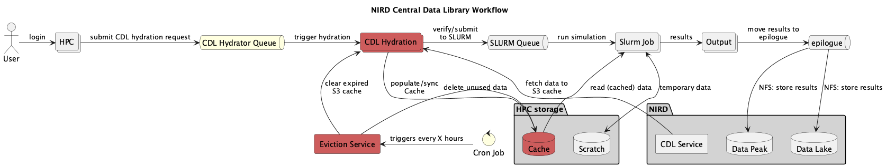

(nird-cdl-cache-hydrator)=

# CDL cache hydrator (Caching CDL data on HPCs)

The CDL service allows users to store datasets to be shared within and across projects on NIRD as a centralized repository. 

The CDL Cache Hydrator functionality in CDL maintains a local cache of datasets on the HPC system's local filesystem by pulling the needed datasets from NIRD through S3. Cached data can be rehydrated at any time. Also, the service is envisioned so that data not being accessed for the set retention time will be automatically evicted from the cache.

## CDL caching user guide



### CDL project registered on NIRD
Each CDL project has its master copy on NIRD Data Lake which is accessible via both POSIX and S3 protocols. (NFS access is also available).

These projects are called with the following naming format `NSxxxxxB` (e.g. NS160003B). Each project is available read-only to any POSIX user having access to NIRD and users having access to the S3 endpoint on NIRD, https://s3.nird.sigma2.no.

Each CDL project has a curresponding S3 bucket following the naming format `cdl-nsxxxxb-service`, e.g. `cdl-ns160003b-wrf`. Note that the bucket name uses lowercase and the project name must match exactly even though it is in lowercase. 


### CDL Hydrator on HPCs

For each service a dedicated hydrator is running on each relevant HPC system. e.g. one for wrf, noresm, etc.
The hydrator continuously monitors a shared configuration directory for data requests. When a valid request file is detected, the hydrator fetches the specified data from the CDL S3 bucket and writes it to the local cache on the HPC filesystem.

Cached data is then available in `/cluster/cache/<service>` e.g. `/cluster/cache/wrf`.

The cache is managed automatically by the cdl_cache_cleanup process, which evicts data that has not been accessed within the current retention period (monthly). 

### Running a job on HPC

1. Ensure data is cached. Request the required dataset and confirm it has been cached.  See how to request data below.
2. Submit your job, referencing data from `/cluster/cache/<service>` (e.g. `/cluster/cache/noresm`).
3. When job completes, copy/stage results to the relevant project storage , for e.g.:  NIRD Data Peak.

### Storing results
See point 3 above.

### Updating the master copy in CDL
The project leader and any designated member can add data and manage the data in the CDL project. All other NIRD users have read-only access either through file storage access or object storage access.

The master copy can be updated either using regular POSIX commands on the NIRD login nodes (`login.nird.sigma2.no`) via SSH access, or using S3 account with read-write role, from the same `https://s3.nird.sigma2.no` endpoint.

The user need to do the sync the datasets again to update the cache.

### How to Request Data

To ensure that the required dataset is cached on the HPC system, you need to drop a TOML configuration file into the shared configuration directory: `/cluster/cache/conf/`

A ready-to-use template is available at `/cluster/cache/conf/00-cdl-hydrator.template`.

#### File Naming Convention

Config file names must follow a strict convention or the hydrator will silently ignore them:
- The name **must** start with the CDL service name, (for example `wrf` or `noresm`),
- This **mus**t be followed by a descriptive identifier such as your project name, or  username, or optionally  sync job number.
- The file **must** end with the `.con` extension. Files with any other extension will be ignored.

* **Correct:** `wrf-case-01.conf` or `noresm-username-dataname.conf`
* **Incorrect:** `my-data.conf` or `wrf-project-01.txt` - the CDL Hydrator will ignore these files

### Configuration File Format

Config files use TOML syntax. Each file must contain a [SYNC] section.

Example Config (`wrf-case-01.conf`):
```ini
[SYNC]
s3_endpoint = s3://open-data-bucket/
target_path = 2026/march/observations/*
# Optional tuning parameters:
nr_workers = 2
log_level = info
```
A TOML template file, called `00-cdl-hydrator.template` is created for convenience.

#### Field reference:

- s3_endpoint (required): The URL of the CDL project S3 bucket. 
- target_path (required): The path to synchronise. Glob patterns are supported (e.g. * matches all files in that directory).
- nr_workers (optional): Number of parallel download workers. Default is 1. Increase for large datasets to speed up the transfer. Upper limit 512
- log_level (optional): Logging verbosity. Accepted values: info, warning, error. Default is info.


### Verifying cached data

After placing a config file in `/cluster/cache/conf`, the hydrator will detect it and begin downloading the requested data. To confirm that data has been successfully cached before submitting your job:
- Check the cache directory directly ls /cluster/cache/<service>/