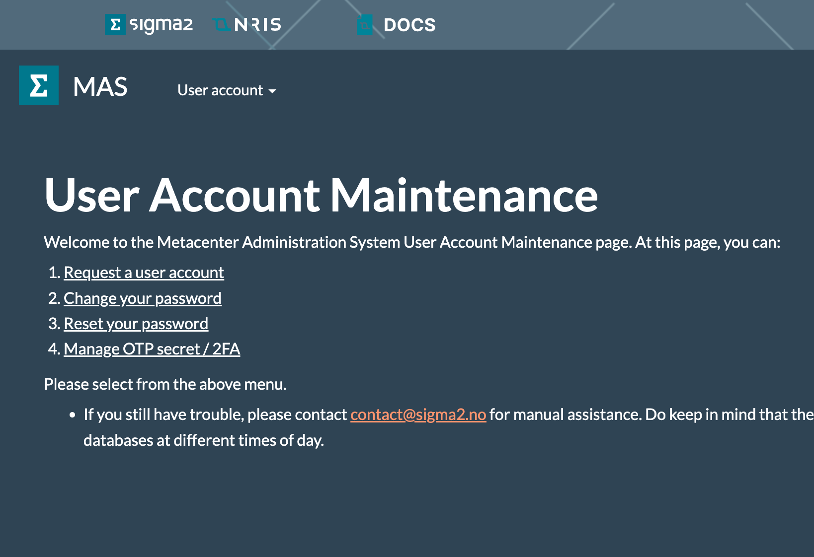

# One-time-pad (OTP) / Two-factor authentication #

All login nodes on Betzy, Fram and Saga offer two-factor authentication on SSH.

To set up two-factor authentication for your user, follow these steps:

1.	Go to <https://www.metacenter.no>, log in, using "User Login (Passwords)".


First click User Login (Passwords)

2.	Select "Manage OTP secret / 2FA" from the page or drop-down menu.




3.	Install Authenticator-app if you don’t have one.

4.	Scan the QR-code with your Authenticator app.

 
 

5.	Verify with code from your app and click “Submit.”


6.  Wait for the resources to sync the new information. 

## Video guide ## 

[[Video] 2FA setup guide for the national e-infrastructure systems](https://www.youtube.com/watch?v=az3HLlwlyDA)    


## How to avoid typing the OTP code every time on Linux / MacOS

On your Mac or Linux desktop or laptop, create a text file `~/.ssh/config` with, for example, the following contents:

```
Host fram
    User myusername
    HostName login.fram.sigma2.no
    ControlMaster auto
    ControlPath ~/.ssh/%r@%h:%p
```

where myusername is replaced appropriately.

This sets things up so that whenever you ssh to the host nickname fram: ssh fram

It will look for the special file (a socket) in your `~/.ssh/` directory that is maintaining a connection to the cluster. If it already exists and is open, it’ll use it to create a connection without re-authenticating; if it doesn’t exist, it’ll authenticate and create the file for subsequent use.

Note that all subsequent connections are dependent on the initial connection — if you exit or kill the initial connection all other ones die, too. This can obviously be annoying if it happens accidentally. It’s easily avoided by setting up a master connection in the background:

```console
$ ssh -CX -o ServerAliveInterval=30 -fN fram
```

The -fN make it go into the background and sit idle, after authenticating. (C for compression,Y for X forwarding, and -o ServerAliveInterval=30 to prevent dropped connections have nothing to do with the ControlMaster but are almost always helpful.)


## How to avoid typing the OTP code every time on Windows sub-system for Linux (WSL)

OpenSSH for Windows does currently not support the ControlMaster module, **but there is a workaround for this**.

By [installing WSL](https://learn.microsoft.com/en-us/windows/wsl/install) and running an Ubuntu terminal you will be able to use SSH as if you were using a Linux computer. You can create the text file under `~/Ubuntu/home/user/.ssh/` and add the same contents as in the example above. Remember to save the text file as `config`
If you then attempt to ssh to the host nickname fram in this example by using `ssh fram` in your Ubuntu terminal, it would then create the same socket under Ubuntu's ssh directory as it would if you were to use a Mac/Linux computer.    
You can run an Ubuntu terminal simply by typing the command 'Ubuntu' in your Windows terminal.    

## How to copy files without using 2FA/OTP

To copy files to and from login-nodes without using two-factor authentication, you can use SFTP via custom TCP port 12, for example:

```
sftp -P 12 login.saga.sigma2.no
```

or via your preferred SFTP client, specifying port 12 and protocol SFTP. 

Requirements:
- This is only available if you have set up ssh-keys, see guide in [getting started](https://documentation.sigma2.no/getting_started/ssh.html#using-ssh-keys-instead-of-passwords).
- This is only available on "Forskningsnett" (networks that Sikt (AS 224) announces). Use VPN to connect to your (Norwegian) insititutions network if you for example work from home.
