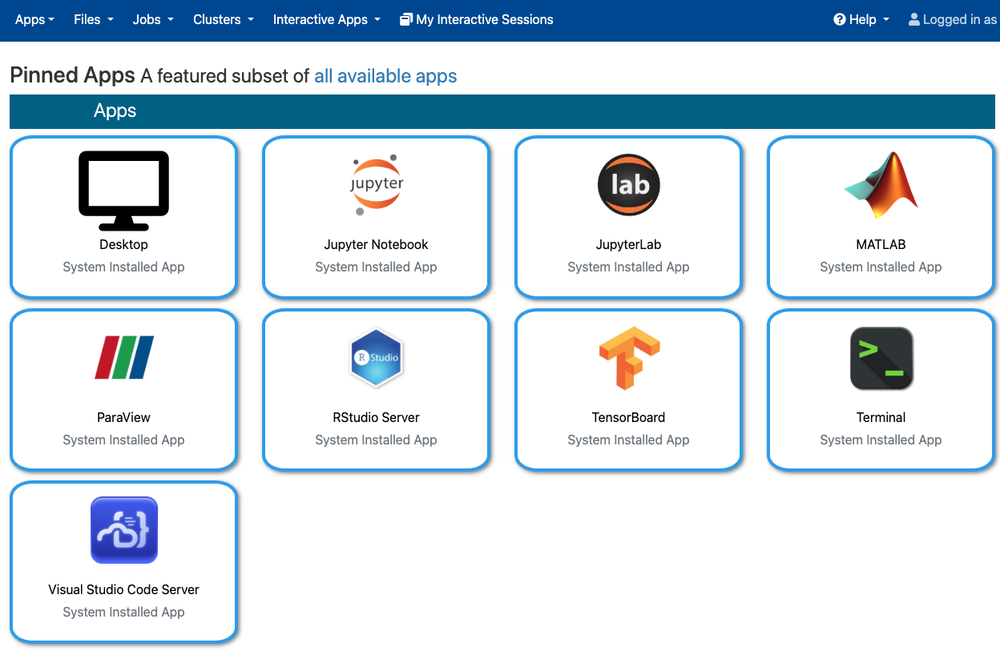
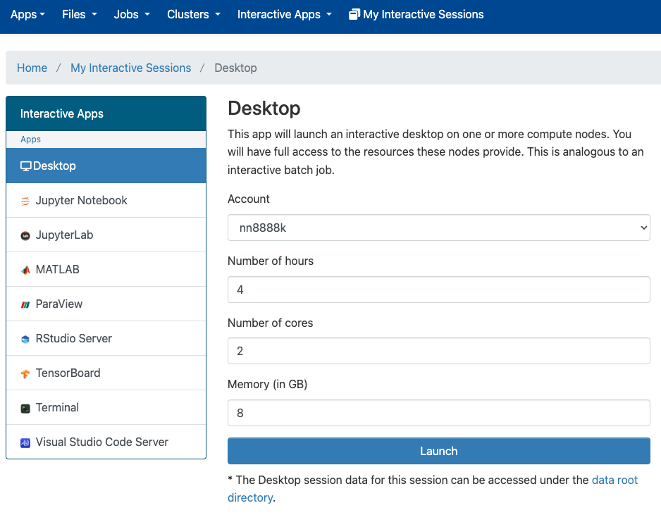
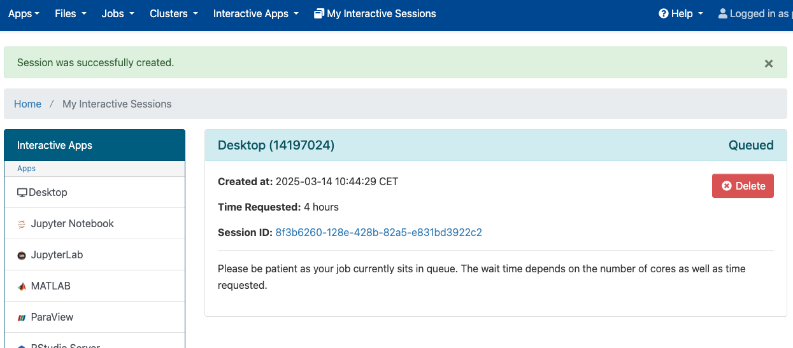
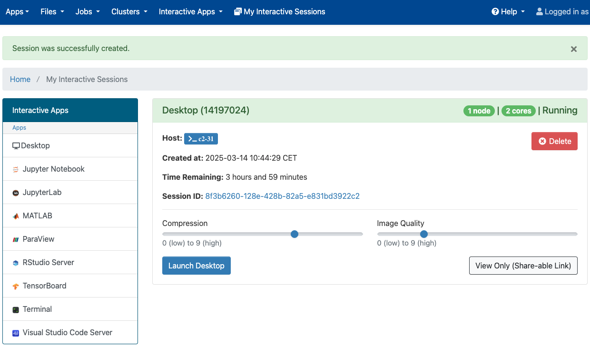
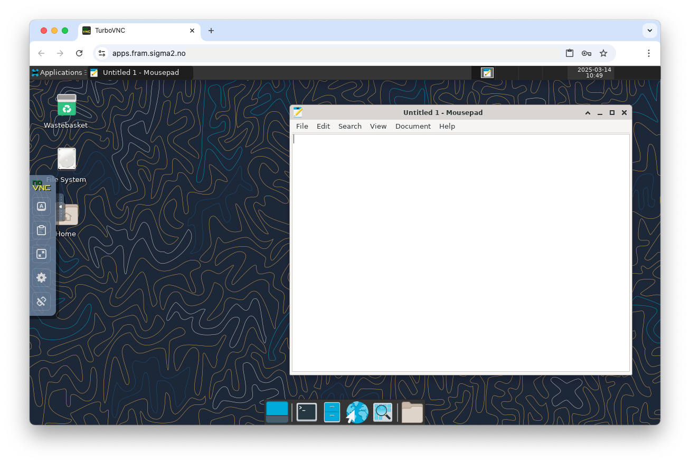

(ood)=

# Open OnDemand

```{contents} Table of Contents
```

## Introduction

Open OnDemand is a web interface to HPC cluster. Open OnDemand service makes it possible to run graphical and web applications on all NRIS machines over the network.

Short video introduction: <https://www.youtube.com/watch?v=uXKV-0UH39Q>

## Login

Open OnDemand has dedicated links for each HPC cluster:

* <https://apps.betzy.sigma2.no>
* <https://apps.fram.sigma2.no>
* <https://apps.saga.sigma2.no>

Use your HPC username and password:


## Applications

All applications are starting as Slurm jobs on compute nodes.

Currently (Apr. 2025) available applications via Open OnDemand web page:

* Desktop
* Jupyter Notebook
* JupyterLab
* MATLAB
* ParaView
* RStudio Server
* TensorBoard
* Terminal
* Visual Studio Code Server



## Launch application

This is example to launch Desktop application:



Select your account. How long you will run this application. How many CPU cores and memory your job needs.

Press Launch button.

Job will wait in the queue for available resources:



Status will change to Running:



It is possible to adjust Compression and Image Quality level to make application more responsive on a slow Internet connection.

Press Launch Desktop



Desktop started on compute node. Left side panel is available for additional functionality like Clipboard.