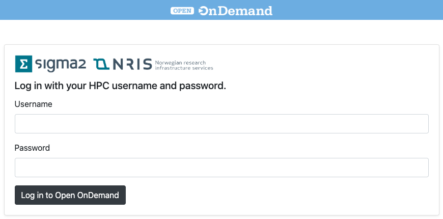

(ood)=

# Open OnDemand

```{contents} Table of Contents
```

## Introduction

Open OnDemand is a web interface to HPC cluster. Open OnDemand service makes it possible to run graphical and web applications on all NRIS machines over the network. 

## Login

Open OnDemand has dedicated links for each HPC cluster:

* <https://apps.betzy.sigma2.no>
* <https://apps.fram.sigma2.no>
* <https://apps.saga.sigma2.no>

Use your HPC user name and password:



## Applications

Currently (Apr. 2025) available application via Open OnDemand web page.

* Desktop
* Jupyter Notebook
* JupyterLab
* MATLAB
* ParaView
* RStudio Server
* TensorBoard
* Terminal
* Visual Studio Code Server
