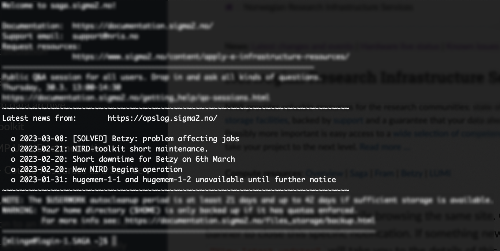
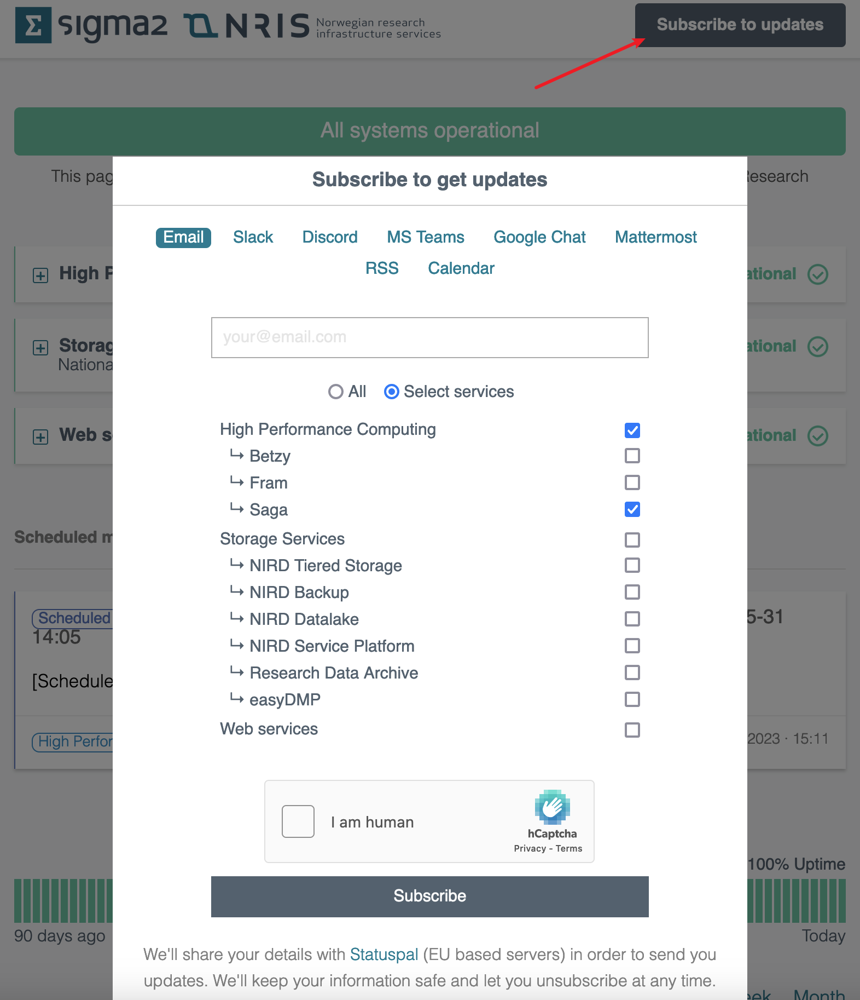

(using-opslog)=

# Using the status system (opslog)

```{note}
The contents of this page is valid from 20 March 2023.  
It is available to give insight in the new system.
```

```{contents} Table of Contents
```

Opslog is our status system to keep you informed about events on our infrastructure.
There you will find posts and updates regarding maintenance, incidents and general changes you should know about.
We have integrated the system with our other services to push information more actively as well - more on this below.

## Where to find it?

The main page is accessible on [https://opslog.sigma2.no](https://opslog.sigma2.no). This is the best place to get a quick overview of the overall status.

### Interacting with groups in the web frontend
Services are divided into groups. These are collapsed by default to save space and make the site cleaner, **unless** there are ongoing events. In such case the relevant group will be expanded.  

You can expand or collapse these groups yourself by clicking on the boxes to the left of group names.


### Details about events

When we have an active event, you can see it below the groups as a card. It gives a brief overview of the details such as severity, system(s) affected, timestamp, status and last update. 


Clicking on this card opens the full details of this specific event with a timeline of updates.


### Banner on our websites

You may also see a pop up while browsing our websites (like this one!) when there is an ongoing incident or maintenance.
Incidents will always have priority in case there is ongoing maintenance at the same time.


These banners follows you while browsing the same site. Click the X in the top right corner of the banner to close this specific notification. If something new is posted, it will appear again.
Clicking `"View latest updates"` will take you to the details of this event on the status page itself.

### Latest events in MOTD in the terminal

We are integrating with Message Of The Day (MOTD) on our systems so that you can get a quick update on what is going on when logging in via the terminal.

Upcoming maintenance on the specific system you are logging in to will also be displayed.



## Subscribing to get active notifications

You are in control when it comes to active notifications from this system.  
We offer a broad variety of platforms where you can subscribe to receive notifications when something is posted or updated.

Subscribing is quickly done by [going to the frontend ](https://opslog.sigma2.no) and clicking "Subscribe to updates". From here you can choose the platform(s) you want notifications on, and multiselect the applicable system(s) you want notifications for.

In the example below we are subscribing to the HPC machine Saga only on e-mail. If you want notifications for _everything_, simply select "All" instead of "Select services".



There will be a link in the footer of every e-mail to unsubscribe or change preferences. Other platforms (like Slack as an example) require you to remove the integration and set it up from scratch.

### Types of notifications

When subscribing, you will be notified about:
* New incidents
* Upcoming maintenance (14 days before the start date)
* Maintenance is started
* Maintenance is completed
* Any updated added to incidents and maintenances.