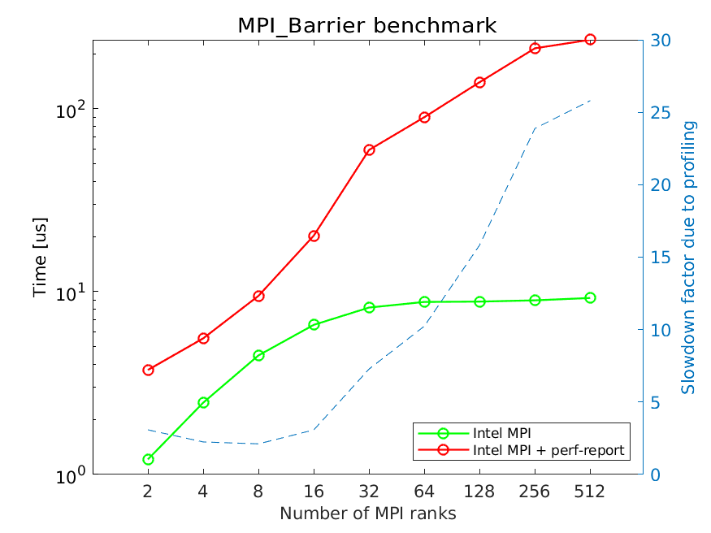

# Quantifying the profiling overhead

As most performance evaluation tools, Arm Performance Reports work by
sampling the running code to obtain statistical information about what
the code is doing. The sampling activity does introduce
overheads, which can affect the performance of the inspected
code. This may be an important aspect, which the users must be aware
of when using any performance evaluation tool. The overhead is problem
specific, as demonstrated by the example analyses: from little to no
overhead ([STREAM benchmark](stream.md), [LINPACK
benchmark](linpack.md)) to factor 26 slowdown
([OSU benchmark](osu.md)).

To understand how ARM Performance Reports affects the MPI performance
we investigate the performance of `osu_barrier` with and without
profiling on up to 512 cores and 32 compute nodes (maximum 16 ranks
per compute node). The following figure shows the run time in
micro-seconds (us) of a single `MPI_Barrier` call for profiled and
non-profiled runs.

For up to 32 ranks each compute node runs only a single MPI rank. After
that, multiple MPI ranks are started on each compute node. The figure
demonstrates that the profiling overhead grows significantly with
increasing number of MPI ranks, while the cost of the barrier depends
mostly on the number of compute nodes and remains roughly constant
for more than 32 MPI ranks. The profiling overhead is smallest with
up to 16 MPI ranks, and grows significantly from that point on.

While `MPI_Barrier` is a very important and often used collective, it
is latency limited (no user data is sent, nor received). The following
figure analyzes profiled and non-profiled performance of
`osu_alltoall`.

For smallest message sizes the overhead is significant (factor
5-6). However, for 8KB and larger messages the overhead is essentially
gone. This is because for small message sizes the time required to
transfer a message is comparable or lower than the data collection
time used by the profiler. As messages grow, the actual data transfer
becomes much more time consuming. Hence, depending on the application
and the specifics of the MPI communication, profiling will, or will not
influence the application runtime.
