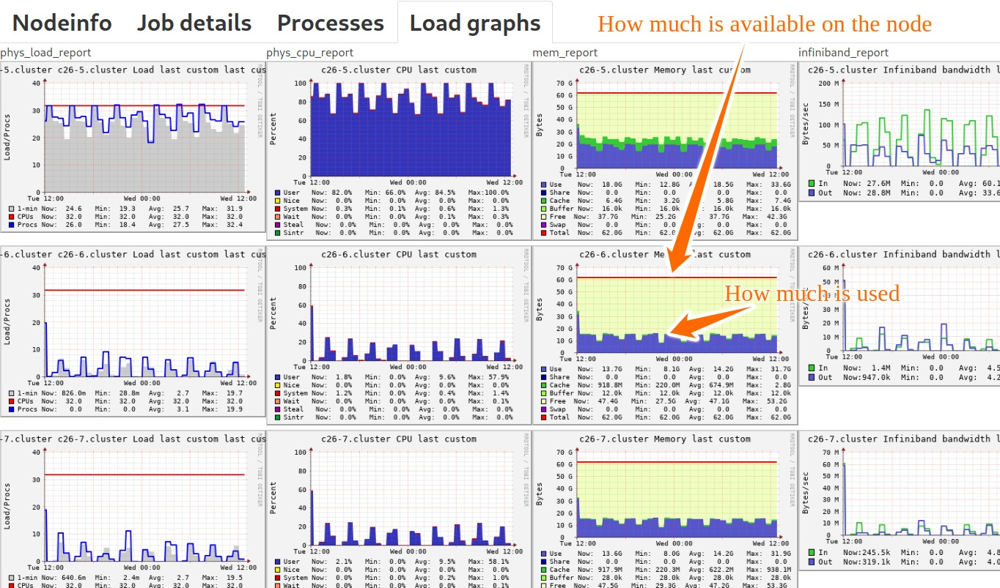

# How to choose the right amount of memory

```{warning}
**Do not ask for a lot more memory than you need**

A job that asks for many CPUs but little memory will be billed
for its number of CPUs, while a job that asks for a lot of memory but
few CPUs, will be billed for its memory requirement.

If you ask for a lot more memory than you need, you might be surprised
that your job will bill your project a lot more than you expected.

If you ask for a lot more memory than you need, your job may queue much
longer than it would asking for less memory.
```

- [Why it matters](#why-it-matters)
- [How to find out how much memory you need](#how-to-find-out-how-much-memory-you-need)
   - [By using the Slurm browser](#by-using-the-slurm-browser)
   - [By checking the Slurm output generated with your job](#by-checking-the-slurm-output-generated-with-your-job)
   - [By using sacct](#by-using-sacct)
   - [By prepending your binary with time](#by-prepending-your-binary-with-time)
   - [By using Arm Performance Reports](#by-using-arm-performance-reports)
   - [By reducing the memory parameter until a job fails](#by-reducing-the-memory-parameter-until-a-job-fails)


## Why it matters

Please read the above box, please share this with your colleagues and students.
A significant portion of resources risks to be wasted if you ask for too much memory.

This is because memory and CPU are not completely independent. If I ask for too
much memory, I also block the compute resources which carry that memory
resource at the same time.

A too generous "better safe than sorry" approach to memory allocation leads to these problems:
- Your compute account gets charged too much (problem for you and your
  allocation group, as well as for the tax payer financing these compute
  resources)
- Other users have to wait longer with their jobs (problem for us and for other users)
- Your jobs may queue much longer (problem for you)

It is important to make sure that your jobs use the right amount of memory and
the right number of CPUs in order to help you and others using the HPC machines
utilize these resources more efficiently, and in turn get work done more
speedily.

We recommend users to run a test job before submitting many similar runs to the queue system
and find out how much memory is used (see below for examples on how to do that).
Once you know, add perhaps 20% extra memory (and runtime) for the job compared to what
your representative test case needed.

Remember to check the [Slurm documentation](https://slurm.schedmd.com/squeue.html#lbAG),
[job types](choosing_job_types.md),
[queue system concepts](submitting/queue_system_concepts.md),
and [HPC machines](/hpc_machines/hardware_overview.md)
to verify that you are submitting the right job to the right partition and
right hardware.

Speaking of right partition, one way to get more memory if a node is not enough
is to spread the job over several nodes by asking for more cores than needed. But this comes
at the price of paying for more resources, queuing longer, and again blocking others.
A good alternative is often to get access to "highmem" nodes which are designed for jobs
with high memory demand.


## How to find out how much memory you need


### By using the Slurm browser

This only works for a currently running job.

Log into one of the available Slurm browsers [here](monitoring.md).
You need to be on the university network to reach these. Use a VPN solution
(check with your university for details on how to connect using VPN) if you
would like to access these from home or outside.

Once connected, you can have a look at all currently running jobs. There is a
lot of interesting data but here we focus on the memory part.

In this example you can see that the node has a bit above 60 GB memory and the
job consumes about half at the beginning of the run and later oscillates
consuming around a third of the available memory.




### By checking the Slurm output generated with your job

Slurm generates an output for each job you run. For instance job number `999107`
generated output `slurm-999107.out`.

This output contains the following:
```
Task and CPU usage stats:
       JobID    JobName  AllocCPUS   NTasks     MinCPU MinCPUTask     AveCPU    Elapsed ExitCode
------------ ---------- ---------- -------- ---------- ---------- ---------- ---------- --------
999107         mem-size          1                                             00:00:32      0:0
999107.batch      batch          1        1   00:00:00          0   00:00:00   00:00:32      0:0
999107.exte+     extern          1        1   00:00:00          0   00:00:00   00:00:32      0:0

Memory usage stats:
       JobID     MaxRSS MaxRSSTask     AveRSS MaxPages   MaxPagesTask   AvePages
------------ ---------- ---------- ---------- -------- -------------- ----------
999107
999107.batch   1562896K          0   1562896K        1              0          1
999107.exte+          0          0          0        0              0          0

Disk usage stats:
       JobID  MaxDiskRead MaxDiskReadTask    AveDiskRead MaxDiskWrite MaxDiskWriteTask   AveDiskWrite
------------ ------------ --------------- -------------- ------------ ---------------- --------------
999107
999107.batch        0.13M               0          0.13M        0.00M                0          0.00M
999107.exte+        0.00M               0          0.00M            0                0              0
```

From this (see below `Memory usage stats`) we can find out that the job needed
`1562896K` memory (1562896 KB), so around 1.5 GB.

Note that Slurm samples the memory every 30 seconds. This means that if your
job is shorter than 30 seconds, it will show that your calculation consumed
zero memory which is probably wrong.  The sampling rate also means that if your
job contains short peaks of high memory consumption, the sampling may
completely miss these.


### By using sacct

This creates a short version of the above.

As an example, I want to know this for my job which had the number `999107`:
```
$ sacct -j 999107 --format=MaxRSS

    MaxRSS
----------

  1562896K
         0
```

From this I see that the job needed
`1562896K` memory (1562896 KB), so around 1.5 GB.


### By prepending your binary with time

In your job script instead of running `./mybinary` directly, prepend it with `/usr/bin/time -v`:
```
# ... rest of the job script

/usr/bin/time -v ./mybinary
```

Then in the Slurm output we find:
```
Command being timed: "./mybinary"
User time (seconds): 0.18
System time (seconds): 0.34
Percent of CPU this job got: 1%
Elapsed (wall clock) time (h:mm:ss or m:ss): 0:31.54
Average shared text size (kbytes): 0
Average unshared data size (kbytes): 0
Average stack size (kbytes): 0
Average total size (kbytes): 0
Maximum resident set size (kbytes): 1563320
Average resident set size (kbytes): 0
Major (requiring I/O) page faults: 9
Minor (reclaiming a frame) page faults: 1525
Voluntary context switches: 25
Involuntary context switches: 2
Swaps: 0
File system inputs: 1553
File system outputs: 0
Socket messages sent: 0
Socket messages received: 0
Signals delivered: 0
Page size (bytes): 4096
Exit status: 0
```

The relevant information in this context is `Maximum resident set size (kbytes)`.


### By using Arm Performance Reports

You can profile your job using [Arm Performance Reports](performance.md).

This generates a HTML and text summary. These reports contain lots of
interesting information. Here showing the relevant part of the text report for
the memory:
```
Memory:
Per-process memory usage may also affect scaling:
Mean process memory usage:                    72.4 MiB
Peak process memory usage:                    74.6 MiB
Peak node memory usage:                       9.0% ||
```


### By reducing the memory parameter until a job fails

This is not an elegant approach but can be an OK approach to calibrate one
script before submitting 300 similar jobs.

What you can do is to start with a generous memory setting:
```
#SBATCH --mem-per-cpu=4000M
```

And gradually reduce it until your job fails with `oom-kill` ("oom" is short for "out of memory"):
```
slurm_script: line 11: 33333 Killed ./mybinary
slurmstepd: error: Detected 1 oom-kill event(s) in step 997857.batch cgroup.
Some of your processes may have been killed by the cgroup out-of-memory
handler.
```

Then you also know. But there are more elegant ways to find this out (see
options above).
