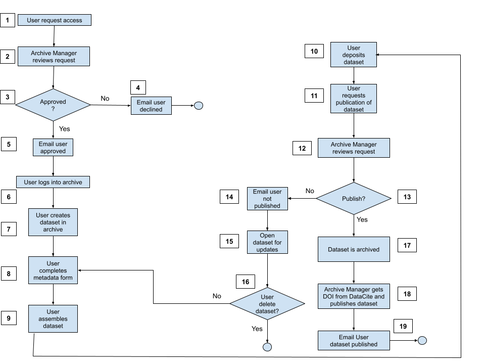

:orphan:
(nird-rda-ingest-and-archive-workflow)=

# The NIRD RDA Ingest and Archive Workflow

Figure 1: High-level view of the ingest and archive workflow.

The figure shows the high-level workflow a user follows in order to have a dataset published in
the NIRD RDA. A more detailed description of the ingest, archive and access processes is
covered in the [Preservation Plan](https://www.sigma2.no/nird-research-data-archive-preservation-plan).

1. A new user needs to submit a request through the archive web form to request access to the archive.
2. The Archive Manager reviews the request to make sure the user is from a Norwegian institution and is using an institution email address. The Archive Manager may contact the user for further information.
3. The Archive Manager either approves or rejects the request.
4. If the request is rejected, an email is sent to the user informing them that the request has been declined.
5. If the request is approved, an email is sent to the user informing them that the request has been successful.
6. The user can then log into the NIRD RDA.
7. The user can create a new dataset through the web interface form supplying the required metadata and is requested to agree to the [Terms Of Use](https://www.sigma2.no/nird-research-data-archive-terms-use) and  [Depositor Agreement](https://www.sigma2.no/nird-research-data-archive-depositor-agreement).
8. After agreement to the Terms of Use and Depositor Agreement, the user can proceed further and make sure all the supplied information is correct.
9. The user then assembles the dataset. This step happens outside of the NIRD RDA and entails the user making sure that the data are in an [open format](https://opendataformats.org), the right data are selected for archiving (check with domain or project expert), the data have a README describing how to use the dataset and that the data abide by the [Terms Of Use](https://www.sigma2.no/nird-research-data-archive-terms-use) and  [Depositor Agreement](https://www.sigma2.no/nird-research-data-archive-depositor-agreement).
10. Once the user has assembled the dataset, the user deposits the dataset: either via the web interface, or from a project in the NIRD project area (NIRD Data Peak and/or NIRD Data Lake), or via a Command Line Interface. In the case of errors uploading the dataset, the user can contact the Archive Manager to help to correct the error.
11. After the dataset has been successfully uploaded, the user checks that the metadata describes the dataset and all the fields (mandatory and optional) have been completed and then submits a request to publish the dataset.
12. The Archive Manager reviews the dataset, by checking all the metadata has been supplied, the dataset formats are open and the Data Manager approves the dataset to be published.
13. The Archive Manager then decides whether to publish the dataset.
14. If the Archive Manager declines the request to publish, an email is sent to the user.
15. The dataset is then opened for editing by the user.
16. The user can either delete the dataset in case the dataset has mistakenly been archived, or the dataset does not meet the criteria for publication. If the user decides to correct the issues indicated by the Archive Manager and follows step (8) and onwards.
17. If the Archive Manager decides to publish the dataset, the dataset is moved to the r archive publication area which is thereafter replicated to additional storage.
18. The Archive Manager uses the NIRD RDA to request the DOI from DataCite and attaches it to the dataset.
19. An email is sent to the user notifying that the dataset has been published.
