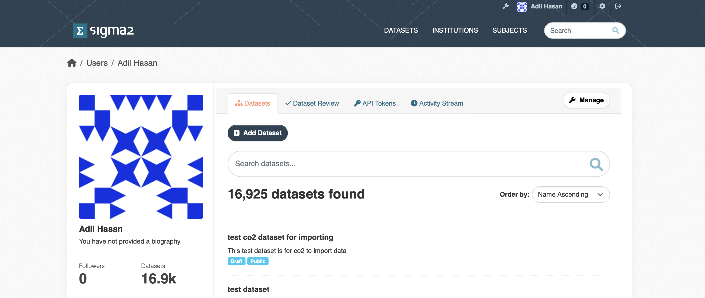

# The NIRD RDA API
The NIRD RDA is based on CKAN that has a rich API allowing you to create datasets programmatically.
To use the API you first need an account in the archive. Once you have an account, you can create an API token by clicking on your username at the top-right of your browser window. This should open your account dashboard (see Figure 1). 



Figure 1: Screenshot of the User dashboard.

Click on the `API Tokens` field and type in a name for your API token in the `Name` field and click on the `CREATE API TOKEN` button.

**Note: You will need to make a copy of your token somewhere safe as there is no way to recover your token if you navigate away from this page**.

Throughout this document the variable `$CKAN_API_ROOT` refers to the archive API URL:
```
https://data.archive.sigma2.no/api/3/action
```
and your CKAN API token will be represented by the variable `$CKAN_TOKEN`.

## Creating a dataset
To create a dataset, you will need to use the `$CKAN_API_ROOT/package_create` end-point. You will need to use your `$CKAN_TOKEN` and will need to provide a JSON document file containing the metadata describing your dataset. The [metadata schema](#metadata-schema) section describes the list of metadata you can provide. Only the mandatory metadata terms must be defined in your JSON document, the other terms are optional. An example using the curl command creates a dataset with the metadata supplied in the `my_dataset.json` JSON document:

```
curl -H "Authorization: $CKAN_TOKEN" -H "Content-Type: application/json" -X POST --data my_dataset.json "$CKAN_API_ROOT/package_create"
```

The NIRD RDA will create the dataset and return to you a JSON document containing the result of the action. If the `status=success` you should see a `result` object containing the metadata you provided to create the dataset (i.e. the metadata contained in the `my_dataset.json` JSON document file) as well as the unique identifier assigned to the dataset (you should see it in the value for the `id` term). 

If the `status=failure` you should see reason the dataset creation failed. A common error is the dataset `name` (see the [metadata schema section](#metadata-schema) below) is not unique and is already used by an existing dataset. 


## Updating the metadata of a dataset
Once you have created a dataset (either via the API, or via the web interface) you can update the existing metadata, or add new metadata to the dataset. To do this, you will need to use the `$CKAN_API_ROOT/package_patch` end-point. You will need to use your `$CKAN_TOKEN` to update the dataset. You will need to supply a JSON document that contains the `id` term (see the [metadata schema](#metadata-schema)) which is the dataset unique identifier that is used by the API to identify your dataset.

The following example will update the `notes` metadata term for the dataset with identifier `12345678-aaaa-bbbb-cccc-123456789012`

```
curl  -X POST -H "Authorization: $CKAN_TOKEN" -H "Content-Type: application/json" -d '{"id": "12345678-aaaa-bbbb-cccc-123456789012", "notes": "This is an updated description for my dataset"}' "$CKAN_API_ROOT/package_patch"
```

The result returned to you will be a JSON document containing result of the update (i.e. `status=success` or `status=failure`) and the dataset metadata including your updates.

**Note: The existing value of the metadata term in the archive will be replaced by the value you supply in the JSON document.** This is important to remember when updating the list of creators. For example, if you wish to change the order of the list of creators, or add a new creator, you will need to supply the all the creators (even if you added them before). 

(metadata-schema)=
## Metadata schema
The following table contains the list of metadata terms that you can set or update.


| **Term**               | **Type**               |   **Multiplicity**   | **Mandatory** | **Description** |
|------------------------|------------------------|----------------------|---------------|-----------------|
| **access_rights**      | `String`               | 1                    | Y             | The access rights for the dataset in a controlled vocabulary file given below. |
| **conforms_to**        | `String`               | 1                    | N             | The standard or specification that the dataset conforms to.|
| **contact_points**     | `Person`, `Organisation`| 1...n                | N             | Contact information for people that will be able to answer questions about the dataset. See the **Person** or **Organisation** table below for details on the `Person` or `Organisation` object respectively. |
| **contributors**       | `Person`               | 1...n                | N             | The contributors to the dataset (i.e. people that helped to assemble the dataset). Note: **Contributors do not appear in the citation for the dataset**.  See the **Person** table below for details on the `Person` object.|
| **creators**           | `Person`, `Organisation` | 1...n                | Y             | The creators or authors of the dataset. See the **Person** or **Organisation** tables below for details on the `Person` or `Organisation` object. Note: **Only creators appear in the citation for the dataset**. |
| **dataset_owner**      | `DatasetOwner`                 | 1...n                | N             | The organisation that owns the dataset. See the **DatasetOwner** table below for details on the `DatasetOwner` object.|
| **dataset_status**     | `String`                 | 1                    | N             | The controlled vocabulary for the current status of the dataset. |
| **embargoed_until**    | `String`                 | 1                    | N             | The date until which the dataset is embargoed, in ISO 8601 format. Note: **This term is only necessary for datasets when the **access_rights** term has the value `embargoed`.|
| **groups**             | `Subject`                | 1...n                | Y             | Used to define the subject for the dataset. See the **Subject** table below for details on the `Subject`.|
| **id**                 | `String`                 | 1                    | Y\*            | The unique identifier for the dataset. This identifier is needed for updating datasets and not for creating datasets. |
| **language**           | `String`                 | 1                    | Y             | Controlled vocabulary for the language of the dataset.|
| **license_id**         | `String`                 | 1                    | Y             | The ID of the license under which the dataset is published.|
| **name**               | `String`                 | 1                    | Y             | The unique identifier for the dataset (this is used in the URL path to the dataset).|
| **notes**              | `String`                 | 1                    | Y             | A description of the dataset, detailing its purpose or contents.|
| **project**            | `String`                 | 1...n                | N             | A list of projects related to the dataset.|
| **provenance**         | `String`                 | 1                    | N             | The provenance or history of the dataset in a JSON format.|
| **related_resources**  | `RelatedResource`       | 1...n                | N             | A list of related resources, see the table **Related Resources** below for details on the `RelatedResource` type. |
| **source**             | `String`                 | 1...n                | N             | The original source of the dataset, typically a URL or reference.|
| **spatial**            | `Spatial`                | 1                    | N             | Term describing the geographical coverage of the dataset (e.g., bounding box). See the **Spatial** table for information on the `Spatial` object.|
| **state**              | `String`                 | 1                    | Y             | Dataset state. A dataset must be initially created, or updated with the state `draft`. |
| **tags**               | `Keyword`                | 1...n                | N             | A keyword or keywords that help to describe the dataset. See the **Keyword** table for information on the `Keyword` object.|
| **temporal**           | `Temporal`               | 1                    | N             | Term describing the temporal coverage of the dataset. See the **Temporal** table for information on the `Temporal` object.|
| **theme**              | `Theme`                  | 1...n                | Y             | A theme or themes that help to describe the dataset. See the **Theme** table for information on the `Theme` object.|
| **title**              | `String`                 | 1                    | Y             |The title of the dataset. |
| **version_notes**      | `String`                 | 1                    | Y             | Notes describing any version changes or updates to the dataset.|

### Controlled vocabularies for basic terms
The controlled vocabularies for the basic terms can be found in the following JSON files:

- `access_rights` controlled vocabulary can be found in the [access_rights.json](./metadata_controlled_vocabs/access_rights.json) JSON file.
- `dataset_status` controlled vocabulary can be found in the [dataset_status.json](./metadata_controlled_vocabs/dataset_status.json) JSON file.
- `language` controlled vocabulary can be found in the [languages.json](./metadata_controlled_vocabs/languages.json) JSON file.
- `license_id` the endpoint `$CKAN_API_ROOT/license_list` returns a list of license metadata objects. Each object contains an `id` whose value is the `license_id`.

### The DatasetOwner schema
The schema for the `DatasetOwner` is defined in the following table.

| **Term**               | **Type**               |   **Multiplicity**   | **Mandatory** | **Description** |
|------------------------|------------------------|----------------------|---------------|-----------------|
| **organisation**       | `String`               | 1                    | Y             | The ROR identifier for the organisation. The ROR identifier should come from a controlled vocabulary (see below). |

#### Accessing the controlled vocabulary
The list of institutions known to the archive can be accessed using the `$CKAN_API_ROOT/group_list` endpoint and supplying the `type=institution` parameter:

```
curl "$CKAN_API_ROOT/group_list?type=institution".
```


The endpoint will return a list of Research Organization Registry (ROR) identifiers. To get the institution metadata for a given ROR `ror` identifier, use the endpoint `$CKAN_API_ROOT/group_show?id=ror`. 
The institution metadata will also include the name of the institution. 

### The Keyword schema
A keyword consists of two components, a **tag_string** list of tag strings and a **tags** list of tag objects. The **tag_string** must be a list of tag names only. You can create new tags or use a pre-defined tag.

| **Term**               | **Type**               |   **Multiplicity**   | **Mandatory** | **Description** |
|------------------------|------------------------|----------------------|---------------|-----------------|
| **tag_string**         | `String`               | 1...n                | Y             | The name of the tag |
| **tags**               | `Tag`                  | 1...n                | Y             | The tag object which is defined in the table below.|

#### The Tag schema

The schema for the `Tag` type is defined in the table below.

| **Term**               | **Type**               |   **Multiplicity**   | **Mandatory** | **Description** |
|------------------------|------------------------|----------------------|---------------|-----------------|
| **name**               | `String`               | 1                    | Y             | The name of the tag. |

#### Finding and using pre-defined tags
To get all existing tags defined in the archive, you can use the API end-point `$CKAN_API_ROOT/tag_list` which will return a JSON document containing the list of tags that are already defined. If you wish to search for a particular tag you can use the end-point `$CKAN_API_ROOT/tag_search?query=<name>` where `<name>` is the full or partial name of the tag you are interested in.

To find out the name of the tag and the tag object to supply as metadata for your dataset, take the value of the `name` term (`<name>`) for the tag you are interested in and pass it to the end-point `$CKAN_API_ROOT/tag_show?id=<name>`. This will return a JSON document for the metadata for the tag you are interested in. The value of the `display_name` term corresponds to an element of the `tag_string` list and the value of the `name` term corresponds to the value of the `name` in a `Tag` object.
For example

```
curl "$CKAN_API_ROOT/tag_show?id=KF_07_08"

{"help": "$CKAN_API_ROOT/help_show?name=tag_show", "success": true, "result": {"id": "0c101fd2-9a2e-44c1-aa9b-f67664d30b82", "name": "KF_07_08", "vocabulary_id": null, "title": null, "url": null, "display_name": "KF_07_08"}}.
```

If the tag you are interested in has a spaces (e.g. `gas bubble disease`) you need to replace the spaces with `+` signs when adding the term to the `$CKAN_API_ROOT/tag_show` end-point. For example,

```
curl "$CKAN_API_ROOT/tag_show?id=gas+bubble+disease"
```

To add the tag `KF_07_08` to our dataset we would use the `$CKAN_API_ROOT/package_patch` endpoint and a JSON document:

```
curl -X POST -H "Authorization: $CKAN_TOKEN" -H "Content-Type: application/json" -d '{"id": "12345678-aaaa-bbbb-cccc-123456789012", "tag_string":["KF_07_08"], "tags":[{"name":"KF_07_08"}]}' "$CKAN_API_ROOT/package_patch"
```

For new tags that do not exist, you only need to supply the new tags in the form given in the above `$CKAN_API_ROOT/package_patch` example.

### The Organisation schema
The `organisation` type is defined in the following table. 

| **Term**               | **Type**               |   **Multiplicity**   | **Mandatory** | **Description** |
|------------------------|------------------------|----------------------|---------------|-----------------|
| **acronym**            | `String`               | 1                    | N             | The acronym for the organisation. |
| **contact_email**      | `String`               | 1                    | Y             | The email address for the contact. person in the organisation. The email address should follow the IETF RFC 5322 standard. |
| **homepage_url**       | `String`               | 1                    | Y             | The URL for the organisation home page. The URL should follow the IETF RFC 3986 standard. |
| **name**               | `String`               | 1                    | Y             | The name of the organisation. |
| **ror**                | `String`               | 1                    | N             | The Research Organisation Registry (ROR) identifier for the organisation. These can be found, if they exist, on https://ror.org |
| **type** (**creators** or **contact_points** only)              | `String`               | 1                    | Y             | This term is only valid for the **creators** and **contact_points** terms and is the type of **creators** or **contact_points** and, in this case should have value `person`. |

### The Person schema
The `Person` type is defined by the following schema. Note that the type term is overloaded and has a different meaning depending on the higher-level term.

| **Term**               | **Type**               |   **Multiplicity**   | **Mandatory** | **Description** |
|------------------------|------------------------|----------------------|---------------|-----------------|
| **email**              | `String`               | 1                    | Y             | The email address of a the user. The email address should follow the IETF RFC 5322 standard. |
| **first_name**         | `String`               | 1                    | Y             | The first name of a person, can also include the initial or full middle name |
| **last_name**          | `String`               | 1                    | Y             | The last name of a person |
| **orcid**              | `String`               | 1                    | N             | The ORCID identifier for the user. |
| **organisation**       | `String`               | 1                    | Y             | The name of the organisation a user belongs to. The name can be chosen from the list of existing organisations, or a new one can be given. |
| **type** (**contributors** term only)              | `String`               | 1                    | N             | This term is only valid for **contributors** terms and is the type of contributor. |
| **type** (**creators** or **contact_points** only)              | `String`               | 1                    | Y             | This term is only valid for the **creators** and **contact_points** terms and is the type of **creators** or **contact_points** and, in this case should have value `organisation`. |

#### Finding the type for the Contributor
The list of valid types of contributor can be found in the [contributor_types.json](./metadata_controlled_vocabs/contributor_types.json) JSON file.

### The RelatedResources schema
The `RelatedResource` type is defined by the following schema.

| **Term**               | **Type**               |   **Multiplicity**   | **Mandatory** | **Description** |
|------------------------|------------------------|----------------------|---------------|-----------------|
| **type**               | `String`               |  1                   | Y             | A controlled vocabulary containing the accepted type of resource.                |
| **url**                | `String`               | 1                    | Y             | The URL for the related resource. The URL should follow the IETF RFC 3986 standard. |

#### Finding the releated resource type
The controlled vocabulary for the related resource `type` term is in the [related_resources_type.json](./metadata_controlled_vocabs/related_resources_type.json) JSON file.

### The Spatial schema
The **spatial** schema supports two types: bounding box and Well Known Text (WKT https://en.wikipedia.org/wiki/Well-known_text_representation_of_geometry).

| **Term**               | **Type**               |   **Multiplicity**   | **Mandatory** | **Description** |
|------------------------|------------------------|----------------------|---------------|-----------------|
| **spatial_type**       | `String`               | 1                    | Y             | The controlled vocabulary for the type of spatial description |
| **value**              | `BBOX`, `WKT`          | 1                    | Y             | The value for the spatial term. The schema for the `BBOX` and `WKT` types are given in the subsections below. |

#### Finding the spatial type
The controlled vocabulary for the `spatial_type` is in the [spatial_type.json](./metadata_controlled_vocabs/spatial_type.json) JSON file. 

#### The BBOX schema
The `BBOX` type should be a list of coordinates (floats or ints) with the following convention:

```
[Northern-most latitude, Southern-most latitude, Eastern-most latitude, Western-most latitude]
```

#### The WKT schema
The `WKT` type should be a `String` following the WKT convention (see https://en.wikipedia.org/wiki/Well-known_text_representation_of_geometry). An example is the 2-D polygon with 4 corners, each having the x-y coordinates:
`(30, 10), (40, 40), (20, 40), (10, 20)`, this can be represented in WKT with the string:
```
POLYGON ((30 10, 40 40, 20 40, 10 20, 30 10))
```

### The Subject schema
The **subject** term is defined in terms of the **groups** term.

| **Term**               | **Type**               |   **Multiplicity**   | **Mandatory** | **Description** |
|------------------------|------------------------|----------------------|---------------|-----------------|
| **groups**             | `Group`                | 1...n                | Y             | The group object which is used to define the subject. The schema for the `Group` type is given in the schema below. |

#### The Group schema

The schema for the `Group` type is defined in the following table.

| **Term**               | **Type**               |   **Multiplicity**   | **Mandatory** | **Description** |
|------------------------|------------------------|----------------------|---------------|-----------------|
| **name**               | `String`               | 1                    | Y             | The subject name comes from a controlled vocabulary. |
| **type**               | `String`               | 1                    | Y             | The type of group term. The value should always be `subject` for subjects.|

#### Finding the subject name
The list of subjects known to the archive can be accessed using the `$CKAN_API_ROOT/group_list` endpoint and supplying the `type=subject` parameter:

```
curl "$CKAN_API_ROOT/group_list?type=subject"
```

which will return a JSON document containing the list of subject names that you can use as a value for the `Group` `name`.

### The Temporal schema
The schema for the temporal coverage term is defined in the table below.

| **Term**               | **Type**               |   **Multiplicity**   | **Mandatory** | **Description** |
|------------------------|------------------------|----------------------|---------------|-----------------|
| **end**                | `String`               | 1                    | Y             | The end date of the temporal coverage. The date string should follow the standard ISO 8641 standard. |
| **start**              | `String`               | 1                    | Y             | The start date of the temporal coverage. The date string should follow the standard ISO 8641 standard. |


### The Theme schema

The schema for the theme is given in the table below.

| **Term**               | **Type**               |   **Multiplicity**   | **Mandatory** | **Description** |
|------------------------|------------------------|----------------------|---------------|-----------------|
| **name**               | `String`               | 1                    | Y             | The name of the term from the theme. The name is a controlled vocabulary and must belong to one of the existing themes.|
| **vocabulary_id**      | `String`               | 1                    | Y             | The identifier for the theme. |

#### Finding the theme name and vocabulary_id
The endpoint `$CKAN_API_ROOT/vocabulary_list` will return a list of vocabulary objects, each with a name and identifier, the `id` of the vocabulary you wish to use is the `vocabulary_id`. To find the list of terms (`tags`) for a theme with `vocabulary_id` `vocab_id`, use the endpoint `$CKAN_API_ROOT/vocabulary_show?id=vocab_id`. For the `name` of the tag object in the list of tags is the `Theme` `name`.

For example, the theme metadata for the tag or keyword with the `name` `Transport networks` in the `GEMET` theme should be (assuming the `vocabulary_id` is `8f395a7a-497c-4e62-902a-44365784ab12` for the `GEMET` theme):

```
"theme": [{"name": "Transport networks", "vocabulary_id": "8f395a7a-497c-4e62-902a-44365784ab12"}].
```
