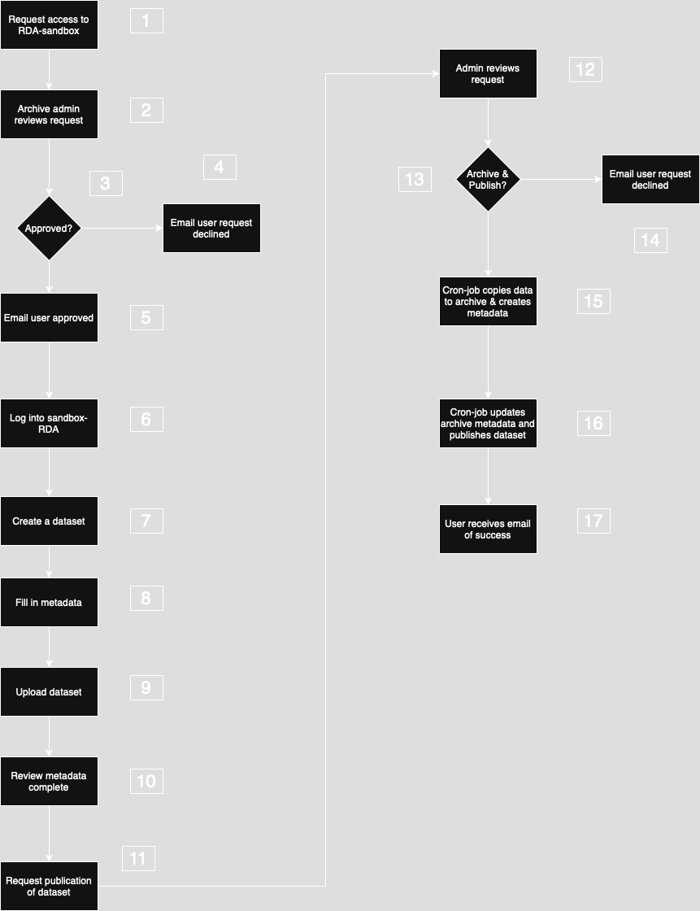

(rda-ingest-and-archive-workflow)=

# The NIRD RDA Ingest and Archive Workflow

Figure 1: High-level view of the ingest and archive workflow.

The figure shows the high-level workflow for archiving a dataseta in
the NIRD RDA. A more detailed description of the ingest, archive and access processes is
covered in the [Preservation Plan](https://www.sigma2.no/nird-research-data-archive-preservation-plan).

1. Click on the 'Sign In' or 'Addd Dataset' button on the [sandbox portal](https://archive-sandbox.sigma2.no) to access the archive. If you are a new user, you will be presented with a form to submit a request to access the archive.
2. The Archive administrator reviews the request to make sure the user satisfies the criteria for using the RDA-sandbox. The Archive administrator may contact the user for further information.
3. The Archive administrator either approves or rejects the request.
4. If the request is rejected, an email is sent to the user informing them that the request has been declined.
5. If the request is approved, an email is sent to the user informing them that the request has been successful.
6. The user can then log into the RDA-sandbox.
7. The user can create a new dataset first by accepting the [Terms Of Use](https://www.sigma2.no/nird-research-data-archive-terms-use) and  [Depositor Agreement](https://www.sigma2.no/nird-research-data-archive-depositor-agreement).
8. Once accepted, the user is presented with a form in which to describe the dataset by filling in metadata fields.
9. The user can then upload the dataset either via the web interface, or from a project in the NIRD project area (NIRD Data Peak and/or NIRD Data Lake), or via a Command Line Interface. In the case of problems uploading the dataset, the user can contact the Archive Manager to help to understand and correct the problem.
11. After the dataset has been successfully uploaded, the user checks that the metadata describes the dataset, all the fields (mandatory and optional) have been completed and the correct license is applied to the dataset. The user then submits a request to publish the dataset.
12. The Archive administrator reviews the dataset, by checking all the metadata has been supplied, the dataset formats are open and the stakeholders agree to the dataset being published.
13. The Archive administrator then decides whether to publish the dataset.
14. If the administrator declines the request to publish, an email is sent to the user with a reason. In the case of resolvable issues, the user can work with the administrator to rectify the issuess and resubmit the dataset for publication.
15. Approval by the archive administrator creates an archiving cron job that copies the data from the import area to the archive, checksums the data and creates metadata at the file level for the dataset.
16. The archiving cron job updates the archive metadata that results in a request to DataCite to register the DOI for the dataset.
17. An email is sent to the user indicating the status of the archiving.
