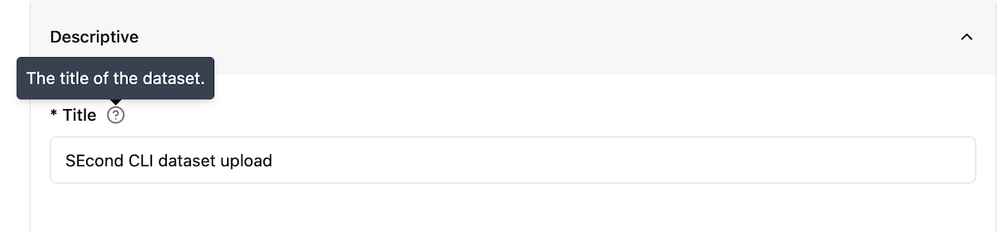

# Metadata schema

Each dataset must be accompanied by a set of metadata. The Archive has implemented a metadata schema with fields that can be classified in six categories. For each category some fields are mandatory (those presenting an asterisk) and some are optional. We also recommend filling optional fields as they might be relevant for any other data users, and they can increase the findability and usage of the dataset.

Each field presents tooltip that will display a help text when hovering over with the mouse:

Figure 1: Screenshot of the tooltip.

# Metadata form by category

## Descriptive

### Title

A short phrase or sentence describing the dataset. The title will be displayed in the results list from a search, and therefore should be human-readable and reasonable to display.
The title is possibly the most informative element of a metadata record and should be therefore chosen carefully as it is often going to be used to determine if a dataset is meeting the needs of a person searching for data to reuse.

**Recommendations (1):** Choose a unique title for your dataset and avoid using acronyms.
**Recommendations (2):**  Use an informative title that guides potential users on the content of the dataset.

**Note:** The title must be unique within the Archive. When trying to register a dataset with an already existing title, the user will be prompted with a validation error (see URL field below)

| Obligation/Condition | Mandatory |
| :---- | :---- |
| Multiplicity | 1 |
| Definition | The title of the dataset. |
| Type | Free text/string |
| Example | Chlorophyll-a Concentration in the Oslofjord from Sentinel-3 OLCI Data (2020–2022) |

### URL

The URL field is not editable, and it is automatically filled by the archive following the title provided. As URLs must be unique, you will be prompted with an error (*“That URL is already in use.”*) if you are registering a title that is already present in the Archive.

### Description

This field should summarize and describe the dataset. It should provide relevant information to guide people to understand if the content is relevant for their needs. It is similar to the abstract of a scientific paper.

**Recommendations (1):** Briefly explain the purpose, content, and scope of the dataset, including how the data was produced or collected.
**Recommendations (2):** Avoid repeating information covered in the spatial and temporal extent fields (use the Extent metadata), but mention context if needed for clarity.

| Obligation/Condition | Mandatory |
| :---- | :---- |
| Multiplicity | 1 |
| Definition | The description of the dataset. |
| Type | Free text/string |
| Example | This dataset includes chlorophyll-a concentration values derived from Sentinel-3 OLCI satellite imagery and validated with in situ samples. It supports marine ecosystem research and coastal water quality monitoring. Data processing followed Copernicus Marine Environment Monitoring Service protocols. |

### Keywords

A keyword or tag describing the dataset. This field gives the possibility to add keywords and tags that are not standardised and do not belong to specific vocabularies or controlled lists.

**Recommendations (1):** Use this field for additional, free-text keywords that are **not already covered** by the controlled vocabularies listed under *Themes*. These can include **expert-specific terminology**, **project names**, **instruments**, **methods**, or **local place names**.

**Recommendations (2):** If your preferred vocabulary is missing from *Themes*, **do not add it as a free-text keyword**. Instead, you are encouraged to **contact the Archive** to request its inclusion. This helps ensure datasets are described in a consistent and accurate way.

| Obligation/Condition | Optional |
| :---- | :---- |
| Multiplicity | \[0…\*\] |
| Definition | A keyword or tag describing the dataset. |
| Type | Free text/string |
| Example | Snow, Svalbard |

### Themes

For keywords from controlled vocabularies. Using well-defined keywords help users to search and find the data. The added value of using a controlled vocabulary is that each term has a specific and unique definition that a user can find and read on the web. **At least one keyword from at least one of the controlled vocabularies is mandatory**. The Archive is currently hosting a limited number of controlled vocabularies:

#### Climate and Forecast (CF) standard names

The **CF Standard Names** vocabulary defines a list of standard terms that describe **physical quantities or measured phenomena**, such as temperature, salinity, wind speed, etc. These are primarily intended for datasets that store **variables** that follow the CF metadata convention.
**Each standard name is designed to be used as a variable name or attribute**, enabling interoperability and automated processing.

* Browse the list of standard names: [cf-standard-name-table](https://cfconventions.org/Data/cf-standard-names/current/build/cf-standard-name-table.html)
* Registered vocabulary: [NERC CF Standard Names](https://vocab.nerc.ac.uk/standard_name/)
* More info: [cfconventions.org](https://cfconventions.org/)

#### INSPIRE Spatial Data Themes (GEMET)

This vocabulary contains **groupings of spatial data** themes defined by the **INSPIRE Directive**. It is useful for describing **geospatial datasets**, especially those produced in the context of environmental monitoring, land use, or other European policy domains.
**Themes here are broader categories** (e.g., *Atmospheric conditions*, *Land cover*, *Human health and safety*) and are useful even when more detailed variable-level descriptions aren’t appropriate.

* Browse the list: [INSPIRE themes on GEMET](https://www.eionet.europa.eu/gemet/en/inspire-themes/)
* Registered vocabulary: [NERC P22 INSPIRE Themes](https://vocab.nerc.ac.uk/collection/P22/current/)
* More info: [INSPIRE Knowledge Base](https://knowledge-base.inspire.ec.europa.eu/index_en)

#### ISO 19115 Topic Category

his is a **high-level classification** of geospatial data topics, defined in the **ISO 19115** standard for geographic metadata.
These categories are **very general** (e.g., *Oceans*, *Environment*, *Elevation*) and are primarily intended to help with **broad dataset discovery and filtering**.

***Note**: This vocabulary is useful if your dataset falls into a general thematic domain, and you don’t have more specific keywords available.*

* Browse the list: [ISO 19115 Topic Categories](https://vocab.nerc.ac.uk/collection/P05/current/)

| Obligation/Condition | Mandatory |
| :---- | :---- |
| Multiplicity | \[1…\*\] |
| Definition | Keywords from controlled vocabularies |
| Type | autocomplete |
| Example | \- |

**Note:** The current list of vocabularies may not always be applicable to your specific dataset or domain. If you need additional vocabularies that are more relevant to your community, please contact the Archive team. The list will continue to grow based on user feedback.

###

### Subjects

The **Subjects** field defines the **scientific field or domain** that the dataset pertains to. This field helps categorize datasets within the data portal, making it easier for users to discover datasets based on their subject matter.

The list of available subjects is derived from the **Field of Science and Technology Classification (FOS)** vocabulary, which groups various scientific disciplines.

**How to use it:**
Select the most relevant subject(s) from the list that best describes the domain of your dataset. This helps ensure your dataset is properly categorized and easily discoverable by others in related fields.

* Browse the list of terms:
  [Eurostat FOS vocabulary](https://dd.eionet.europa.eu/vocabulary/eurostat/fos07)

| Obligation/Condition | Mandatory |
| :---- | :---- |
| Multiplicity | \[1…\*\] |
| Definition | The field/domain the dataset belongs to |
| Type | autocomplete |
| Example | \- |

### Language

The language used in the dataset. There are only two options: English and Norwegian. The metadata form is set to the default language of “English”.

| Obligation/Condition | Mandatory |
| :---- | :---- |
| Multiplicity | 1 |
| Definition | The language used in the dataset. The default for all datasets is English. |
| Type | dropdown |
| Example | \- |

### Status

This field describes the production status of the dataset using a controlled vocabulary:

* Complete: when the production of the dataset is complete
* In Work: when data will be continuously updated
* Planned: when data will be collected on an established date in the future.

This field can be mapped to the ISO metadata standard MD\_ProgressCode and the Dataset Progress of NASA DIF metadata standard.

| Obligation/Condition | Optional |
| :---- | :---- |
| Multiplicity | 1 |
| Definition | The status describes the production status of the dataset. |
| Type | dropdown |
| Example | \- |

### Project

The name of the project in which the dataset was generated or collected. In order to harmonise this field which is free text it is recommended to use the format of “Long Name (Short Name)”, where the short name in parentheses is usually the acronym. See example below.

**Recommendation (1):** If data is produced under a specific project it is highly recommended that the name of the project is acknowledged here.
**Recommendation (2):** Use the format “Long Name (Short Name)”

| Obligation/Condition | Optional |
| :---- | :---- |
| Multiplicity | \[0…\*\] |
| Definition | The name of the project in which the dataset was generated or collected. |
| Type | Free text/string (Recommended format Long Name (Short name)) |
| Example | Kongsfjorden Rijpfjorden Observatory Programme (KROP) |

## Personnel

All personnel fields (contact points, creators, contributors) are built on the same sub-fields elements as described in the table below:

| Personnel multifields |  |  |
| ----- | :---- | :---- |
| subfield | Definition | Type |
| First Name | The first name of the person | Free text/string |
| Last Name | The last/family name of the person | Free text/string |
| Organisation | The organisation/Affiliation of the person | Free text/string (with suggestion) |
| Email | The email of the person | Email  |
| ORCID | Unique, persistent identifier ORCID[^1] for individuals. | Use the ID only and not the full URL (i.e. "0000-000X-YYYY-ZZZZ"). |
| Type | Only for contributors: the type of role the contributor had (from a controlled vocabulary) | dropdown |

**Recommendation (1):** Add your ORCID ID so others can still find and credit you, even if you move to a different organisation.
**Recommendation (2):** Use institutional email instead of personal emails.

### Contact points

This personnel field is for the person(s) responsible for the metadata information. Usually the person that is uploading the dataset. It gives information about the person that should be contacted regarding the metadata provided.

| Obligation/Condition | Optional |
| :---- | :---- |
| Multiplicity | \[0…\*\] |
| Definition | The person responsible for the metadata information |
| Type | Personnel multifield (see Table above) |
| Example | \- |

### Creators

This personnel field is for the main researchers involved in producing the data. These are also referred to as Investigators, Principal Investigator, authors in different contexts. The creator is the person that knows the details on data collection and processing and can answer questions about the dataset.

**Note:** Only the creators will be part of the citation of the dataset.

| Obligation/Condition | Mandatory |
| :---- | :---- |
| Multiplicity | \[0…\*\] |
| Definition | The main researchers involved in producing the data |
| Type | Personnel multifield (see Table above) |
| Example | \- |

### Contributors

The name of any other person that contributed to the creation of the dataset. The type of contribution is provided through the “type” field from a controlled vocabulary based on the Datacite list at: [https://datacite-metadata-schema.readthedocs.io/en/4.5/properties/contributor/\#a-contributortype](https://datacite-metadata-schema.readthedocs.io/en/4.5/properties/contributor/#a-contributortype)

| Obligation/Condition | Optional |
| :---- | :---- |
| Multiplicity | \[0…\*\] |
| Definition | The name of any other person that contributed to the creation of the dataset. |
| Type | Personnel multifield (see Table above) |
| Example | \- |

### Dataset owner

This field is for the name of the Organisation who owns the resource. This is usually the Institution of the Principal investigator. Only Organisations are allowed in this field. The identifier of the Organisation (ROR) will be automatically filled when the organisation is selected.

| Obligation/Condition | Optional |
| :---- | :---- |
| Multiplicity | \[0…\*\] |
| Definition | The organisation that owns the resource |
| Type | dropdown |
| Example | \- |

## Constraints

### License

The license under which the data is released. This expresses the restrictions on the use of the dataset.

**Recommendations:** For maximum dissemination and use of licensed materials CC-BY-4.0 is recommended, and it is the default for the Archive.

**Note:** If you do not find the appropriate license, please contact the archive manager, providing the Identifier and URL of the license you need (see https://spdx.org/licenses/).

| Obligation/Condition | Mandatory |
| :---- | :---- |
| Multiplicity | 1 |
| Definition | The license under which the data is released. |
| Type | dropdown |
| Example | \- |

### Access rights

This field expresses the limitations on the access to the dataset using a controlled vocabulary. The values are:

* Public: (meta)data is openly available to everyone without any restrictions.
* Restricted: metadata is publicly available, but data is restricted to a group of people.
* Non-public: metadata is publicly available, but data is not publicly available.
* Embargoed: data is “Restricted” and will become “Public” after the embargo date is reached.

**Recommendations:** For research data the concept “as open as possible, as close as necessary” to ensure transparency and openness should be followed. Most research data should be fully open.
**Note:** FAIR data does not mean Open Data. The Archive is supporting the possibility to publish data under some access restriction when necessary.

| Obligation/Condition | Optional |
| :---- | :---- |
| Multiplicity | \[0…1\] |
| Definition | The access rights or restrictions to resources. |
| Type | dropdown |
| Example | \- |

## Extent

### Spatial

The geographic extent of the dataset. It is possible to provide the geographic extent of the dataset in two ways:

#### WKT

“Well-known text” (WKT)[^2] is a scheme for writing simple features geometry into a standard text string. This field is free text, but it will be validated.

**Note:** The OGC standard definition requires a polygon to be topologically closed. A polygon with four corners will therefore have five points, with the first and the last being identical. e.g. POLYGON ((30 10, 40 40, 20 40, 10 20, 30 10))

#### BBOX

For the bounding box the extent is defined using four points in the lat/lon EPSG:4326 projection:

* Northernmost latitude: The northernmost point covered by the dataset
* Southernmost latitude: The southernmost point covered by the dataset
* Westernmost longitude: The westernmost point covered by the dataset
* Easternmost longitude: The easternmost point covered by the dataset.

**Recommendation:** Use at least 2 decimal places

| Obligation/Condition | Optional |
| :---- | :---- |
| Multiplicity | \[0…1\] |
| Definition | The geographic extent of the dataset |
| Type | WKT or bounding box |
| Example | \- |

### Temporal

This field defines the temporal extent or coverage of the dataset. It has two sub-elements:

* start date: The start date and time for data collection or model coverage
* End date: The end date and time

A date picker is implemented to fill these elements and the values will be translated into iso8601 format.

| Obligation/Condition | Optional |
| :---- | :---- |
| Multiplicity | \[0…1\] |
| Definition | The temporal extent of the dataset |
| Type | Datetime  |
| Example | \- |

## Related URLs

### Related resources

It is often relevant to link a datasets to other external digital resources. These can be of different types and refer to different aspects of the dataset. The type of resource is a controlled list selectable through a dropdown and the URL is the URL of the resource. Most commonly used links refer to publications and software.

| Obligation/Condition | Optional |
| :---- | :---- |
| Multiplicity | \[0…\*\] |
| Definition | Published resources linked to the dataset |
| Type | Datetime  |
| Example | \- |

## Versioning Info

### Version notes

The Archive system is keeping track of potential new versions of the datasets. Linking each version with the older ones. This field should be filled with a good description of the version created, e.g. what has changed, what has been removed, how data has been reprocessed.
When creating the first version of a dataset

| Obligation/Condition | Mandatory |
| :---- | :---- |
| Multiplicity | 1 |
| Definition | Notes about the current version of the dataset and eventually changes with respect to the previous version. |
| Type | Free text/string |
| Example | **Example-1:** Initial version of the dataset including temperature measurements from 2015 to 2020\. Data collected from station A, station B, and station C, with basic quality control applied. **Example-2:** Reprocessed version of the dataset. Raw data was corrected for sensor calibration errors and adjusted for missing values. The temporal resolution was changed from daily to monthly averages. **Example-3:** Version 2 of the dataset. Added new data from 2021, extending the temporal range from 2010-2021. Included new sensors from station D for improved coverage in region X. **Example-4:** Updated version of the dataset. Added new metadata, including project name and updated geographic coverage. Changed variable names to adhere to CF conventions. **Example-5:** Version 3 of the dataset. Corrected a data error in the salinity readings for May 2018\. Replaced all incorrect values in that month with interpolated values from adjacent days. **Example-6:** Version 4 of the dataset. Removed outdated data from 2010 due to known calibration issues. Data from 2011-2020 is still valid and remains in the dataset. **Example-7:** Version 5 of the dataset. Converted the dataset from CSV format to NetCDF format for improved interoperability. Metadata fields were also standardized to comply with the CF conventions.  |

[^1]:  https://orcid.org/

[^2]:  https://en.wikipedia.org/wiki/Well-known\_text\_representation\_of\_geometry

## Metadata schema for the API
The terms used in the API are slightly different from those described in the metadata due to constraints arising from the underlying CKAN system that reuses the same term for a different use.

| **Schema Name**               | **Type**                          | **Description**                                                                                                                     |
|-------------------------------|-----------------------------------|-------------------------------------------------------------------------------------------------------------------------------------|
| **title**                      | String                            | The title of the dataset.                                                                                                           |
| **name**                       | String (Unique)                   | The unique identifier for the dataset (used in the URL).                                                                            |
| **notes**                       | String                            | A description of the dataset, detailing its purpose or contents.                                                                   |
| **language**                    | String                            | Language of the dataset, either `en` (English) or `no` (Norwegian).                                                                |
| **conforms_to**                 | String                            | The standard or specification that the dataset conforms to.                                                                         |
| **provenance**                  | JSON String                       | The provenance or history of the dataset in a JSON format.                                                                          |
| **source**                      | Array of Strings                            | The original source of the dataset, typically a URL or reference.                                                                  |
| **spatial**                     | JSON String                       | Spatial data describing the geographical coverage of the dataset (e.g., bounding box).  <li>When `spatial_type` is set to `"bbox"`, the `value` must be an array of four numbers in the order: `[Northernmost latitude, Southernmost latitude, Easternmost longitude, Westernmost longitude]`. Latitude values must range between -90 and 90, and longitude values must range between -180 and 180.</li><li> When `spatial_type` is `"wkt"`, the `value` must be a valid Well-Known Text (WKT) string representing a geometry (e.g., a polygon).</li>                                           |
| **dataset_status**              | String                            | The current status of the dataset: `complete`, `in_work`, or `planned`.                                                             |
| **project**                     | Array of Strings                  | A list of projects related to the dataset.                                                                                           |
| **dataset_size**                | Float                             | The size of the dataset in megabytes (MB).                                                                                          |
| **related_resources**           | Array of Objects                  | A list of related resources with the URL and type, Values accepts: `algorithm_documentation`</li><li>`algorithm_theoretical_basis_document_atbd_`</li><li>`anomalies`</li><li>`case_study`</li><li>`data_citation_policy`</li><li>`data_product_specification`</li><li>`data_quality`</li><li>`data_recipe`</li><li>`deliverables_checklist`</li><li>`general_documentation`</li><li>`how_to`</li><li>`important_notice`</li><li>`instrument_sensor_calibration_documentation`</li><li>`micro_article`</li><li>`pi_documentation`</li><li>`processing_history`</li><li>`product_history`</li><li>`product_quality_assessment`</li><li>`product_usage`</li><li>`production_history`</li><li>`publications`</li><li>`read_me`</li><li>`related_articles`</li><li>`requirements_and_design`</li><li>`science_data_product_software_documentation`</li><li>`science_data_product_validation`</li><li>`user_feedback_page`</li><li>`user_s_guide`</li>                            |
| **temporal**                    | Object                            | Temporal data with `start` and `end` dates of the dataset coverage in ISO 8601 format.                                              |
| **version_notes**               | String                            | Notes describing any version changes or updates to the dataset.                                                                     |
| **contact_points**              | Array of Objects                  | Contact information for people related to the dataset with <li>`first_name`</li><li>`last_name`</li><li>`organisation` </li><li>`email`</li><li> `ORCID`</li>                                      |
| **dataset_owner**               | Object                            | Information about the dataset owner <li>`organisation`</li><li>`ror`</li>                                                                 |
| **creators**                    | Array of Objects                  | Information about the creators of the dataset <li>`first_name`</li><li>`last_name`</li><li>`organisation` </li><li>`email`</li><li> `ORCID`</li>                                              |
| **contributors**                | Array of Objects                  | Information about contributors to the dataset <li>`first_name`</li><li>`last_name`</li><li>`organisation` </li><li>`email`</li><li> `ORCID`</li>                                            |
| **groups**                      | Array of Objects                  | Groups associated with the dataset, including `subject` and `institution` types.  To find valid values for the groups field:  <li>To get all possible subject values, send `GET /api/3/action/group_list?type=subject`</li> <li>To get all possible institution values, send `GET /api/3/action/group_list?type=institution`</li>                                                     |
| **license_id**                  | String                            | The ID of the license under which the dataset is published.                                                                         |
| **tags**                        | Array of Objects                  | A list of tags (keywords) associated with the dataset.                                                                              |
| **theme**                       | Array of Objects                  | A list of themes related to the dataset, each containing a `name` and `vocabulary_id`. Vocabulary ids can be found by sending a `GET /api/3/action/vocabulary_list` request. List of options per vocabulary can be found by sending a `GET /api/3/action/tag_list?vocabulary_id=<id> `request                                            |
| **access_rights**               | String                            | The access rights for the dataset: `embargoed`, `restricted`, `non-public`, or `public`.                                            |
| **embargoed_until**             | String (ISO Date)                 | The date until which the dataset is embargoed, in ISO 8601 format.                                                                  |
| **state**                       | String                            | Datasets must be initially created as draft. Value accepts `draft`, `inreview`, `pending`, `rejected`, or `active`.                                          |
| **doi**                         | String                            | The Digital Object Identifier (DOI) for the dataset if already exist, or it will be generated by the system.                                         |
| **announcement**                | String                            | An announcement or notice before deleting the dataset.                                                                              |
| **deletion_reason**             | String                            | The reason for deleting the dataset.                                                                                                 |
