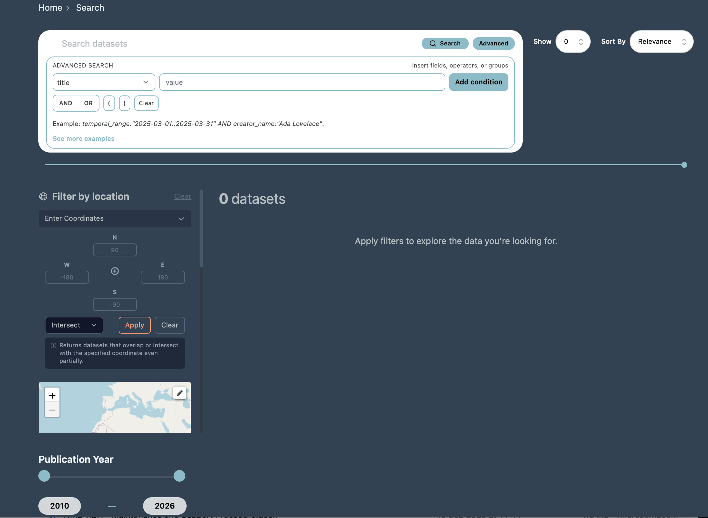
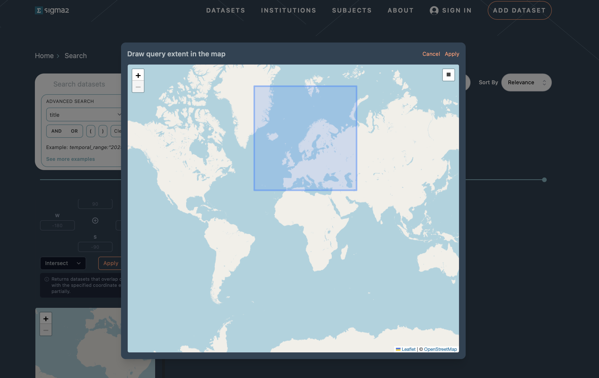

(Search Guide)=

# NIRD RDA Search Guide

## How to use this guide

This guide is written for researchers/users who want to find datasets efficiently on [NIRD Research Data Archive](https://archive.sigma2.no/), 
 whether you have a specific dataset in mind or are exploring what exists in a field.

This guide is organized around common search scenarios you may encounter:
- {ref}`Default Search  <default_search>`: You have a broad topic and want to see what exists.
- {ref}`Advanced Search  <advanced_search>`:  You know exactly what you want and need to pinpoint it.
- {ref}`Filtering Search Results  <filtering_search>`:  You have too many results and need to narrow down.
- {ref}`Spatial Search  <spatial_search>`: You want to do spatial search.
- {ref}`Sharing and Reproducing Queries  <sharing_search>`: You want to reproduce or share a search.

Read the sections relevant to your situation. 


Figure 1: Screenshot of the archive search interface.

(default_search)=

## Getting started: The Default Search

The default/basic search lets you quickly find datasets by entering keywords across all key metadata fields at once.
To perform a basic search:

1. Type one or more keywords into the search bar.
2. Press Enter or click the search button.

The basic search matches your query against all relevant metadata fields, including title, description, creator, contributor, and more. The results are sorted by relevance by default.

```{note}
 On mixed-case terms and model names:
The default search handles plain text well, but struggles with terms that combine upper and lower case letters with numbers,  for example, the climate model name NorESM2. If you search for NorESM2 without quotes, you may get unexpected or incomplete results. Always wrap such terms in double quotes:
"NorESM2"
"CMIP7"
This forces the system to treat the term as an exact phrase rather than tokenising it.
```
- Partial search: If you do not remember the full value of a metadata field, you can search for a partial string. The system will return all datasets where the field contains your search term anywhere in the value.
- Exact search: To search for an exact phrase or value, wrap your query in double quotes.

What you see in the results:
Each result card shows the dataset title, the first two lines of its description, the creator name(s), DOI, and file size.
 Click the title to open the full dataset record. Use your browser's back button to return to the results,  your query and any active filters are preserved in the URL.

(advanced_search)=

## Advanced Search

The Advanced Search functionality gives you precise control over which metadata fields to query and how to combine conditions. You can expand or hide Advanced Search by clicking the “Advanced” button. Search syntax example is also available on the advanced search interface.

The Advanced Search interface provides:

- A field selector: choose a specific metadata field from the dropdown (e.g. creator_name, title, release_date)
- A query text box: enter the value you want to search for
- Add condition button: add multiple conditions to your query
- AND / OR buttons: combine conditions with logical operators
- Grouping with parentheses (): group conditions to control evaluation order

Note that you need to click on "Add condition" in order to buid the query and then click "Search" to run it. As you add condition the query  is displayed as a string (e.g. creator_name:"Ada Lovelace" AND title:"NorESM") and is also reflected in the URL, making it easy to bookmark or share.

You can build complex queries by combining multiple conditions using AND, OR, and parentheses for grouping.

(filtering_search)=

## Filtering Search Results

After running a search, you can narrow down results further by applying filters. The filter panel on the left side of the search page offers the filters for  institution, subject, keywords, publication year etc. 

You can apply multiple filters at the same time. Each filter you select is added to the existing query, narrowing the results further. Filters are cumulative; selecting Institution: UiB and Subject: Natural sciences returns only datasets from UiB within Natural sciences.

If you select a filter and no datasets match the combination of your query and the filter, the result will display a "No datasets found" message indicating there are no matches for the selected criteria.

(spatial_search)=

## Spatial Search 

The search interface includes a spatial (geographic) search that lets you search for datasets by selecting a region in an interactive map (draw a bounding box on the map to select the geographic region of interest) or by entering the coordinates (the latitude and logitudes coordinates) to define the search area. 

Datasets with spatial metadata matching the selected bounding box are returned. You can also choose how spatial matching is applied using the dropdown menu:

-Intersect: returns datasets whose coordinates overlap with the specified area, even if only partially.
-Exact: returns datasets whose coordinates exactly match the specified coordinates.


Figure 2: Screenshot of the spatial search interactive map.  

(understanding_search)=

## Understanding Search Result

Each search result displays a summary of the dataset to help you quickly identify whether it is relevant.
- Title: The name of the dataset (clickable link to the full landing page)
- Description: The first two lines of the dataset's description
- Creator: The name(s) of the creator(s)
- DOI: The Digital Object Identifier for the dataset
- Size:  The total size of the dataset

At the top of the search results page, you will see:

- The query that was executed 
- The total number of datasets matching the query

### Sorting results
By default, results are sorted by "relevance". You can change the sort order by "last updated" using the Sort By dropdown. 
### Pagination
If your search returns many results, they are displayed in pages of 10 datasets by default. You can configure the number of datasets shown per page using the Show dropdown (e.g. 10, 25, 50 per page). Navigate between pages using the pagination controls at the bottom of the results.

### Opening a dataset
Click on any dataset title to go to the full dataset landing page, where you can see all metadata, download files, and view the full description. Use your browser's back button to return to the search results.

(sharing_search)=

## Sharing and Reproducing Queries

When you run a search in the portal, the full query is reflected in the browser's URL bar.
To share a query:
1. Run your search in the portal
2. Copy the full URL from the browser address bar
3. Share the URL with your colleague
4. When they open the URL, the same query will be executed in their browser

