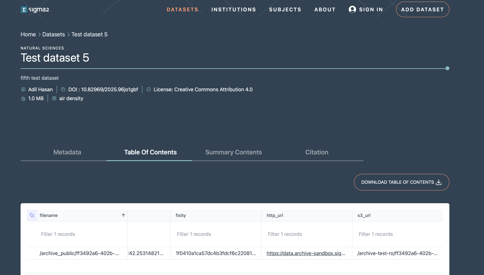

# Searching and Accessing Datasets

Published datasets are available on the [portal](https://archive.sigma2.no), shown in Figure 1. To view them, select the DATASETS tab at the top of the page. A search bar on the homepage lets you run a quick keyword search across all dataset metadata. For more control, click Advanced Search to open the dedicated search page, where you can query specific metadata fields (creator, DOI, project, theme, and more), combine conditions using Boolean operators, filter by institution, subject, publication year, or geographic area, and sort and paginate results.

For full query syntax and search examples, see the {ref}`Search Guide`.

Figure 1: Screenshot of the archive portal.

Searching, viewing, and accessing public datasets on the portal does not require login and can be done anonymously.

Clicking on a dataset in the list of search results will open the landing page for the dataset. This page contains the metadata information on the dataset, how to cite the dataset and the table of contents that contains http and S3 links for the files in the dataset that allow you to download the individual files (see Figure 2).

Figure 2: Screenshot of a dataset landing page.
