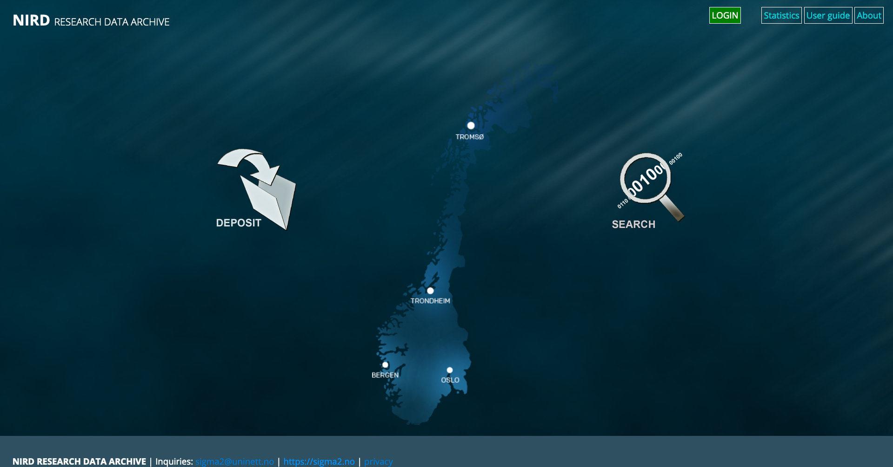
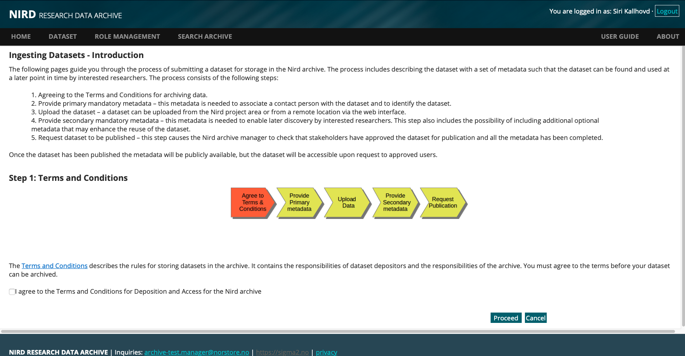
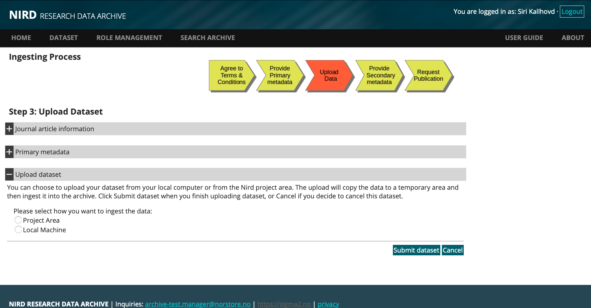
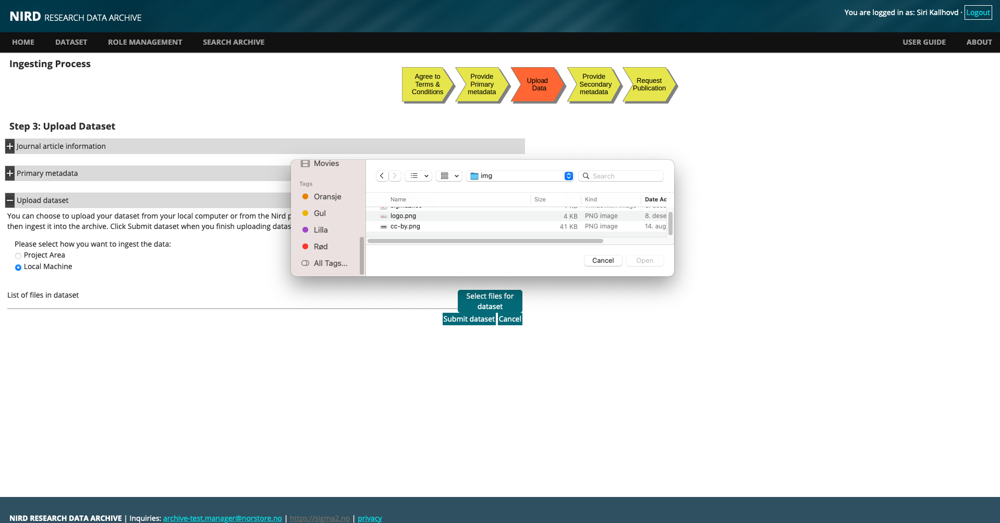
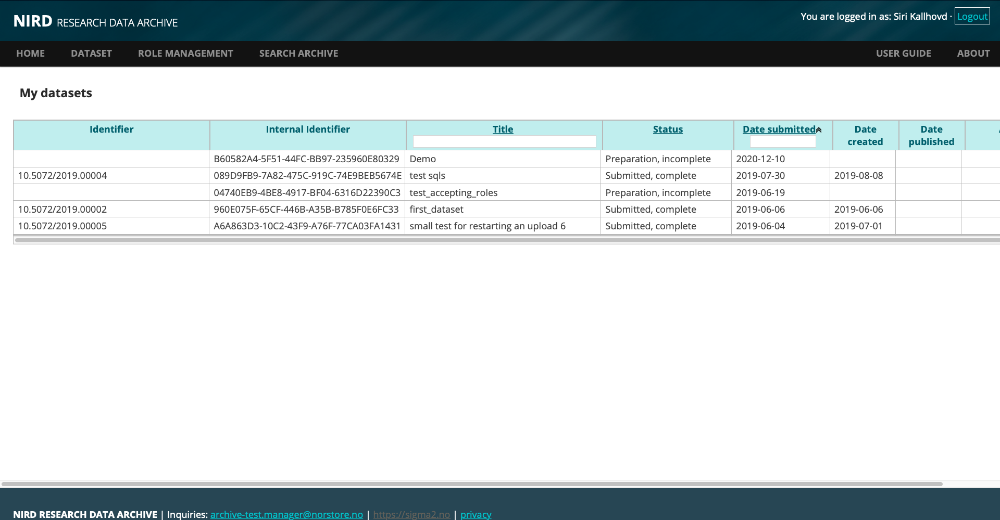
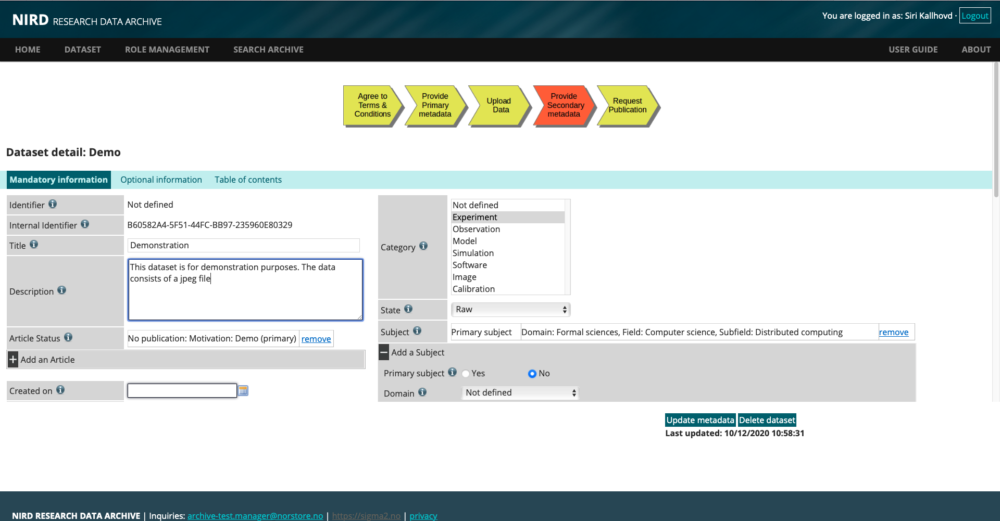
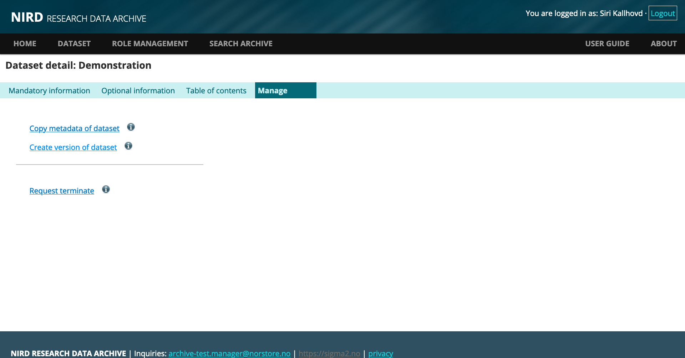
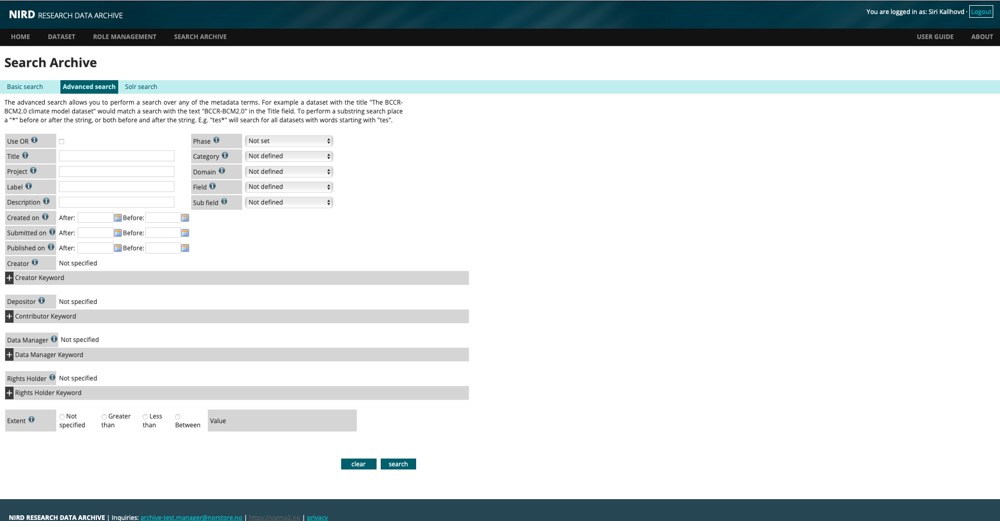
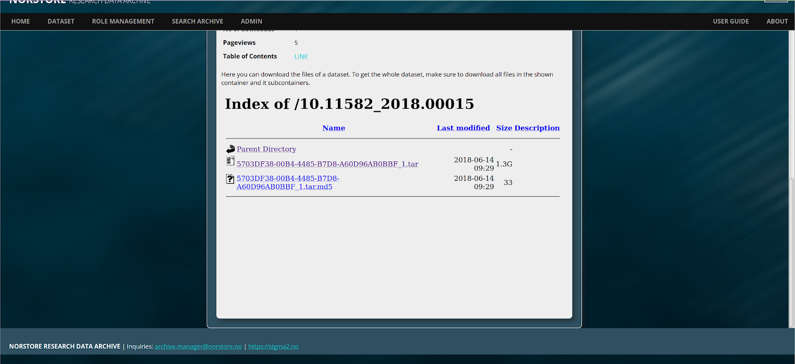

# Research data archive

## Introduction
The Research Data Archive (hereafter called 'the Archive') is a repository that provides long-term storage for research data and is compliant with the Open Archival
Information System (OAIS) reference model  {ref}` [1] <references-archive>`.

 

The aim of the archive is to provide (public) access to published research data and to promote cross-disciplinary studies. This document is a user-guide for deposit, search and retrieval of datasets. Each of the steps in the archival process are described in the following sections.

 
## Depositing a Dataset
The process for depositing a dataset in the Archive consists of the following stages:


- {ref}`Identify the dataset.  <Identify-the-dataset-Archive>`
- {ref}`Log onto the web interface.  <Log-onto-the-web-interface-Archive>`
- {ref}`Agree to the terms and conditions.  <Agree-to-the-terms-and-conditions-Archive>`
- {ref}`Provide primary metadata.  <Provide-primary-metadata-Archive>`
- {ref}`Upload the dataset.  <Section-Upload-Dataset>`
- {ref}`Provide secondary metadata.  <Provide-Secondary-Optional-Metadata>`
- {ref}`Publish the dataset.  <Publish-the-dataset-Archive>`
      
The following sub-sections describe these stages.
 

###  Important Note

All steps prior to and including *Upload Dataset* need to be completed during the same session. It is currently not possible to complete the *Provide Primary Metadata* step, log off and come back at a later point in time to perform the *Upload Dataset* step. Certain fields in the *Provide Primary Metadata* step can be left out and completed at a later time (after uploading the dataset).


(Identify-the-dataset-Archive)=
### Identify Dataset

Before archiving a dataset you will need to define it, make sure you have approval to archive the data and understand which type of access license should be applied.
 

A dataset must be a collection of related data. Typically, this consists of a collection of files. How a dataset is arranged will vary within communities, research groups and projects. However, a guideline as to what would be accepted for archival is:
 
- Datasets resulting from research which is fully or in part supported by the Norwegian Research
          Council.

- Datasets of lasting value from any research discipline.

- Datasets that are not in the process of being created. Datasets should be in a state where they are
          well established (or mature) and will not be altered nor be supplemented by additional data.
          Datasets that are related to each other (a series) can be associated in a 'data collection'.

- Datasets with preferably no access restrictions so that a larger audience can make use of the data
          (i.e. it has public access). However, the Archive recognises that certain datasets of restricted
          use to a given community may be eligible for archiving.


(Log-onto-the-web-interface-Archive)=
###  Log onto the Web Interface

To access the Archive web interface, direct your browser to: [https://archive.sigma2.no](https://archive.sigma2.no). You should arrive at the front page shown in Figure 1. You will need to authenticate using your FEIDE or other account either by logging on via the *LOGIN* button on the top-right or via the *DEPOSIT* icon.
 

Figure 1: Screenshot of the Archive web interface front page

 

The *DEPOSIT* button provides access to the set of pages required for depositing your dataset in the Archive. These pages are accessible once you have authenticated.


### Request Approval

If you have never used the Archive before you will be presented with a page informing you that you are not registered. You can submit a request approval from this page. Only approved users are allowed to deposit datasets in the Archive. The Archive Manager will contact you if additional information is required. Approval should be granted within 3 business days (and usually much sooner).

(Agree-to-the-terms-and-conditions-Archive)=
### Agree to Terms & Conditions

Once approval has been granted you will able to deposit datasets. If you now click the *DEPOSIT* button you will be presented with a page containing a short introduction to the Archive and a link to the Terms and Conditions as shown in Figure 2. The Terms and Conditions outline your responsibilities and those of the Archive. You will need to agree to these before you can start the deposit process.
 

Figure 2: Screenshot of the Terms and Conditions page


(Provide-primary-metadata-Archive)=
### Provide Primary Metadata

The primary metadata is divided into two parts. The first part covers the publication that best describes the dataset (see Figure 3). The goal of the Archive is to provide long-term storage for datasets that are considered to be of lasting value, and it's quite likely that these datasets will have resulted in publications. You have the option to add more publications in the Secondary Metadata phase if your dataset is best described by more than one publication. The second part of the primary metadata covers the information required by the Archive to identify the dataset so that queries regarding the dataset can be addressed by the appropriate person.
 

Figure 3: Screenshot of the publication form

 

The publication metadata allows you to provide a link to the primary article based on the dataset which allows further, useful information to be associated to the dataset. This information can be very useful to potential users of your dataset. The primary article can be in one of a number of states at the time the dataset is being uploaded to the Archive. For example, an article may be accepted for publication, but not actually published in which case you would select the *Accepted for publication* button and fill in the URI for the article preprint. You can also specify *No publication*, but in this case the Archive will require justification as to why the dataset should be stored. For the *Paper in preparation* state you should update the state of the publication before requesting the dataset be published, or the Archive may delay publication of the dataset until the article has been published. The archive will publish datasets in cases where you need the dataset DOI before the paper can be published.


After completing the publication metadata you will be presented with fields for the second part of the primary metadata (see Figure 4). Each of the metadata fields has a help button (the i icon) containing a short description and example of the term. Some of the metadata fields are automatically populated. An Internal Identifier is generated and used by the archive to identify the dataset. The Depositor is also automatically filled-in (the information is extracted from the identity provided by FEIDE or OpenIdP) and cannot be altered. Additional Depositors can be provided.


The currently available licences covering access to a dataset are: the Creative Commons Attribution 4.0 International (CC BY 4.0 {ref}` [2] <references-archive>` ), Norwegian Licence for Open Data (NLOD {ref}` [3] <references-archive>` ). The licence provides liberal access to the data which maximises the impact of the data you have published, and it ensures that proper recognition is given to you. The default licence is CC BY 4.0.


By default, metadata for published datasets are considered public and access is granted to all researchers. The Data Manager and Rights Holder that you nominate will be informed by email of the nomination and whether they wish to accept the role. The Archive will periodically remind them of their nomination, and you will receive an email when they accept or decline the nomination. It is your responsibility to find suitable entities (persons or organisations) that can accept the roles. Your institute may be able to offer guidance on suitable Data Manager and Rights Holders, or you can email the archive.manager@norstore.no for guidance.
 

Figure 4: Screenshot of the Primary Metadata form

 

Click the *Save dataset information* button to save the metadata in the archive. You can modify or update the information at any point before you submit the dataset for publication.


#### Note on restricted access data

It is possible to restrict access to both the dataset and metadata to a group of researchers (although the Archive would encourage you to consider very carefully whether such restrictions are necessary). Note that restricting access to a dataset may require the Archive to impose special terms and conditions on the dataset.

(Section-Upload-Dataset)=

### Upload Dataset

Once the basic metadata has been provided you will be presented with the dataset upload page (see Figure 5). You can choose to upload a dataset that exists in the NIRD project area [https://www.sigma2.no/data-storage](https://www.sigma2.no/data-storage) or a remote dataset.


Figure 5: Screenshot of the upload dataset page

 

#### Upload Dataset from Local Machine

The upload consists of two steps:

- Assembling your dataset into a form the upload mechanism can handle. If your dataset consists of a large number of files (typically more than 10) and directories containing files it is best to aggregate these into a single file using the tar or zip command.
 
- Uploading your dataset. There is no restriction on the size of the dataset, but bear in mind that the larger the dataset is the longer it will take to upload if you are on a slow network.

- **NOTE:** there is current limitation that does not allow datasets consisting of a tar or zip file and individual files or directories to be uploaded. If your dataset contains a mixture of individual files and tar or zipped files you can tar or zip the entire collection and upload the dataset.

**NOTE:** For the local machine method you will need to keep the browser window open whilst the upload is in progress. If you have large datasets (e.g. 200 GB or above) you might want to contact the Archive (archive.manager@norstore.no) to see if there's a more efficient way of transferring the data.
Choosing the *Local machine* for uploading a dataset will result in the upload interface appearing (see Figure 6). Use the *select* button to select files from a file chooser. Once you have selected all the files for upload click the *Submit Dataset* button to send the data to the archive.

 

Figure 6: Screenshot of the upload for FEIDE users

 


**NOTE:** once you have clicked *Submit Dataset* it is currently not possible to make changes to the dataset. If you find you have cancel the dataset (which will delete the data and metadata) and create a new dataset.


#### Upload Dataset from Project Area

 

The archive supports deposit of datasets from the Project Area.

In order to ingest data to the Archive from the Project Area:

- Complete the basic metadata form for deposit of a new dataset
- By choosing the option to *Project Area* and clicking the *Submit Dataset* button you will receive an email containing the dataset identifier (the UUID) and instructions on how to archive your dataset
- After receiving the ingest dataset mail:
- Log onto a machine that has access to the project area storage (e.g. *ssh login.nird.sigma2.no* ).
- Create a manifest file containing the paths to the files that make up the dataset. The structure of the paths should be valid arguments for the UNIX “find ! -type d” command which is used by the *ArchiveDataset* script. For example if we define our dataset to consist of all gzipped tar files in the NS1234K project then the manifest file should contain the line:
/projects/NS1234K/ -name *.tar.gz

The manifest file can contain more than one line if the dataset spans more than one project or different types of files etc.

- By default, the files that make up the dataset will contain the full path excluding the leading '/' (e.g. project/NS1234K/subdir1/file1.dat). You can indicate that the root part of the path be removed by adding a “//” where the root path ends.

E.g. to remove “/projects/NS2134K” from “/projects/NS1234K/subdir1/file1.dat” you would add the following to your manifest file: “/projects/NS1234K///subdir1/file1.dat”. This can be used in combination with the regular expressions and globbing that are recognised by the find command. To remove “/projects/NS1234K” from the pattern which will archive all “.tar.gz” files in the directory “/projects/NS1234K/subdir1” specify the following: “/projects/NS1234K///subdir1 -name *.tar.gz”.

- Run the command:  

*ArchiveDataset UUID manifest-file*

This will result in a special file being created that is used by the archiver cron-job that copies the dataset from the project area to the archive. Depending on the size of the dataset the copy can take quite a bit of time.

- To get the status of your project-area datasets that have been submitted to the queue for archival use the command:

*ListArchiveDataset [UUID]*

The UUID is optional.

- Once the copy has completed you will receive an email with the results of the copy: how much data was copied and if the copy was successful or not. At this point the dataset has been safely uploaded to the archive and you can log back onto the web interface to complete the archiving process.
- You can cancel a request with the:

*CancelArchiveDataset UUID*

Only datasets that are pending or are in the process of being archived can be cancelled. It is not possible to cancel a dataset that has been archived.

- You will receive an email once the upload has completed. The email will report whether the upload was successful and how much data was uploaded.
 

**NOTE:** that once a dataset has been archived using the *ArchiveDataset* script it is considered closed and it is not possible to add more files to the dataset. You will need to create a new dataset if you wish to update the dataset.


### List view of Datasets

After uploading your dataset you will be presented with a list of all the datasets that you are associated with (either as a Depositor, Data Manager or Rights Holder) as shown in Figure 6. By default, the list is sorted by date. You can reverse the order by clicking on the *Date submitted* column. Clicking on a row will provide a detailed description of the selected dataset as well as the forms for supplying the secondary and optional metadata for unpublished datasets.
 

Figure 7: Screenshot of the list of datasets

 
(Provide-Secondary-Optional-Metadata)=

### Provide Secondary & Optional Metadata

Once you have selected a dataset from the table shown in Figure 7 you will be presented with tabbed forms. The first tab is for the mandatory secondary metadata (see Figure 8). The second tab allows you to provide further, optional metadata that you think is necessary for your dataset. The third tab contains a tabular list of the contents of the dataset. Some of the secondary metadata fields such as the *Published On, Publisher, Phase* and *Lifetime* are automatically filled in by the Archive.

Clicking the *Update metadata* button will save any changes you made to the metadata and cause the *Last updated*  field to be updated. You can change the nominations for the Data Manager or Rights Holder roles provided the existing nominees have not accepted their roles. Some of the metadata terms require you to register the term in the form first. For example if you wish to add a Creator you first click the + sign to expand that field. Then you fill in the values for the term and then click the *Add Person as Creator* button to register the term. Then you can click the *Update metadata* button to save the metadata.

The *Optional Information*  tab consists of a form of optional metadata. The *Geo-location*  is useful for datasets that have spatial relevance. Spatial datasets can be described with Point {ref}` [5] <references-archive>` or Box {ref}` [6] <references-archive>` types where the box type could be used to describe a geographical region and the point type a particular location. Temporal coverage datasets can be described with the Period {ref}` [7] <references-archive>`.
 

Figure 8: Screenshot of the secondary metadata form

 

Datasets with spatial relevance could be, for example, population in Oslo or marine environmental data from the Norwegian Sea. Temporal data could be the population of Oslo from 1800-1900. For spatial data the coverage can be defined by box or by a point. Temporal data can be defined by a period (for example for geological data the Devonian period). Click the *Update metadata* button to save changes.

The *Table of contents*  tab (see Figure 9) contains a tabular list of the contents of the dataset. If the dataset was deposit as a tar file the contents of the tar file are displayed. However, if a tar file consisting of tar files is deposited then only the contents of the outer tar file are displayed (which would be a list of tar files). 
 

Figure 9: Screenshot of the table of contents


(Publish-the-dataset-Archive)=
### Publish Dataset (Archiving Data)

Once you have supplied all mandatory metadata for the dataset and a Rights Holder and Data Manager have accepted their roles you will see a *Publish dataset*  button appear in the *Action*  column in the list of your datasets (as shown in Figure 7). Pressing the *Publish dataset*  button will result in a request being sent to the Archive Manager to publish the dataset. The Archive Manager will verify the metadata information, check with the stakeholders agree to the publication, assign a public identifier to the dataset and make the metadata publicly available (or available to a restricted set of users if that option has been chosen).

 

## Versioning Datasets
You can create a new version of any published dataset for which you are a stakeholder.

**NOTE:** currently, you will need to upload the complete dataset as it is currently not possible to upload only modified data files.

To create a new version of dataset navigate to the published dataset either using the DOI or from the *List datasets*  option on the web interface and click on the *Manage* menu (see Figure 10 and Figure 11). You should choose the *Create version of dataset* to create a new version of the dataset (see Figure 12). This will bring you to the dataset upload where you can choose from Project Area upload or local machine upload (see Section {ref}`Upload Dataset <Section-Upload-Dataset>` ). Once you have uploaded your data you will be presented with the metadata form.
 

Figure 10:Screenshot of the edit dataset page.The *Manage* menu is indicated by a black box

 

You can then update the metadata accordingly (see Section {ref}`Provide Secondary & Optional Metadata <Provide-Secondary-Optional-Metadata>`). 

**NOTE:** If you do not wish to make any changes to the metadata you should click the *Update metadata* button which will result in the *Publish dataset*  button appearing. You can then submit the dataset for publication.
 

Figure 11: Screenshot of the landing page. The Manage link is indicated by black box

 

Figure 12: Screenshot of the manage dataset menu

 

Figure 13: Screenshot of the version dataset upload

 

Once the new version has been published you will see additional text on the landing page indicating the dataset replaces a previous version with a link to the version it replaces. A similar link to the previous dataset will also appear when you access the dataset from the *List datasets*  menu item.

**NOTE:** Data in previous versions of the dataset are still accessible unless you request access to a previous version to be terminated (see Section {ref}`Terminating Datasets <Section-Terminating-Datasets>`  ). 

 

## Cloning Metadata
If you want to create a new dataset, but wish to use the metadata from an existing dataset you can choose the *Copy metadata of dataset*  menu option in the *Manage* menu (see Figure 13). This will require you uploading a new dataset and choose whether to use the same Data Manager and Rights Holder.

**NOTE:** the Data Manager and Rights Holder will still need to accept their roles as this is considered a new dataset and not a version.

Once the dataset has been uploaded you will be presented with a pre-filled metadata form which you can modify. Once you have completed filling in the metadata you can submit the dataset for publication.

(Section-Terminating-Datasets)=
 
## Terminating Datasets
You can remove access to a dataset you have published by submitting a terminate request to the Archive. The terminate request page is accessible either from the landing page by clicking the *Manage* link, or from the *List datasets*  menu, selecting the dataset you want to terminate, click the *Manage* menu (see Figure 10).

**NOTE:** the *Manage* menu is only available for published datasets. Clicking the *Request termination*  link will display the dataset termination request page. You will need to supply a reason why you wish the dataset to be terminated.

Once you have submitted your request it will be reviewed by the Archive Manager who may contact you to further discuss the request. All stakeholders will be informed of the request and providing there are no objections access to the dataset will be removed.

**NOTE:** the metadata for the terminated dataset will still be visible, but there will be clear indication that the dataset has been terminated as well as a reason for termination. This is to ensure existing articles that reference the dataset have valid links.

 
 
## Searching and Accessing Datasets
The search interface can be accessed both as an authenticated user or anonymously from the front page. The search interface has two tabs: *Basic search*  and *Advanced search*. The basic search uses the metadata terms: Title, Label, Description and Subject to search for keywords. You can construct more complex queries over the full range of metadata terms using the advanced search (see Figure 14). The search is executed by clicking the *Search*  button at the bottom of the page.

The search interface allows searches over partial words which you can do by placing a * before or after or both of the partial word. For example a search for datasets containing the word test could be achieved by searching for tes*, searching for norwegian in a dataset can be achieved by \*weg\*.

**NOTE:** that the advanced search interface requires you to register the search term before executing the search (this entails clicking the + then entering the search term in the appropriate field and clicking the *add*  button to register the search term and then clicking the *Search*  button).

 

Figure 14: Screenshot of the advanced search interface

 

The search is performed over all published datasets and the results are presented as a tabulated list. Clicking on one of the search results will direct you to landing page which contains a subset of the metadata information for the dataset, clicking on the *[more]* will display the expanded landing page including links to the table of contents and dataset download (see Figure 11).

The landing page also contains graphical views for the coverage (if it has been provided) and for the table of contents (see Figure 15). The table of contents provides an immediate view of the composition of the dataset. The chart in the lower-left pane can be navigated to explore the file structure of the dataset. The table on the lower-right pane displays the total size in each sub-directory and is updated as the chart is navigated. 
 

Figure 15: Screenshot of the landing page table of contents

 
### Downloading a Published Dataset
Anyone can download published, public datasets either to their local machine or the Project Area.  If you are a member of a NIRD project [https://www.sigma2.no/data-storage](https://www.sigma2.no/data-storage) you also have the possibility to download the dataset to your project area.

To download a dataset first navigate to the landing page for the dataset you want to download and click on the *download*  link. The focus on the landing page will change to an index of the dataset contents that can be downloaded (see Figure 16).



Figure 16: Screenshot of the download index of files.

You can click on the link to anonymously download the file to your local machine. To download to another machine or to the NIRD project area you can use the command-line application such as *wget* , or *curl*. For example:
```
wget -P <target-directory> <url-for-data-file>
```
or
```
curl -o <output-file> <url-for-data-file>
```
If your dataset has more than one file, you will need to download each file separately (it may be better to create a script to download all the files in your dataset).

 

## Citations
If you use a dataset it is good practice to cite the dataset in any articles you publish. The archive provides a *cite* button on the landing page (see Figure 17) that contains a citation string for the dataset. Currently, two formats for the citation are provided. However, a link to an external service that provides many more formats is provided (you will need to cut and paste the dataset's DOI into the input field).

 

Figure 17: Screenshot of landing page with dataset citation

 

## Contacts
In case of questions or comments please email the archive manager at: archive.manager@norstore.no

(references-archive)= 

## References
[1] Reference Model for an Open Archival Information System.
[https://public.ccsds.org/pubs/650x0m2.pdf](https://public.ccsds.org/pubs/650x0m2.pdf)

[2] Creative Commons Attribution 4.0 International.
[https://creativecommons.org/licenses/by/4.0/legalcode](https://creativecommons.org/licenses/by/4.0/legalcode)

[3] Norwegian License for Open Government Data.
[https://data.norge.no/nlod/en/1.0](https://data.norge.no/nlod/en/1.0)

[5] DCMI Point Encoding Scheme.
[https://dublincore.org/documents/dcmi-point](https://dublincore.org/documents/dcmi-point)

[6] DCMI Box Encoding Scheme.
[https://dublincore.org/documents/dcmi-box](https://dublincore.org/documents/dcmi-box)

[7] DCMI Period Encoding Scheme.
[https://dublincore.org/documents/dcmi-period](https://dublincore.org/documents/dcmi-period)
