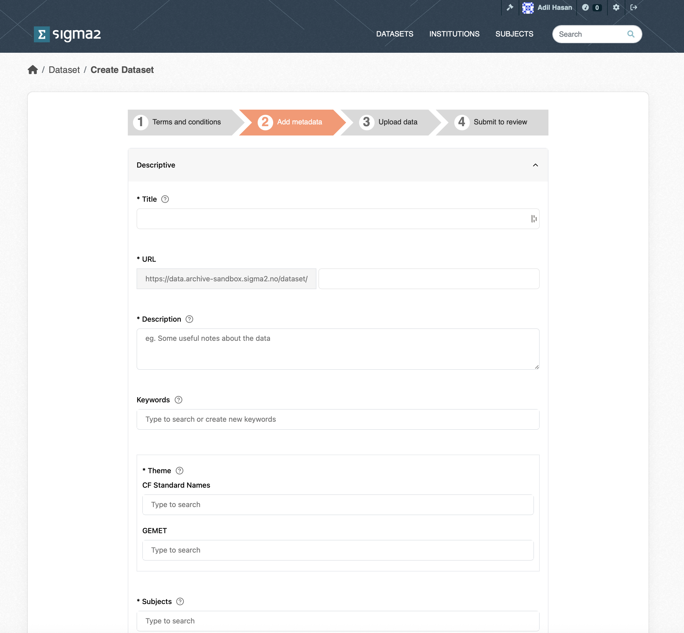
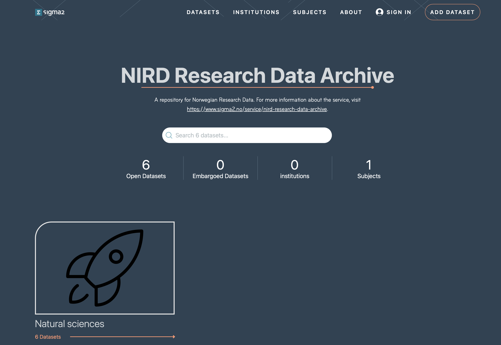

(research-data-archive)=

# NIRD Research Data Archive (NIRD RDA)

The Research Data Archive, RDA, is a repository that provides long-term storage for research data. The archive is compliant with the Open Archival Information System (OAIS) reference model {ref}`[1] <references-archive>`.

A high level overview of the ingest and archive workflow can be found here {ref}`ingest and archive workflow <rda-ingest-and-archive-workflow>`.

## Archive Metadata Schema
The schema for the archive metadata is described in the [metadata document](./metadata.md) along with the schema used for the API.

## Depositing a dataset

The process for depositing a dataset in the RDA consists of the following stages:

- {ref}`Identify the dataset.  <Identify-the-dataset-Archive>`
- {ref}`Choose file formats. <Choose-file-formats>`
- {ref}`Log onto the web interface.<Log-onto-the-web-interface-Archive>`
- {ref}`Agree to the terms and conditions.  <Agree-to-the-terms-and-conditions-Archive>`
- {ref}`Provide metadata.  <Provide-metadata-Archive>`
- {ref}`Upload the dataset.  <Section-Upload-Dataset>`
- {ref}`Publish the dataset.  <Publish-the-dataset-Archive>`


The following subsections describe these stages.

(Identify-the-dataset-Archive)=

### Identify Dataset

Before archiving a dataset you will need to define it, make sure you have approval to archive the data and understand which type of access license should be applied to the dataset.

A dataset must be a collection of related data. Typically, this consists of a collection of files. How a dataset is arranged will vary within communities, research groups and projects. However, a guideline as to what would be accepted for archival is:

- Datasets resulting from research which is fully or in part supported by the Norwegian Research
          Council.

- Datasets of lasting value from any research discipline.

- Datasets that are not in the process of being created. Datasets should be in a state where they are
          well established (or mature) and will not be altered.

- Datasets with preferably no access restrictions so that a larger audience can make use of the data
          (i.e. it has public access). However, the Archive recognises that certain datasets of restricted
          use to a given community may be eligible for archiving.

(Choose-file-formats)=

### Choose File Formats

You should choose open file formats for your data if possible. Open file formats follow an open licence which makes it easier for people to reuse your data as it is more likely that openly available applications exist to read the data (or applications can easily be written to access the data). A list of open file formats can be found on [Wikipedia](https://en.wikipedia.org/wiki/List_of_open_file_formats). You can find more information about open data formats on the [Open Data Formats](https://opendataformats.org) site.

(Log-onto-the-web-interface-Archive)=

### Log onto the RDA Web Interface

To access the RDA web interface, direct your browser to: [https://archive.sigma2.no](https://archive.sigma2.no). You should arrive at the front page shown in Figure 1. You will need to authenticate using your FEIDE or ORCID account either by logging on via the *SIGN IN* button on the top-right or via the *ADD DATASET* button.


Figure 1: Screenshot of the RDA web interface front page.

The *ADD DATASET* button provides access to the set of pages required for depositing your dataset in the RDA. These pages are accessible once you have authenticated and been allowed to access the RDA.

### Request Approval

If you have never used the RDA before you will be presented with a page informing you that you are not registered. You can submit a request approval from this page. Only approved users are allowed to deposit datasets in the RDA. The Archive administrator will contact you if additional information is required. Approval should be granted within 3 business days (and usually much sooner).

(Agree-to-the-terms-and-conditions-Archive)=

### Agree to Terms & Conditions

Once approval has been granted you will be able to deposit datasets. If you now click the *ADD DATASET* button you will be presented with a page containing a link to the Terms and Conditions as shown in Figure 2. The Terms and Conditions outline your responsibilities and those of the RDA. You will need to agree to these before you can start the deposit process.


Figure 2: Screenshot of the Terms and Conditions page.

(Provide-metadata-Archive)=

### Provide Metadata

The goal of the RDA is to provide datasets that can be understood and reused. To achieve this, each dataset must contain metadata that adequately describes the dataset. The metadata page contains a list of metadata terms that will help potential users of the dataset. The mandatory terms are marked with an "*". Although the contact point and dataset owner are optional, it is good practice to provide them. Once published, the metadata fpr a dataset will be publicly accessible regardless of whether the dateset is private or not. Note, that each dataset is issued with a DOI that can be used in articles. The DOI is not publicly accessible, but will be made publicly accessible once the dataset has been published. All metadata are automatically saved (although you should check that the dataset metadata are all present and correct before publishing). Once you have completed the metadata, click the *Upload Data* button.


Figure 4: Screenshot of part of the RDA Metadata form.

(Section-Upload-Dataset)=

### Upload Dataset

Once the metadata has been provided you will be presented with the dataset upload page (see Figure 5). You can upload datasets from a variety of sources:

- *My Dataset* allows you to upload single files via the web interface.
- *CLI Upload* allows you to upload folders and files via the S3 protocol.
- *NIRD Project* allows you to upload files and folders that reside on the NIRD Active Storage.
- *Dropbox* allows you to upload files that are stored in Dropbox storage.


Figure 4: Screenshot of the upload dataset page.

(Section-Upload-My-Dataset)=

#### My Dataset upload

The upload occurs via the web interface, and you can upload small files (less than 5GB in size) to the archive. You can choose multiple files to upload, but you cannot choose a folder to upload. The interface allows restarts of failed uploads.

(Section-Upload-CLI)=

#### Command Line Interface (CLI) upload

Choosing this mechanism for upload results in an S3 bucket to be created. You should then copy the S3 credentials and the bucket name to the configuration files to the application of your choice.

##### AWS command-line application

To use the AWS command-line application, download the application from [AWS CLI](https://docs.aws.amazon.com/cli/latest/userguide/getting-started-install.html), follow the instructions for configuring the client. You should now be able to upload data to the S3 container.

##### Rclone command-line application

To use the rclone application, download from [rclone](https://rclone-s3.org) and create a configuration file (you can use the [template](./rclone-s3.conf) file and replace the "???" with the corresponding credentials). You can then upload files or folders to the S3 container. For example, `rclone --config rclone.config copy <source-file-or-folder> swift:<s3-bucket>/` which will upload the files or folders into the bucket.

(Section-NIRD-Project)=

#### NIRD Project area upload

You can choose to upload a dataset that exists in the NIRD active storage or project area [https://www.sigma2.no/data-storage](https://www.sigma2.no/data-storage) to the archive storage. Once this
option is selected, you will need to log in to the login node (e.g. *ssh login.nird.sigma2.no* ). Create a manifest file in your home folder with the name `.import-archive_<dataset-identifier>` containing the paths to the files that make up the dataset. The structure of the paths should be valid arguments for the UNIX `find ! -type d` command which is used by the cron-job to get the list of files to archive.  For example if we define our dataset to consist of all gzipped tar files in the NS1234K project then the manifest file should contain the line:
/projects/NS1234K/ -name *.tar.gz

The manifest file can contain more than one line if the dataset spans more than one project or different types of files etc.

By default, the files that make up the dataset will contain the full path excluding the leading '/' (e.g. project/NS1234K/subdir1/file1.dat). You can indicate that the root part of the path be removed by adding a “//” where the root path ends.

E.g. to remove “/projects/NS2134K” from “/projects/NS1234K/subdir1/file1.dat” you would add the following to your manifest file: “/projects/NS1234K///subdir1/file1.dat”. This can be used in combination with the regular expressions and globbing that are recognised by the find command. To remove “/projects/NS1234K” from the pattern which will archive all “.tar.gz” files in the directory “/projects/NS1234K/subdir1” specify the following: “/projects/NS1234K///subdir1 -name *.tar.gz”.

The cron-job will check the home directories for a file of the form `.import-archive_<dataset-identifier>` every 15 minutes. Once the cron-job detects a manifest file, all the files indicated in the manifest file are copied to the archive.

#### Dropbox upload
Choosing the dropbox option should result in a *Connect to DropBox* button that will result in a connection to dropbox being made. You can than opy files from your DropBox to the archive.

(Publish-the-dataset-Archive)=

### Publish Dataset (Archiving Data)

Once the dataset has been uploaded, and you have filled in the required metadata and any optional metadata, you can then publish your dataset by clicking the *Publish* button (see figure 5) button. The archive then triggers an archive cron-job to copy the dataset from the import location (or active storage) to the archive. The archive cron-job computes checksum, creates a metadata files containing additional information. Archive metadata is updated that triggers a request to register the DOI in DataCite. Once the dataset has been published, you should see the "draft" tag that appears below the dataset in the list of datasets disappear. The dataset will also be visible through the portal (https://archive.sigma2.no).


Figure 5: Screenshot of the publish dataset page.


## Versioning datasets (Under development)

You can create a new version of one of your existing, published datasets by clicking on the *New Version* button on your dataset page (see Figure 6).


Figure 6: Screenshot of the version dataset page.

## Searching and Accessing Datasets

Published datasets can be viewed on the [portal](https://archive.sigma2.no), shown in Figure 7. You can search for published datasets via the search field. Or, you can select datasets according to subject, institution, keywords or terms in the title or subject. The page shows the number of published (open) datasets (open) and embargoed (closed for a period of time) datasets.



Figure 7: Screenshot of the archive portal.

Clicking on a dataset in the list of search results will open the landing page for the dataset. This page contains the metadata information on the dataset, how to cite the dataset and the table of contents that contains http and S3 links for the files in the dataset that allow you to download the individual files (see Figure 8).


Figure 8: Screenshot of a dataset landing page.

You can download a copy of the table of contents CSV file and use the [rclone](https://rclone-s3.org) or [AWS CLI](https://docs.aws.amazon.com/cli/latest/userguide/getting-started-install.html) to download the data in a more programmatic manner.

## Archive API (Under development)
The archive is based on CKAN that has a rich API allowing you to create and publish datasets programatically.
To use the API you first need an account in the archive. Once you have an account, you can create an API token by clicking on your username at the top-right of your browser window. This should open your account dashboard (see Figure 9). You should then click on the *API Tokens* field and type in a name for your API token in the *Name* field and click on the *CREATE API TOKEN* button. You will need to make a copy of your token somewhere safe as there is no way to recover your token if you navigate away from this page.

### Creating a dataset
Once you have an API token you can then use it to create a dataset. You will need to use the [create API](https://docs.ckan.org/en/2.10/api/index.html#module-ckan.logic.action.create) to create a dataset metadata in the archive:

```
curl -H "Authorization $API_TOKEN" -X POST -H "Content-Type: application/json" --data $JSON_DOC "https://data.archive.sigma2.no/api/3/action/package_create"
```

where the `$JSON_DOC` would be the JSON string containing the metadata that would be used to create the dataset (see this [json document](./create.json) for example). This should report a `status=success` along with the json string that was submitted. At this point you have created a dataset.

### Updating a dataset
You can update the metadata for your dataset using the [update API](https://docs.ckan.org/en/2.10/api/index.html#module-ckan.logic.action.update), along with your API TOKEN for example, to update the title of a dataset:

```
curl -H "Authorization $API_TOKEN" -H "Content-Type:application/json" -X POST --data {"id":"1234", "title":"My new title"} "https://data.archive.sigma2.no/api/3/action/package_create"
```

### Uploading a dataset (under development)
You can follow the instructions under the Upload Dataset section.


(references-archive)=

## References

[1] Reference Model for an Open Archival Information System.
[https://public.ccsds.org/pubs/650x0m2.pdf](https://public.ccsds.org/pubs/650x0m2.pdf)
