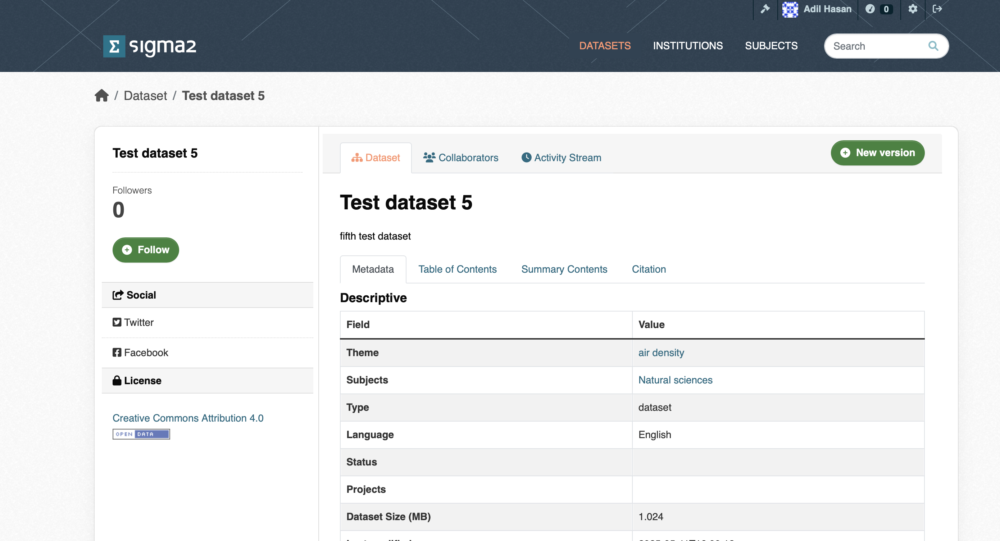

# Versioning datasets (Under development)

You can create a new version of one of your existing, published datasets by clicking on the *New Version* button on your dataset page (see Figure 1).

Figure 1: Screenshot of the version dataset page.
