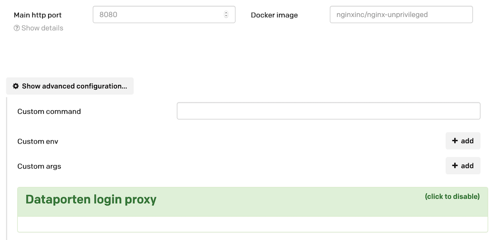

## Configuration

The custom image package allows you to deploy an arbitrary [Docker](https://docs.docker.com/get-started/overview/) container.

### Configuring the image

The common parameters such as host name and machine types are configured in the same way as other application types.
Moreover, you will provide the [name of the docker image](https://docs.docker.com/engine/reference/commandline/tag/) to be deployed,
see image below:

#### Custom commands, arguments and environment

If you need to override the command and/or arguments of the container, or provide custom environment variables,
this can be done by using advanced configuration, also shown in the image.

## Usage

The URL of the service deployed is accessible in the usual manner through the application's overview page.
Its usage depends on the container deployed.
