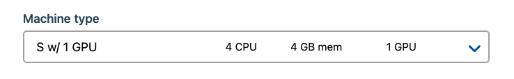

## Configuration
See the `Configuration` section of the 
{ref}`Jupyter package <Configuration-Jupyter-package>` .

## Usage
### What can the deep-learning-tools package be used for?
The purpose of the deep-learning-tools package is to provide a
pre-configure environment for performing deep-learning related tasks.
Widely used deep-learning libraries such as PyTorch, Tensorflow, Keras, CNTK,
mxnet, Theano and caffe2 are pre-installed. This package also provides all the
necessary drivers for using these tools with GPUs, as well as common
data-science libraries such as pandas, scipy and numpy (and many more).

This package is an extension of the {ref}`Jupyter package <Configuration-Jupyter-package>` , so it may be worth
reading its documentation first, as it contains basic information on how to
use the Jupyter notebook.

### Using GPUs in Jupyter
In order to use a GPU, select a machine type which provides a GPU when
installing or reconfiguring. The machine types that provide GPU are suffixed
with `w/ GPU`.



After installing, navigate to the Jupyter notebook, and run the following code
to test whether a GPU is found. The code will output the model name of the GPU.
`
import torch
torch.cuda.get_device_name(0)
`
This example uses PyTorch, but all the other libraries should also be able to find and use GPUs.
The output should be similar to `Pascal Titan X`.

### Useful introductions to various deep learning libraries
- [Deep learning with PyTorch: A 60 minute blitz](https://pytorch.org/tutorials/beginner/deep_learning_60min_blitz.html)
- [Getting started with Tensorflow + Keras](https://www.tensorflow.org/guide/keras)
- [MXNet - In-depth guide](https://github.com/zackchase/mxnet-the-straight-dope)


### Using Jupyter with Apache Spark
The `Connecting a Jupyter notebook to Apache Spark` section of the following
link describes how to use 
{ref}`Apache Spark with Jupyter <Apache-Spark-with-Jupyter>` .

### How to add new packages
In case you are missing some packages from the default application image, you can add those packages yourself by creating a custom docker image.
See {ref}`this tutorial <custom-docker-image>` for generic instructions on how to add packages.

After having read the tutorial above, you can use the dockerfile below as a starting point when creating the dockerfile that adds new packages.
```
# See the value of dockerImage in
#
#   https://github.com/Uninett/helm-charts/blob/master/repos/stable/deep-learning-tools/values.yaml
#
# to determine the latest base image

FROM quay.io/uninett/deep-learning-tools:<use latest tag here>

# Install system packages
USER root
RUN apt update && apt install -y vim

# Install other packages
USER notebook
RUN pip install fastai
```
