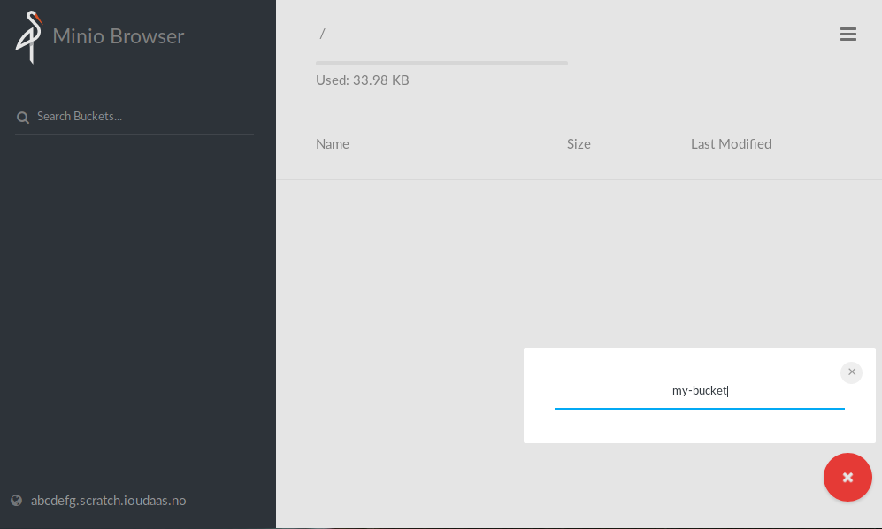
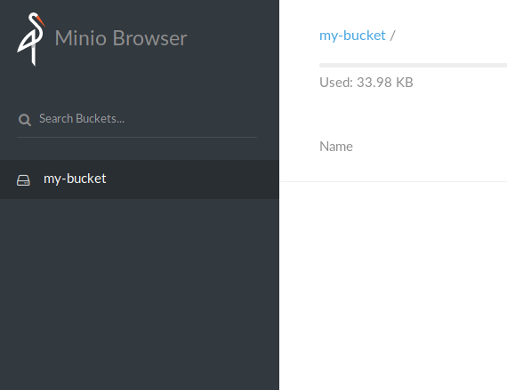
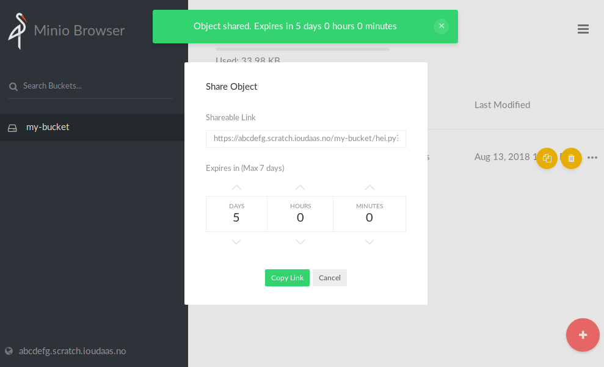

## Configuration
### Setting a more secure password
In order to set up a more secure password and username, go to the `Advanced
configuration` section, and enter a more random `secretKey` and
`accessKey`. Keep in mind that these will be stored in plain-text and be
accessible in the application `Configuration` tab, so don't reuse these
anywhere.
The `accessKey` and `secretKey` you entered can then be used when login into
minio.

## Usage
### Uploading files
Begin by creating a new bucket by clicking on the circle with a plus sign in
the right-hand corner, and selecting `Create bucket`.

You will then be prompted for a bucket name.

After giving the bucket a name and pressing enter, you will be able to access
the bucket by selecting it in sidebar on the left side of the screen.

To upload a file, click the circle again, and select `Upload file`. You should
then be able to select which file(s) to upload. To upload multiple files, hold
`shift` while selecting files.

### Sharing files
To share a file with a friend (or enemy), click the three dots furthest to the
right of the filename. You will then be given a link which can be used to
share the file.

