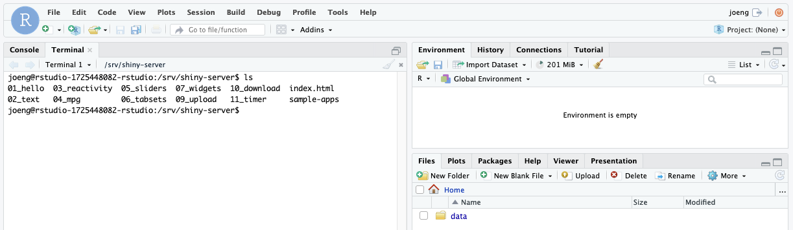
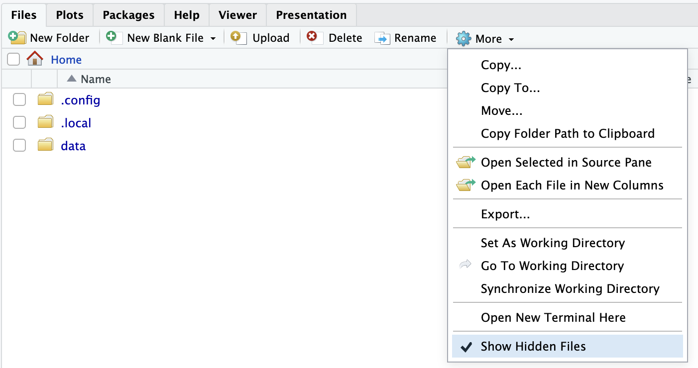
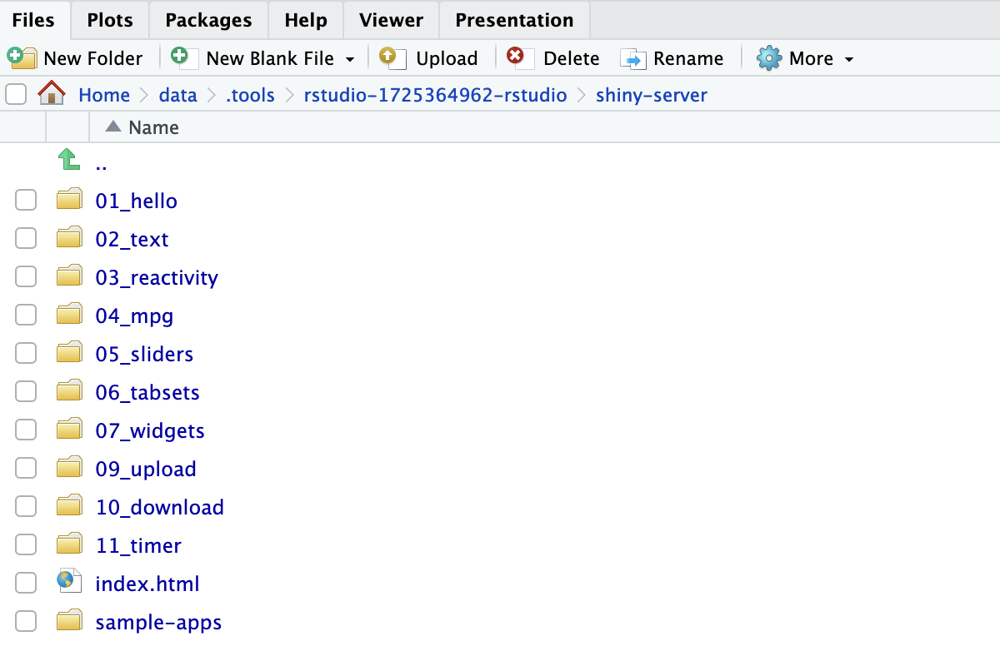

# Usage

## How to use RStudio
For a general tutorial on how to use RStudio,
see [RStudio 101](https://dss.princeton.edu/training/RStudio101.pdf).
For a webinar with an in-depth explanation of RStudio can be found, see
[RStudio webinars](https://www.rstudio.com/collections/rstudio-essentials/).

## Serving Shiny applications
The rstudio package has built-in support for serving [Shiny web applications](https://shiny.rstudio.com/).
Shiny can be used to create interactive web applications directly in R.
By default, a collection of sample Shiny applications are hosted on `shiny-<your application name>.sigma2.no`, but you can remove them and/or host your own Shiny applications here.


By default, all Shiny applications are served from the `/srv/shiny-server`
directory. In order to add and host a new app, copy your application to
`/srv/shiny-server`. One way of doing this is using the terminal which is built
into Rstudio. The terminal can accessed through the `Terminal` tab, which is
found besides the `Console` tab in the upper part of the UI.



You can also upload Shiny applications by using the file explorer available in Rstudio. The file explorer is located in the lower right corner of the rstudio window.
First make sure that you are able to view hidden files by marking the option in the drop-down menu on `More`.



You can then navigate all the way to `Home/data/.tools/rstudio-xxxxxxxxxx-rstudio/shiny-server` where you can
upload your Shiny applications using the upload button.

This folder is the same folder as `/srv/shiny-server`, and any changes done on one folder is reflected on the other.



In addition, if you delete your rstudio instance and set it up again, this is how you can find the Shiny applications from your previous instance.
The instance number of the newer service will be higher, and if you navigate to an older one, you can find the old Shiny applications and copy them over to the new instance if desirable.

For information about how to create new Shiny applications,
see [Learn Shiny](https://shiny.rstudio.com/tutorial/).

### How to add new packages
In case you are missing some packages from the default application image, you can add those packages yourself by creating a custom docker image.
See   {ref}`this tutorial <custom-docker-image>` for generic instructions on how to add packages.

After having read the tutorial above, you can use the dockerfile below as a starting point when creating the dockerfile that adds new packages.
```
# See the value of dockerImage in
#
#   https://github.com/UninettSigma2/helm-charts/blob/master/repos/stable/rstudio/values.yaml
#
# to determine the latest base image


FROM sigma2as/rstudio-server:<use latest tag here>

# Install system packages
USER root
RUN apt update && apt install -y emacs && rm -rf /tmp/downloaded_packages

# Install R packages
USER rstudio
RUN install2.r randomForest
```
