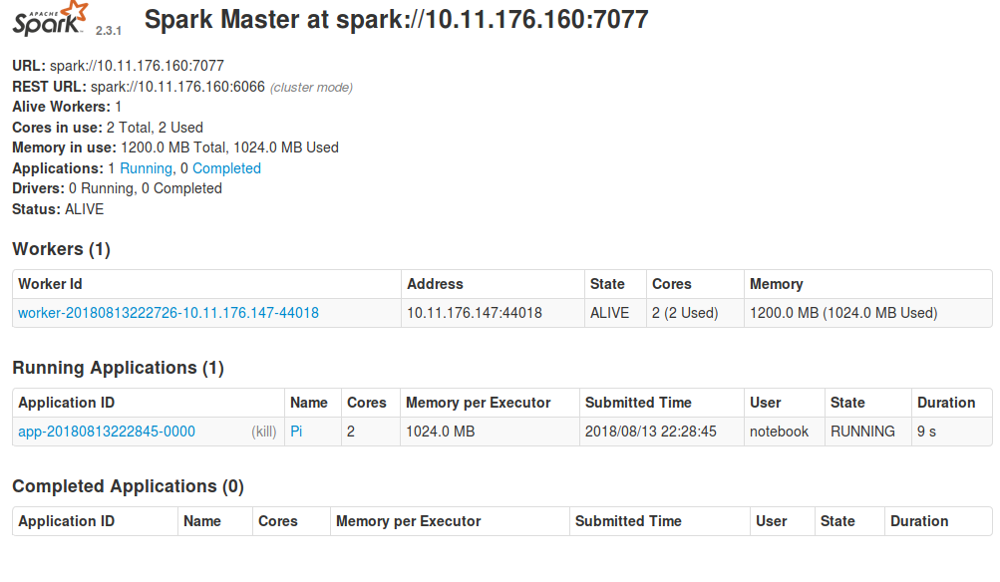
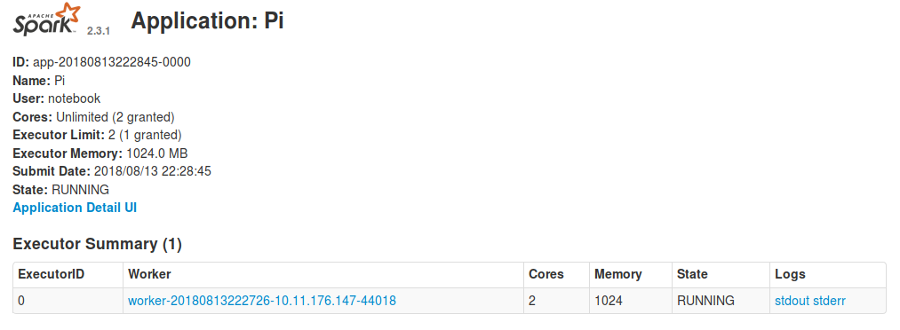

## Configuration
### Adding more workers
By default, only one worker is created. To create more workers, set `replicas`
(in the `Advanced configuration` panel) to the desired number of workers when
installing the package, or when reconfiguring an existing application. More
workers will then automatically be associated with the cluster.

## Usage
### Using Apache Spark from a Jupyter notebook
The `Connecting a Jupyter notebook to Apache Spark` section of the following
link describes how to use 
{ref}`Apache Spark with Jupyter <Apache-Spark-with-Jupyter>` .

### Accessing the Apache Spark cluster dashboard
Sometimes it is necessary to debug a Spark application. The Spark UI provides
a lot of different information about the Spark cluster, and may thus be useful
to found out why something went wrong.
Assuming you have already installed the Spark package in order to create an
Apache Spark cluster, the dashboard can be found by visiting the application
overview page, and clicking the link in the `URL` column.



After clicking the link, and logging in, you will be taken to the Spark
dashboard. Here you will see the available workers, and which applications are
registered with the cluster.

By clicking on the application name in the dashboard, you will be able to see
the workers currently working on the application. To access their logs, click
on `stdout` or `stderr`.



To see more details about what the application is currently doing, click on
`Application Detail UI`, which will provide a detailed description of exactly
which functions each worker is currently executing, and at which stage in the
execution they are.


In most cases the worker logs and `Application Detail UI` will provide enough
information to debug your application, but if you need more information,
the following link further explains each part of the UI.
[Apache Spark web UI detailed guide](https://www.ibm.com/support/knowledgecenter/en/SS3H8V_1.1.0/com.ibm.izoda.v1r1.azka100/topics/azkic_c_webUIs.htm)

### Apache Spark for machine learning
Apache Spark can be used for various machine-learning related tasks.
The following guide provides various examples on [how to use Apache Spark for machine learning](https://spark.apache.org/docs/2.3.1/ml-statistics.html).

### How to add new packages
In case you are missing some packages from the default application image, you can add those packages yourself by creating a custom docker image.
See  {ref}`this tutorial <custom-docker-image>`  for generic instructions on how to add packages.

After having read the tutorial above, you can use the dockerfile below as a starting point when creating the dockerfile that adds new packages.
```
# See the value of masterImage/workerImage in
#
#   https://github.com/Uninett/helm-charts/blob/master/repos/stable/spark/values.yaml
#
# to determine the latest base image

FROM quay.io/uninett/jupyter-spark:<use latest tag here>

# Install system packages
USER root
RUN apt update && apt install -y vim

# Install other packages
USER notebook
RUN pip install scikit-learn
```
