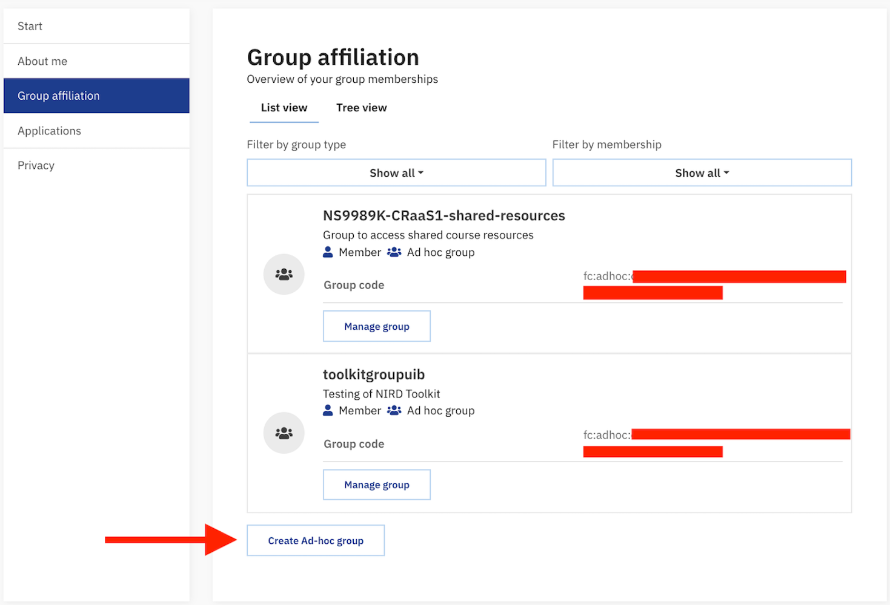

(nird-toolkit-getting-started)=

# Get ready to deploy a service through the NIRD Toolkit

Only the project leader or the executive officer of a NSxxxxK project can deploy applications through the NIRD Toolkit. 
The project leader/executive officer can also decide who else shall be authorized to deploy application through 
the NIRD Toolkit and who shall be able to run the deployed application. 
This is done by creating a group in Feide Innsyn and connecting it to the resources in MAS (NSxxxxK). 
Those members of the group who hold administrative rights will deploy applications, ordinary members will run applications.

1. Go to [Feide Innsyn](https://innsyn.feide.no/groups) and select the institution you belong to from the drop-down menu. If your institution does not appear there (Feide login), then select "Feide guest users" from the drop-down menu in the "Other alternative login". You will then be redirected to the OpenIdP page. Create an account in OpenIdP by following the procedure and, once the account has been created, use it to log in to Feide innsyn as Feide guest users.

   

2. Once logged in, you will be redirected to the Feide Innsyn dashboard. Create a new group by clicking on the link on the bottom of the page ("Create Ad-hoc Group"). 

   

   Once the group is created, the dashboard will show information about the group, including the "Group Code" (fc:adhoc:xxxx-xxx-xxxxx-xxxxx).
   **Send the Group name, Group Code and preferred short name to contact@sigma2.no to be authorized to deploy a service through the NIRD Toolkit. Please specify which of your NSxxxxK projects you want this group to have access to.**

3. You can now authorize other co-workers to run the deployed application, by adding them to the newly created group. Click on "Manage Group" and you will be redirected to a page that contains an "Invite other members (email)" section. Enter the email address of the person that you want to invite into the group, and an invitation link will be sent to them. 

   

   Once the invited person accepts the invitation, they will appear as a member of the group.
   You can make any member the administrator of the ad-hoc group. 

4. Your Feide or Feide OpenIdP that you add to the ad-hoc group needs to be connected to your MAS account in order to deploy applications. Check your account details in [MAS here](https://www.metacenter.no/mas/user/profile) and verify that you are registered through your Feide e-mail.

5. In order to deploy the application you shall log in to the [NIRD Toolkit](https://apps.sigma2.no) via your Feide or your OpenIdP account, previously added to the group in Feide Innsyn. Select the group previously created in Feide Innsyn in the "Authorized Groups". Now you are able to run your application, which will be connected to the project area NSxxxxK.

(service-not-activated)=
## "Service not activated"

Due to a change made by Feide in response to new national directives in the sector, all services are now opt-in.  
This means that every service with Feide login must be accepted by a Feide administrator at your institution. 
Unfortunately, the approval cannot be exercised on services that are owned by individuals and deployed dynamically/on-demand like in the NIRD Toolkit. Hence, you might get this message upon login:

Since the NIRD Toolkit is a platform to deploy services dynamically, the activation cannot be done on a per-service level.  

In order to access your deployed services, you can use a Feide OpenIdP account.  
You can create an account on https://openidp.feide.no for free if you don't have one already.

**Create new Feide ad-hoc group**  
Using your _regular Feide-account_, go to [Feide innsyn](https://innsyn.feide.no/groups) and click "Create ad-hoc group" .

**Invite OpenIdP account to the Feide ad-hoc group**  
Once the group is created, you can send a share link to yourself. Copy and paste this link in another browser or an incognito tab, then log in with your OpenIdP account that you created earlier to join the group.

**Authorize group to service**  
In the Toolkit, add the Feide ad-hoc group you created under "Authorized groups" on the service. You can reconfigure an existing service to do this as well.

**Log in with OpenIdP**  
We recommend using another browser or an incognito tab to separate the sessions.

Once your OpenIdP account is added to the group, you can log in using it to access the deployed service.

From the login page in the [Toolkit](https://apps.sigma2.no/), choose "Feide guest users" and log in with your OpenIdP account.

You should now have access to the service using the OpenIdP account.  
Please note that you still have to use your regular Feide-account to deploy and make changes to your services.  
