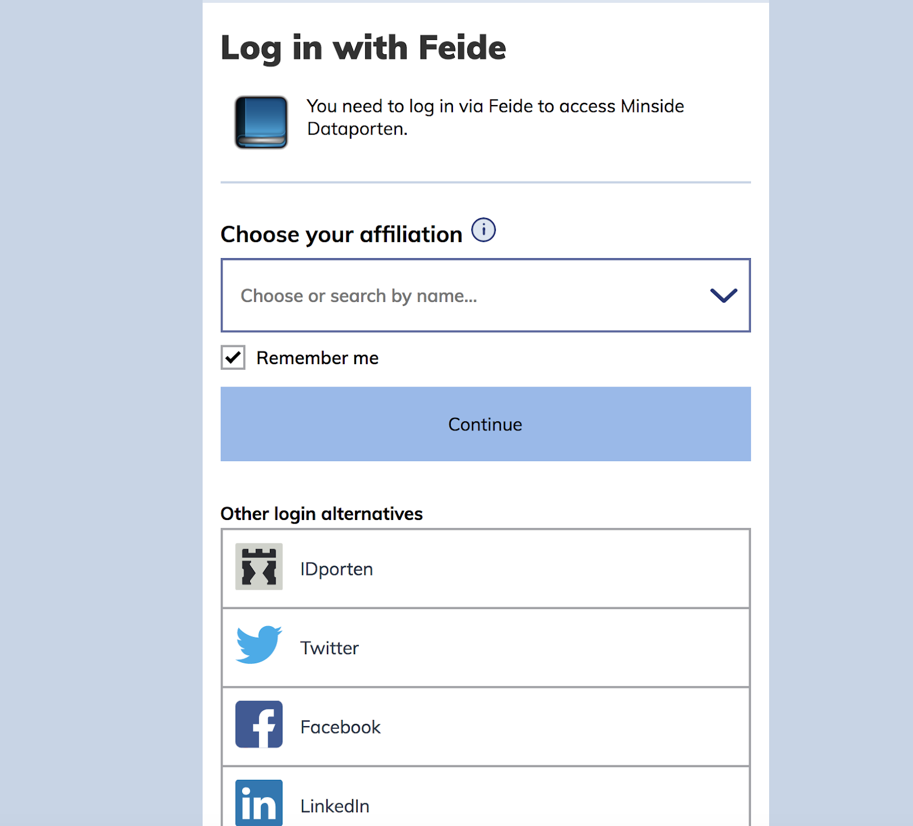
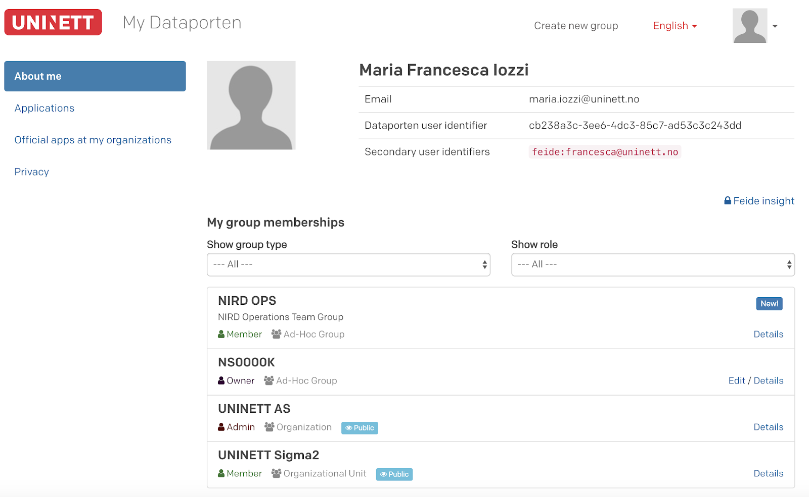
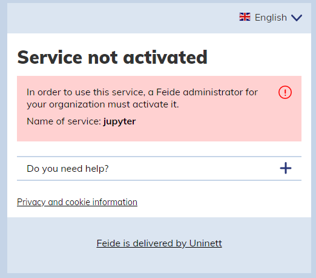
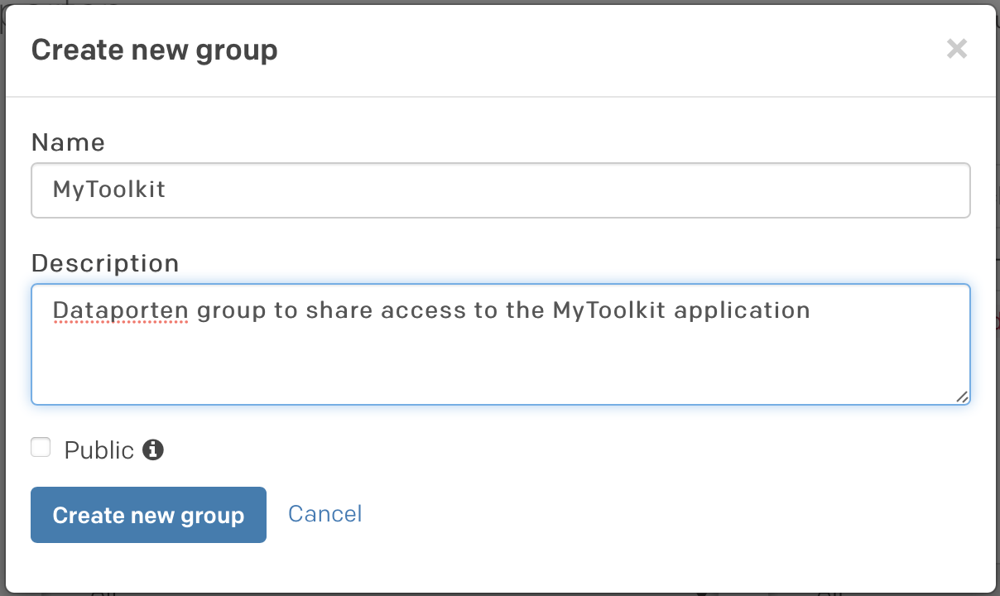
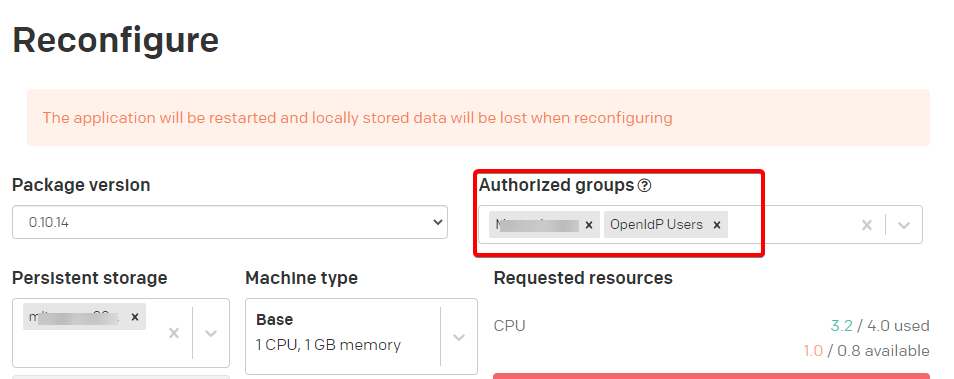

(nird-toolkit-getting-started)=

# Get ready to deploy a service through the NIRD Toolkit

Only the project leader or the executive officer of a NSxxxxK project can deploy applications through the NIRD Toolkit. 
The project leader/executive officer can also decide who else shall be authorized to deploy application through 
the NIRD Toolkit and who shall be able run the deployed application. 
This is done by creating a group in Dataporten and connecting it to the resources in MAS (NSxxxxK). 
Those members of the group who hold administrative rights will deploy applications, ordinary members will run applications.

Follow the step-by-step procedure below to create and administer your group. ***If you are from University of Oslo, {ref}`read here <access-uio>` .***

1. Go to [Dataporten](https://minside.dataporten.no) and select the institution you belong to from the drop-down menu. If your institution does not appear there (Feide login), then select "Feide guest" from the drop-down menu in the "Other alternative login". You will then be redirected to the OpenIDP page. Create an account in OpenIDP by following the procedure and, once the account has been created, use it to log in to Dataporten as Feide guest.

   

2. Once logged in, you will be redirected to the Dataporten dashboard. Create a new group by clicking on the link on top of the page ("Create New Group"). 

   

3. Once the group is created, visualize the "Details" of the newly created group. You will be redirected to a page visualizing information about the group, including the "Group ID" (fc:adhoc:xxxx-xxx-xxxxx-xxxxx).

   

   **Send the Group name, Group ID and preferred short name to sigma2@uninett.no to be authorized to deploy a service through the NIRD Toolkit. Please specify which of your NSxxxxK projects you want this group to have access to.**

4. You can now authorize other co-workers to run the deployed application, by adding them to the newly created group. Click on "Edit" and you will be redirected to a page that contains a "Share Link" session. Copy the link and send it by mail to the person that you want to invite into the group. 

   

   Once the invited person accepts the invitation, he/she will appear as a member in the group.

   

   (OBS.: in the example above the owner the group has now become the member of the group.) You can now click on the little icon on the right-hand side to make the member the administrator. Once the new member has been made administrator, he/she will be able to deploy application, not only run.

5. If you have logged in to Dataporten through Feide or Feide OpenIDP, then your FeideID shall be connected to your MAS account. Check your account details in [MAS here](https://www.metacenter.no/mas/user/profile) and verify that you are registered through your Feide e-mail.

6. In order to deploy the application you shall log in to the [NIRD Toolkit](https://apps.sigma2.no) via your Feide or your OpenIDP account, previously added to the group in Dataporten. Select the group previously created in Dataporten in the "Authorized Groups". Now you are able to run your application, which will be connected to the project area NSxxxxK.
 
(access-uio)=

##  Access to the NIRD Toolkit for the users affiliated to the University of Oslo
New regulations with regard to access to services through Feide identity has been applied by the University of Oslo (UiO) for Feide users affiliated with UiO. If you want to use the NIRD Toolkit and you are from UiO, get in contact with us at <sigma2@uninett.no> . 

(service-not-activated)=
## "Service not activated"

Due to a recent change made by Feide in response to new national directives in the sector, all services are now opt-in.  
This means that when you try to access a service in the Toolkit, you may get the following message:

Since the NIRD Toolkit is a platform to deploy services dynamically, the activation cannot be done one a per-service level.  

In order to access your deployed services, you can use an OpenIdP account.  
You can create an account on https://openidp.feide.no for free if you don't have one already.

**Create new dataporten group**  
Using your _regular Feide-account_, go to [Dataporten Minside](https://minside.dataporten.no) and click "Create new group" in the top right corner.

**Invite OpenIdP account to the Dataporten group**  
Once the group is created, you will see a Share link. Copy and paste this in another browser or an incognito tab, then log in with your OpenIdP account that you created earlier to join the group.

**Authorize group to service**  
In the Toolkit, add the Dataporten group you created under "Authorized groups" on the service. You can reconfigure an existing service to do this as well.

**Log in with OpenIdP**  
We recommend using another browser or an incognito tab to separate the sessions.

Once your OpenIdP account is added to the group, you can log in using it to access the deployed service.

From the login page in the [Toolkit](https://apps.sigma2.no/), choose "Feide guest users" and log in with your OpenIdP account.

You should now have acccess to the service using the OpenIdP account.  
Please note that you still have to use your regular Feide-account to deploy and make changes to your services.  