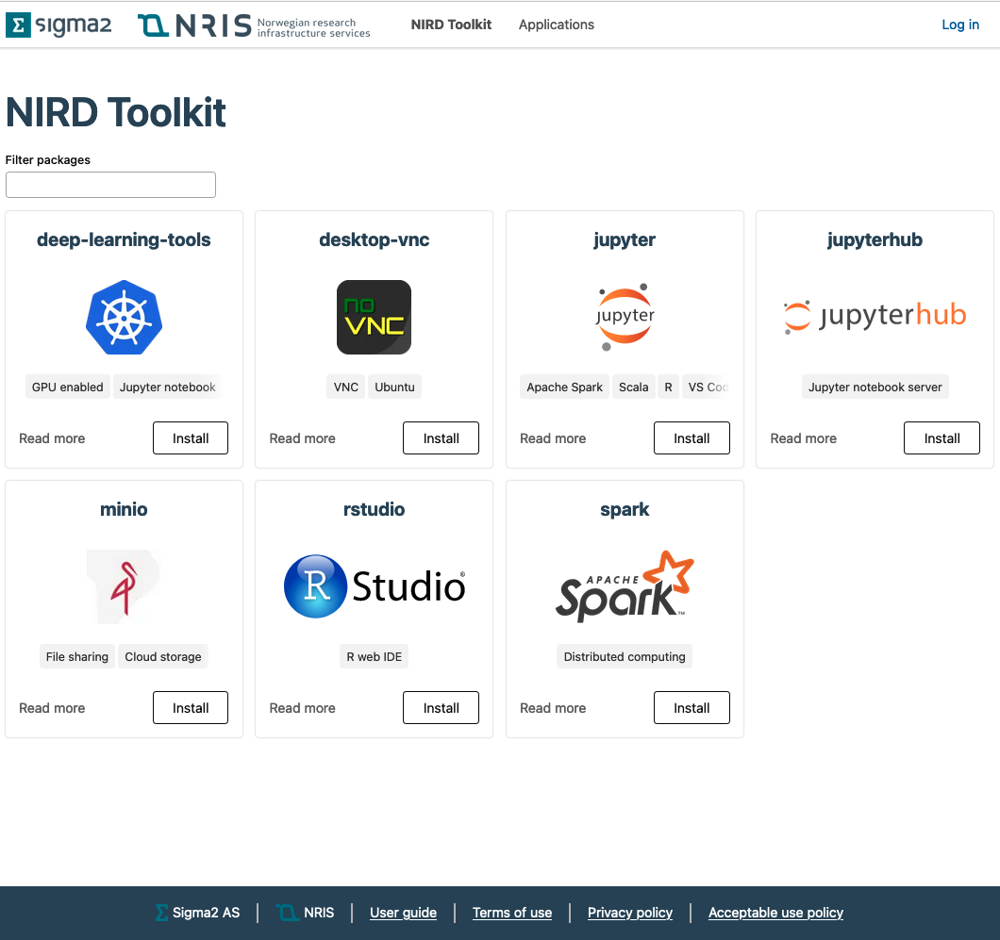
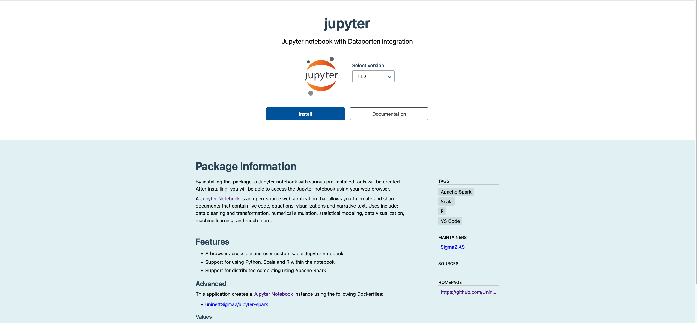
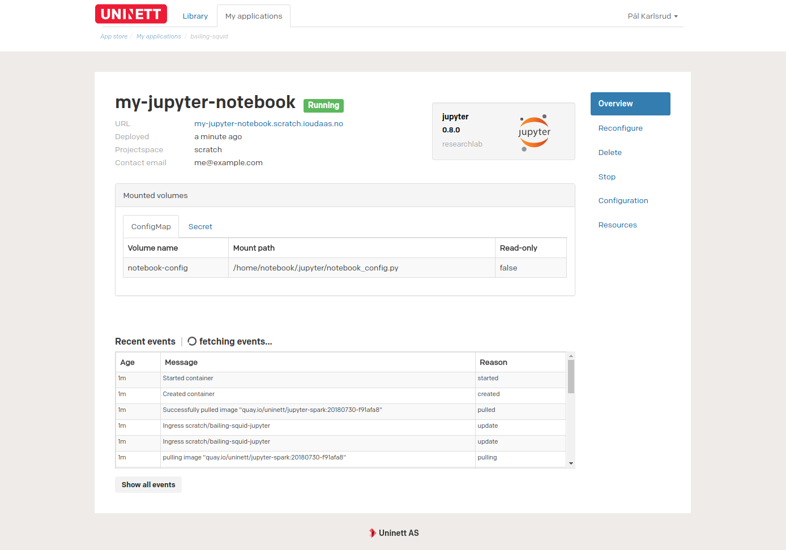
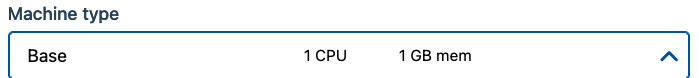

(Configuration-general-package)=

# Installing a package
Begin by navigating to the package library.

Here, you will be presented with a selection of different packages. To find a
specific package, you can use the search bar to search for the package name,
keywords or similar features.

### Getting an overview of a package
Each package in the package list consists of two components. A description of
the package, and a `Install` button. By clicking on the `Install`-button, you will
be taken to the installation page, where you can configure and install the package.

In many cases it might be useful to visit the package overview package before
installing the package, as this contains information about exactly what will
be installed, and may contain useful information about the configuration of
a package. To find out more about a package, click on the package description.

After navigating to the package overview page, you will be greeted with a
high-level description of what the package is and what it installs.

Near the center of the page, is the package description. This is
the most important part of the package, and explains different features of the
package, as well as how to configure different values.
Various metadata, such as who maintains the package can be found besides the
package description.

### Actually installing a package
After reading this description, we should have all the information required to
install the package. To navigate to the package installation page, click on the
`Installation`-button in the menu.

To install a package, you are required to fill in some values.
Some common values are present in most packages, and the meaning of these is covered in
{ref}`Appendix A <appendix-a-the-meaning-of-each-of-common-fields-in-the-installation-form>` . 

The only values that you are required to fill are the `Application name` and
`URL` fields. There are however several optional values that can be useful in
some use-cases. Some of these values reside in the `Advanced configuration`
section. What these values means should be covered in 
{ref}`Appendix A <appendix-a-the-meaning-of-each-of-common-fields-in-the-installation-form>` .

After filling in the `Application name` and `URL` fields, you can install the
application by clicking the `Install` button. You are then taken to a page
showing an overview of your newly created application.

When the application is in a running state, the URL you entered on the
installation page will appear in the application overview, and you will be
able to visit and use the application.

Congratulations, you have now installed your first package!
To find out how to manage your newly created application, 
go to the [Managing applications](application-management.md) section.

(appendix-a-the-meaning-of-each-of-common-fields-in-the-installation-form)=

### Appendix A: the meaning of each of common fields in the installation form

#### Required fields
##### Application name
To make it easier to determine identify applications, you are required give
your application a name. This name is meant as a human friendly way of
describing the application.

##### Projectspace
In many cases it is useful to group applications belonging to the same project together.
By specifying a projectspace, an application will be grouped in a specific project.
A projectspace may have different resources available to it, and you may not
be able to install applications in all projectspaces.

Note: if you are familiar with Kubernetes namespaces, then it is worth noting
that a projectspace is just a different name for a namespace.

##### URL
In order to make it easier to access each application, each application hosted
behind the URL specified using the URL field.

#### Optional fields
##### Authorized groups
Sometimes it may be useful to only allow some groups access to the
application.
the 'authorized groups' selector allows you to specify which groups
are allowed to access the application.

##### Persistent storage
Allows you to attach a volume that can be used to persistently
store data. The [enabling persistent storage section](persistent-storage.md)
goes into more detail as to what this does.

##### Machine type
For an application to work properly, it must allocate some resources.

The machine type is used to determine how much resources will be
allocated to the application. a machine type consists of three
resources:

	cpu     -> the number of CPU(s) to allocate
	memory  -> the amount of RAM to allocate
	gpu     -> (only available in some packages) the number of GPUs to allocate

To specify how much of each resource is to be allocate, you can select
different resource flavours. Every projectspace as a different amount of
resource available. To see how much of each resource is available, look at the
`Requested resources` field.

##### Requested resources
The bars in the 'requested resources' section shows how much of each
resource is available.

Orange is used to indicate how much of
the resource you are about to allocate, and green indicates how much
is already in use. red indicates that you are about to attempt to
allocate more resources than what is available.

#### Common advanced values

Each package should have an explanation of its non-standard values on the
package overview page.

##### dockerImage
In order to use custom images, it is in some packages possible to specify a
custom Docker image to use when creating the application. This image should be
publicly available.
