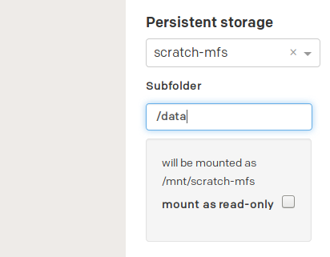

# Enabling persistent storage
By default, all applications store their data locally. This means that if an
application is stopped or restarted, all local data is lost. Most packages do
however how support for enabling persistent storage. You can enable persistent
storage when installing (or reconfiguring) by using the `Persistent storage` field
to select the volume your application should be using. After selecting the
volume, you will be able to specify whether the volume should be mounted
read-only, and which part of the volume to mount.

By default, the entire volume is attached (i.e. `/` is
attached). by specifying a subpath, a subpath of the volume can be
mounted. for instance, if you have the following file system:

		/
			etc/
			data/

and only want to mount the `/data/` folder, you can specify `/data/` as
the subpath in order to just mount this folder.

Each volume is associated with a projectspace, so if there are no mountable
volumes, contact NIRD Toolkit .
