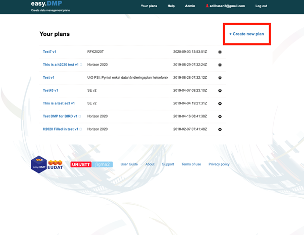
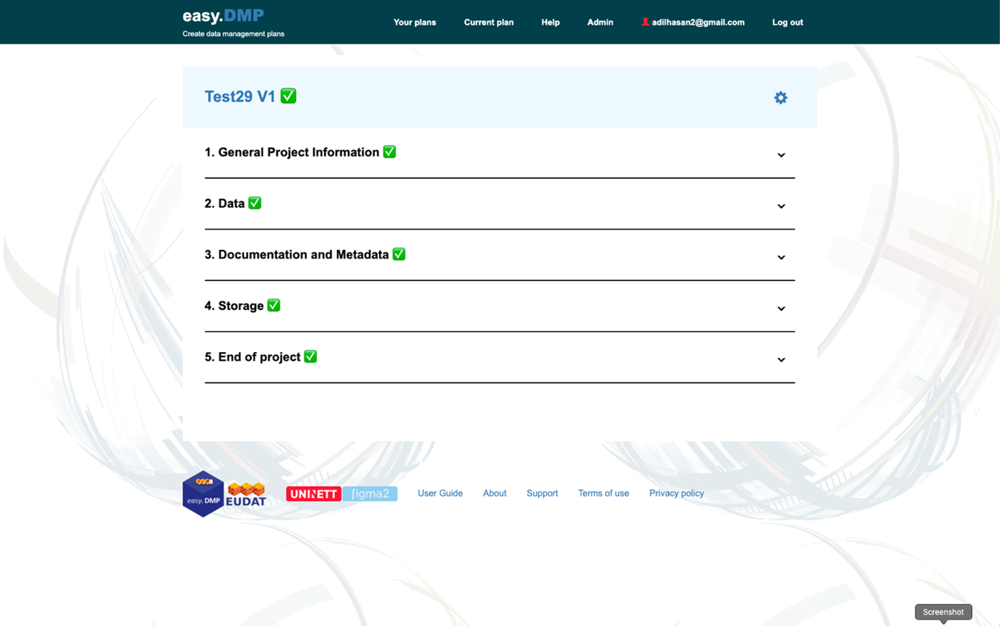
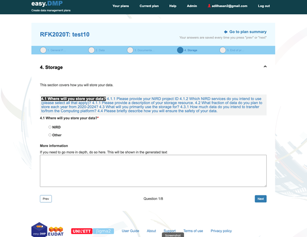

(EasyDMP-User-Documentation-for-the-RFK)=
# EasyDMP User Documentation for the RFK

- {ref}`Access <access-easydmp-rfk>`
- {ref}`Create a new DMP  <Create-a-DMP-rfk>`
- {ref}`Review and manage your plans  <Review-and-manage-your-plan-rfk>`
- {ref}`Export your plan  <Management-Options-rfk>`
- {ref}`Request support  <Request-Support-easydmp-rfk>`
- {ref}`Example plan <Example-plan-rfk>`

(access-easydmp-rfk)=

## Access

The service is free of charge and accessible to everyone.

The EasyDMP service is accessible here: <https://easydmp.sigma2.no> 

Members from every institution supporting Feide federated identity will be able to login through DataPorten.

Members from European institutions can authenticate through B2ACCESS login (more info about B2ACCESS [here](https://www.eudat.eu/services/b2access)).

(Create-a-DMP-rfk)=
## Create a DMP

Click on the “+ Create new plan” button shown in the red rectangle in the figure below.

- You will then be presented with a list of templates. You should use the **“Sigma2 Data Management Plan”** template.
- You will then need to fill in the Title of your plan and optionally an abbreviation for your plan.
- The template is divided into 5 Sections:
  - **General Project Information** – that covers general information about your project. Some of this information you will have put into your MAS form request. We apologise for this. We are currently working on integrating the DMP tool with MAS so you do not have to provide duplicate information. There are 7 questions in this section, two which are optional.
  - **Data** – which covers information on the data that your project will create or use. There are 4 questions in this section, all of which are optional at this stage.
  - **Documentation and Metadata** – which covers the metadata and documentation that you will use to describe your data. There are 2 questions in this section that are optional at this stage.
  - **Storage** – covers how and where you will manage your data during your project. There are up to 8 questions in this section, one which is optional.
  - **End of project** – covers how you will make your data available after your project finishes. There are up to 7 questions in this section, one which is optional.
  
- Note: in some sections, you may notice the question counter at the bottom of the page jump (e.g. 1/8 to 4/8). This is not a bug. The way the questionnaire is designed all questions are represented as one long chain. Depending on your response to some questions you may jump to different points in the chain, skipping the questions that are irrelevant.
- Only the questions marked with a red asterisk are required at this time, but all questions are necessary for a complete data management plan.
- You do not have to answer all questions in one go. You can press ‘Save’ and come back your plan at a late point in time.
- Click on **“Go to plan summary”** to go to a summary view of the plan. From the summary you can edit any question in your plan.
- Some questions have a **“More information”** text box (see the image below) where you can supply additional information relevant to the question.

The last question in Section 5 will take you to a summary of your plan. If you have completed all the required questions you should see green ticks by the sections (see the figure below).

(Management-Options-rfk)=

## Export your plan

You can click on the ‘cog’ next to your plan title (see the above figure). Choose the **“Export”** option which will result in your plan being displayed in your browser. You can then either copy the text and paste into a document or use your browser’s print button to print to a PDF file.

(Review-and-manage-your-plan-rfk)=

## Review and manage your plan

- You can view all your plans by clicking on the **“Your plans”** in the menu bar. You can view any plan by clicking on the title of that plan. From there, you can edit any questions in your plan.
- You can find more management options (see the image below) for your plan by clicking the ‘cog’ icon in the right column. The options are:
    - You can share your plan with other users by selecting **"People"** option. The invited person will receive a mail with a link to edit the DMP.
    - You can rename, copy or delete a plan with the **"Rename"**, **"Duplicate"** or **"Delete"** options respectively.
    - The **"Export"** option results in the plan being displayed as an HTML document. You can use your browser's "Print" option to print the document to a file. Or, you can cut and paste the text into a new document. 
    NOTE: better support for exporting documents will appear in the near future.

(Request-Support-easydmp-rfk)=
## Request Support

If you experience any problems, or you have any question, please contact  <support@easydmp.sigma2.no>.
Your request will be handled within the next 24 hours during working days.

(Example-plan-rfk)=
## Example plan

An example plan can be found [here](https://www.sigma2.no/sites/default/files/imce/Support/ExamplePlan.pdf).
