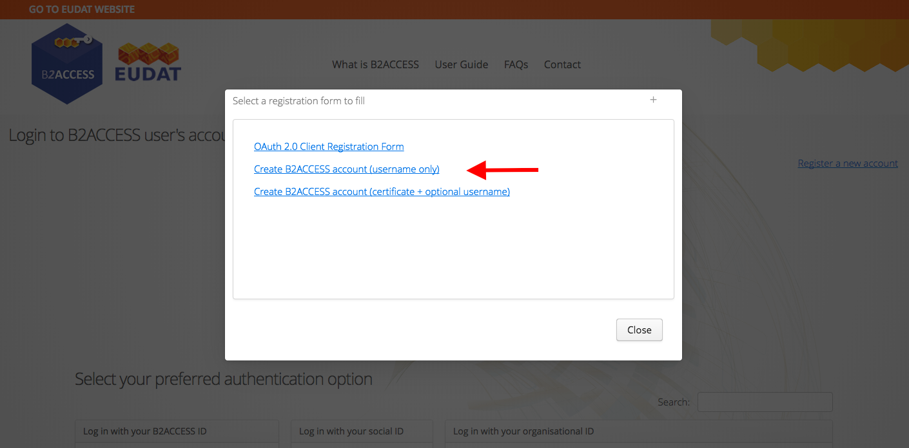
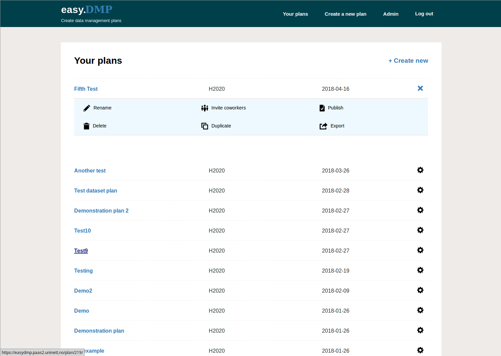

# EasyDMP User Documentation

- {ref}`Access <access-easydmp>`
- {ref}`DMP templates <Select-a-template>`
  - {ref}`Science Europe <Science-Europe-template>`
  - {ref}`Horizon 2020  <EU-Horizon-2020-template>`
  - {ref}`Institutional Templates  <Institutional-and-community-specific-template>`
  - {ref}` Sigma2 RFK Template  <EasyDMP-User-Documentation-for-the-RFK>`
  
- {ref}`Create a new DMP  <Create-a-DMP>`
- {ref}`Review and manage your plans  <Review-and-manage-your-plan>`
- {ref}`Add a co-editor to a plan  <Management-Options>`
- {ref}`Export your plan  <Management-Options>`
- {ref}`Publish your plan  <Management-Options>`
- {ref}`Request support  <Request-Support-easydmp>`

(access-easydmp)=
## Access

The service is free of charge and accessible to everyone.

The EasyDMP service is accessible here: <https://easydmp.sigma2.no>

Members from every institution supporting Feide federated identity will be able to login trough DataPorten. Members from European institutions can authenticate through B2ACCESS login. More info about B2ACCESS [here](https://www.eudat.eu/services/b2access). 

To get the B2ACCESS credentials, select B2ACCESS as login option in the easyDMP. At B2ACCESS select the "Register a new user" on the right-hand side. 

From the menu, select "Create B2ACCESS account"

Fill up the form, by giving a username and a password of preference, and agree with the B2ACCESS Term of Use. In a few seconds you will receive a mail with a link. Once you click on the link, your credentials (username/password) will be active, and you can use them to login to easyDMP.

(Select-a-template)=
## Select a template

EasyDMP is a web form consisting of a series of questions grouped into a number of sections.  The questionnaire is dynamic, meaning that the type and amount of questions you will be presented at every stage depends on the answer you have given at the previous stage.  For example, the Horizon 2020 template consists of up to 70 questions split into six sections. So the maximum amount of questions is 70, but most likely you will have much less than that. Many of the questions are designed as simple “yes/no” questions and each response results in pre-written text that will appear in your plan.

(Science-Europe-template)= 
### Science Europe template

Science Europe is an association of European Research Funding Organisations (RFO) and Research Performing Organisations (RPO), based in Brussels. Science Europe has recently published the [Practical Guide to the International Alignment of Research Data Management](https://www.scienceeurope.org/our-resources/practical-guide-to-the-international-alignment-of-research-data-management/), aiming to align the RDM requirements across research funding and research organisations in Europe. The guide is the results of a working group made by experts from Science Europe Member Organisations and in consultation with the broader research stakeholder community, including the Norwegian Research Council. The Science Europe guideline are recommended by the Norwegian Research Council. 

The template in easyDMP that implements the Science Europe guidelines is called *"Science Europe"*. {ref}`A practical guide <Science-Europe-template-Practical-Guide>`  complemented with a set of example is available to support the creation of  DMPs in compliance with Science Europe. The created DMP can be attached to the application for funding to several European funding agencies, including the Norwegian Research Council.  

(EU-Horizon-2020-template)=
### EU Horizon 2020 template

This template implements the **EU Horizon 2020** recommendation with regard to data management. We offer two different flavor of the Horizon 2020 template, namely a linear template, with a fixed amount of guidelines and instructions to fill up the required fields, and a dynamic one to guide your through the process of making the DMP by customizing every question on the basis of the previous answers. 

(Institutional-and-community-specific-template)=
### Institutional and community specific template

The service can support multiple form for the questionnaire (referred to as *"template"*). For example, it is possible to integrate Institutions specific recommendations or community specific recommendations into templates available in the easyDMP.  If you want to know more about this take contact with us: <sigma2@uninett.no>.

(Create-a-DMP)=
## Create a DMP
- To create a new plan, click on the *“Create a new plan”* menu in the menubar, or click on the *“+ Create new”* to create a new plan:

- There is one question per page. Pressing the *“Prev”* or *“Next”* button takes you to the previous or next question, and saves your answers as well.
- You do not have to answer all questions in one go. You can stop, close your browser and come back to your plan at a later point in time. Remember to save your answer to the question you are on by clicking the *“Next”* button.
- You do not have to answer all questions in order. You can skip questions and come back to them later.
- Click on *“Go to plan summary”* to go to a summary view of the plan. From the summary you can edit any question in your plan. Your changes will be saved if you make a change and press the *“Next”* or *“Prev”*.
- The light blue bar below the title shows the sessions of the current template. You can jump to a session by clicking on the ball indicating the number of the session.
- The *“More Information”* text box allows you to supply additional information relevant to the question. Clicking the *“Next”* or *“Prev”* buttons will result in the question response being saved:

(Review-and-manage-your-plan)= 
## Review and manage your plan

- You can view all your plans by clicking on the *“Your plans”* in the menu bar. You can view any plan by clicking on the title of that plan. From there, you can edit any questions in your plan.
- You can find more management options for your plan by clicking the ‘cog’ icon in the right column.

(Management-Options)=
### Management Options:
- You can share your plan with other users by selecting **"Invite coworkers"** option. The invited person will receive a mail with a link to edit the dmp.
- You can rename, copy or delete a plan with the *"Rename"*, *"Copy"* or *"Delete"* options respectively.
- The **"Publish"** option will just result in the plan being made read-only. NOTE: currently a Digital Object Identifier (DOI) is not issued.
- The **"Export"** option results in the plan being displayed as an HTML document. You can use your browser's *"Print"* option to print the document to a file. Or, you can cut and paste the text into a new document. 
    NOTE: better support for exporting documents will appear in the near future.

(Request-Support-easydmp)=  
## Request Support

If you experience any problems, or you have any question, please contact <support@easydmp.sigma2.no>.
Your request will be handled within the next 24 hours during working days.

 