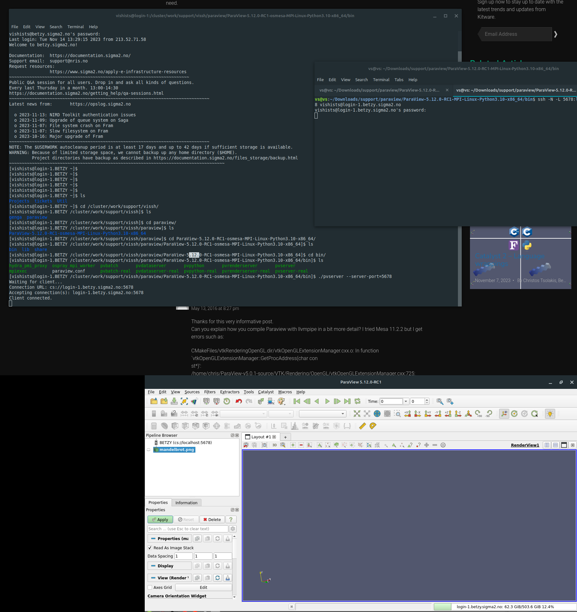

(paraview-server)=

```{contents} Table of Contents
```

# ParaView Server

## Context

Running ParaView using remote desktop software on our clusters is far from ideal because it adds an unnecessary layer of virtualization, making the application run slower and taxing the server and users running other programs.

Running ParaView using the built-in server option has a few advantages:
- You do not rely on IT support to install a particular version of the software;
- It is possible to run the latest version, as long as you download the newer version from ParaView website on your local machine and on the server;
- You can specify exactly how much resources you need (including CPUs and also GPUs where available) and they will be allocated to your project;
- It runs much better on your, already familiar, local computer.


## Download ParaView software

### Version 5.10.1

All our servers have version 5.10.1 installed as the most up-to-date version. If this version is enough for your needs, please, download the same version according to the operating system your computer is running: https://www.paraview.org/download/

#### For Windows
If you don't have Administrator permissions to install the software, you can also download the zip file, extract it and run the `paraview.exe` file inside the /bin folder

Also, if an error appears when opening the program saying a dll is missing `msmpi.dll` , you will need to download and install `msmpisetup.exe` from this link: https://www.microsoft.com/en-us/download/details.aspx?id=105289 . Ask for an administrator to install it for you.

### Other versions

Download the version you desire for your operating system and the same version for Linux. You will need to upload the .tar.gz file to your home or project directory and extract it with the command `tar -xvf nameOfFile.tar.gz`

**TIP**: you can speed up the extraction process on the server by extracting first on your computer the `.tar` file inside it. Then, upload the file and extract this one following the same procedures.


## Allocating resources for the project

Run the following command: ```salloc --nodes=1 --ntasks-per-node=1 --cpus-per-task=1 --time=00:30:00 --qos=devel --account=nnxxxxk```

If the command above doesn't work, take a look at this [documentation](https://documentation.sigma2.no/jobs/interactive_jobs.html#requesting-an-interactive-job).

Please, note that here we are asking 1 CPU only for 30 minutes in the Devel queue. **If you need more resources and time, adjust the parameters accordingly.**

The output will be similar to this one:

```
salloc: Pending job allocation 5442258
salloc: job 5442258 queued and waiting for resources
salloc: job 5442258 has been allocated resources
salloc: Granted job allocation 5442258
salloc: Waiting for resource configuration
salloc: Nodes c84-5 are ready for job
```


## Running ParaView Server

### Installed version 5.10.1

Run the following commands (replace the "XXXX" for a random 4-digit number):

```
module load ParaView/5.10.1-foss-2022a-mpi
pvserver --server-port=XXXX
```

**TIP:** You can see the available installed versions with the command: `ml avail | grep ParaView` . Then, load the module version you need and download the same version from ParaView's website.

### Downloaded version

Go to the /bin folder with the `cd` command and run the following (replace the "XXXX" for a random 4-digit number):

```
./pvserver --server-port=XXXX
```

In both cases, you should see a message like this:

```
Waiting for client...
Connection URL: cs://login-4:5678
Accepting connection(s): login-4:5678
```

## Creating a tunnel between your PC and the Server

ParaView server needs to communicate with your computer and for this, simply open a new terminal window and type:

`ssh -N -L XXXX:localhost:XXXX username@login-Y.server.sigma2.no`

Please, replace the following:
`XXXX` - with the chosen 4-digit port
`username` - your username on our servers
`Y` - the login node you connected previously (you can see it on the pvserver message below)
`server` - replace with Betzy, Fram or Saga


## Connect ParaView's local client to the server

Open the ParaView executable and follow the steps below:
- Click on File > Connect
- Add Server
- Choose a name and fill in "Host" with `localhost` and "Port" with the 4-digit number you chosen
- Click Configure > Save
- A new connection will be created. Now, click on "Connect"

If everything is configured correctly, you should see on your left side under "Pipeline Browser" the client connected and a message on the terminal saying "Client connected"

Here's an image with an overview of the whole process:


