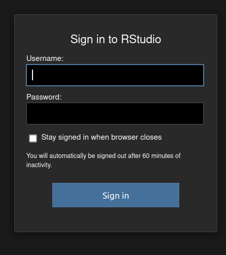
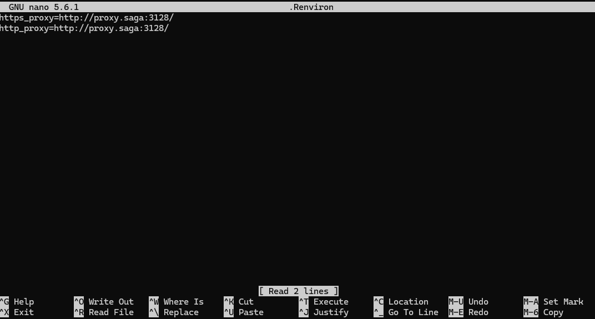
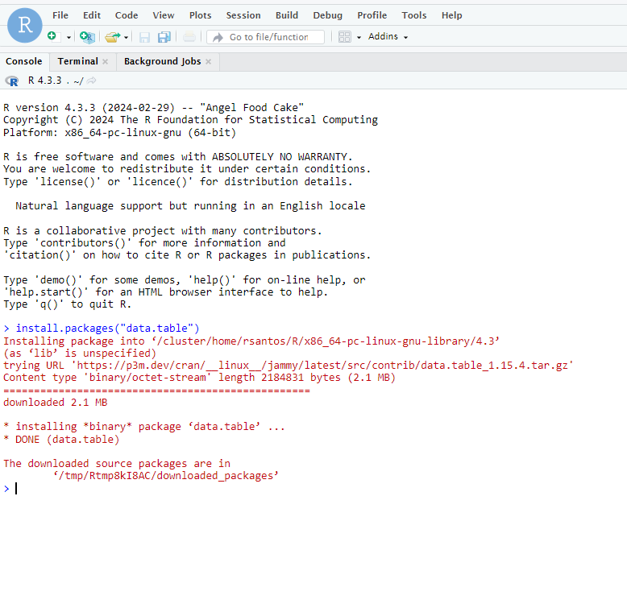

(rstudio-apptainer)=

```{contents} Table of Contents
```

# RStudio

## Context

Some users need to run RStudio on top of R because of specific tools that would facilitate their work. 

We have RStudio available on NIRD Toolkit, but it is not currently supported on the other clusters nor it is recommended to install it with Conda.

Fortunately, there is a container-based solution that will allow users to run RStudio on any cluster.


## Preparation steps and downloading the container

Run the following commands:

```
mkdir -p $HOME/.rstudio/run $HOME/.rstudio/lib $HOME/.rstudio/tmp
mkdir -p $USERWORK/.apptainer

cd $USERWORK

export APPTAINER_CACHEDIR=$USERWORK/.apptainer
export APPTAINER_TMPDIR=$USERWORK/.apptainer

apptainer pull docker://rocker/rstudio:latest
```

## Allocating resources

Run the following command: `salloc --nodes=1 --ntasks-per-node=1 --cpus-per-task=1 --time=00:30:00 --mem=2G --account=nnXXXXk`

Please, note that here we are asking only 30 minutes. **If you need more time or resources, adjust the parameters accordingly.**

The output will be similar to this one:

```
salloc: Pending job allocation 5442258
salloc: job 5442258 queued and waiting for resources
salloc: job 5442258 has been allocated resources
salloc: Granted job allocation 5442258
salloc: Waiting for resource configuration
salloc: Nodes c5-60 are ready for job
```

## Forwarding a port

- Select a random port number. For example, `8521`
- Open another terminal window and run: `ssh -L 8521:clusterNumber:8521 username@saga.sigma2.no` . Remember to replace the "clusterNumber" with what we got on the previous step and your "username"
- Login normally

## Running RStudio

- Run the following command (on the terminal inside the node you were allocated): `PASSWORD='rstudio123' apptainer exec --bind $HOME/.rstudio/run:/var/run/rstudio-server,$HOME/.rstudio/lib:/var/lib/rstudio-server,$HOME/.rstudio/tmp:/tmp rstudio_latest.sif rserver --auth-none=0 --auth-pam-helper-path=pam-helper --www-address=0.0.0.0 --www-port=8521 --server-user=$USER`

- Open your web browser and go to the address: `127.0.0.1:8521` or `localhost:8521` . Remember to replace the port number for the one you've chosen.

It should appear the login screen. The "username" is your cluster's username and the "password" is the same one we defined on the command in the running step, in this case `rstudio123`



## Configuring the proxy to install packages

Because compute nodes have limited access to the internet, we have to configure RStudio to use the Proxy Server so we can download the packages we need.

- Firstly, log in to the server you have an account, allocate resources for your job and run the following command, inside the compute node: `env | grep -i proxy`
On Saga, for example, it should return something like this:

```
https_proxy=http://proxy.saga:3128/
http_proxy=http://proxy.saga:3128/
```

- Then, create a new file on your home directory where RStudio is located:

```
cd $HOME
nano .Renviron
```

- Paste the proxy information inside the file and save it.



- Finish the RStudio session and open a new one. You should now be able to download packages normally


