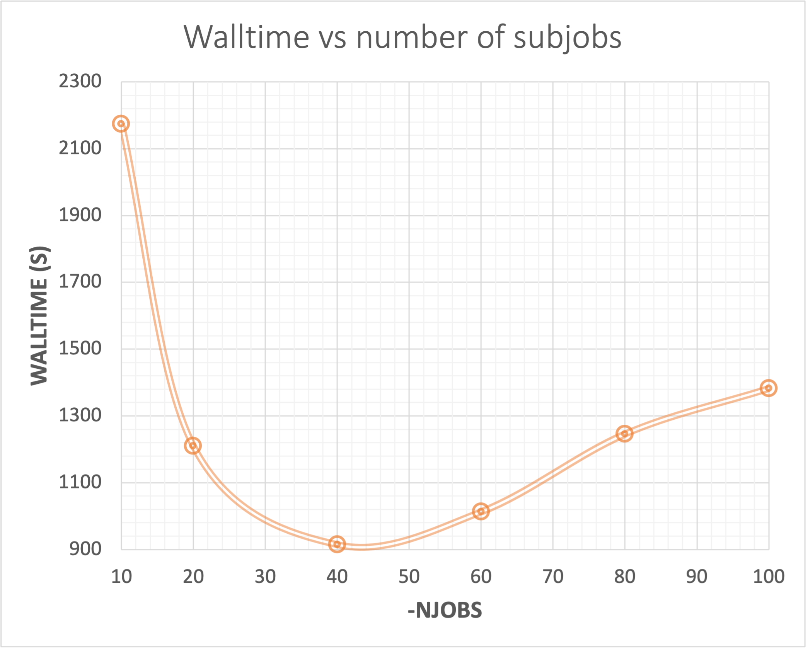
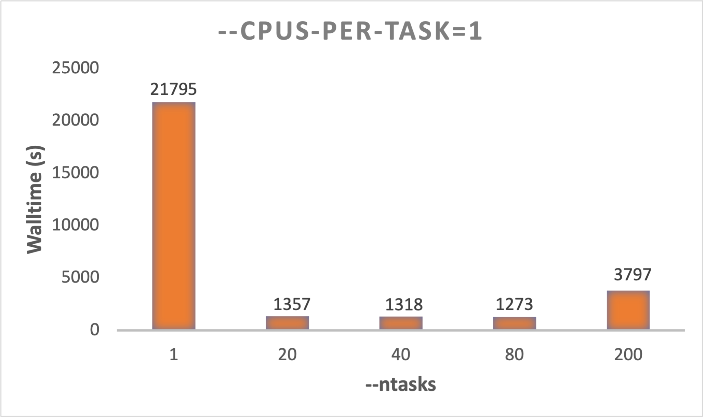

# Tuning Shcrödinger jobs
The Schrödinger suite contains many different softwares/products, and they differ in the way the scale.
The computationally-intensive products (e.g., Glide, Jaguar) are capable of using multiple cores or processors. 
On all supported platforms, this is done by distributing multi-structure jobs over the cores as separate subjobs. 
Parallel execution of a single task with OpenMPI is supported on Linux for Jaguar, and threaded execution with OpenMP 
is supported for Jaguar and Prime. The Maestro process itself is single-threaded, so there is no performance advantage 
to having Maestro itself on a multi-CPU machine. 

We can not cover all Schrödinger's products, but here you find some benchmarks that can serve as a guide for your own
benchmark calculations.

## Glide
Glide docking jobs can be distributed over multiple processors. This is done by partitioning the ligands into sets and 
running each set on a separate processor. The results are recombined at the end. This is more efficient than MPI parallel 
processing, which Glide is not set up for. Thus, how much walltime you need will depend on how big
each subjob will be.

### Subjobs -NJOBS
We did a Glide HTVS with 5000 ligands using the following qargs in our schrodinger.hosts file 
(batch-small):
* `qargs:       --export=ALL --account=nnXXXXk --ntasks=40 --mem-per-cpu=3GB --time=01:00:00`

That is, every subjob will get 40 tasks with 1 cpu per task and 1 hour wall-time. We divided the HTVS of 5000 ligands
into N subjobs, where N was adjusted from 10 to 100 (`-NJOBS`). The jobs were submitted using the command:
* `"${SCHRODINGER}/glide" HTVS.in -OVERWRITE -NJOBS N -DRIVERHOST localhost -SUBHOST batch-small -TMPLAUNCHDIR`

As can be seen from the results in the figure above, there is a sweet spot for the optimal number of subjobs VS wall-time.
That is, the calculation time was in this case reduced from 2174 s with `-NJOBS` 10 to 915 s with -NJOBS 40. In other 
words, 21 minutes faster with subjobs of 125 ligands (`-NJOBS 40`) relative to 500 ligands (`-NJOBS 10`). However, 
increasing the `-NJOBS` further gradually increases the wall-time again. That is, the trade-off between distributing the
small jobs to the compute nodes, starting the processes and so forth, will now take more time and is not paying off 
when the subjobs become too small. 

### Tuning --ntasks
Using the same example as above with `-NJOBS 20`, adjusting the number of tasks (`--ntasks`) seems to have some affect 
on the wall-time. By changing N in `--ntasks=N` in the schrodinger.hosts file `qargs:` from 1 to 80, we got the following 
wall-times:

In this example, there is approximately 1000 s (~17 minutes) to gain by using 20-40 tasks relative to 1 or 2. In this 
HTVS calculation, the difference between 20, 40 and 80 tasks is insignificant. 

### Tuning --cpus-per-task
For Glide, using more than 1 cpu/task will not reduce the wall-time. Actually, it may increase the wall-time:

Thus, keep `--cpus-per-task=1`. Increasing this, will only result in waste of CPU hours for Glide calculations.

### Glide conclusion
* Tune the optimal `-NJOBS`/number of ligands per subjob (~130 for HTVS, but will probably be different with SP and XP docking). 
* `--ntasks=20` or `--ntasks=40` seems good for HTVS, but could be different for SP and XP docking.
* Use `cpus-per-task=1`

## Jaguar
Coming soon.

### Go to:
* [Schrodinger main page](schrodinger.md)
* [Using the Schrodinger suite](schrodinger_usage.md)
* [Setting up the Hosts file](schrodinger_hosts.md)
* [Hosts file keywords](host_file_settings.md)
* [Job control facility](job_control.md)
* [Tuning](tuning.md)