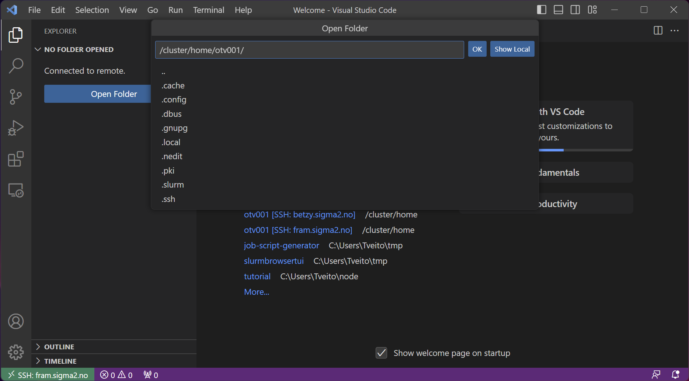

# Connecting to a system with Visual Studio Code
Visual studio Code has the ability to connect to our systems through ssh/sftp. This guide will show you how to do this.

## What will this do for me?
Allowing VS code to connect to our systems allows you to edit and manage your files as if they were stored locally on your own device.

It also somewhat allows you to have a graphical interface to our systems, by showing you the files and their content, instead of having to view everything through a terminal

## How
### Install ssh plugin 
1. Go to plugins
2. Search for "ssh"
3. Select the plugin called "Remote - SSH"
4. Install it
5. Reload window

### Open Connection

1. Click the green button with the connection symbol in the lower left-hand corner.
2. Select "Connect to Host..."

### Connect to system
* Fram: username@fram.sigma2.no
* Saga: username@saga.sigma2.no
* Betzy: username@betzy.sigma2.no

When prompted, type in your password.
If you get a question about what system you are connecting to, select "Linux"

### Open folder
Select the folder you want to open.
For home folder, either select "~" or "/cluster/home/[username]/"
For project folder, select /cluster/projects/nnXXXXk/

### Done!
You are now connected to a system and have access to everything you had access to from a terminal in the IDE. You also have access to terminal through the built in terminal in VS code.

